# 📸 Screenshots Index

This file documents every screenshot in this repository. Each entry includes:
- **Where it appears** in the main README
- **What to look for** — key elements to notice in the screenshot

Place your `.png` files in this folder using the filenames listed below.

---

## Phase 1 — Splunk Setup

### 01 - Splunk Installation
**File:** `01-splunk-install.png`
**README reference:** [Phase 1.1 — Splunk Server Installation](../README.md#11-splunk-server-installation)

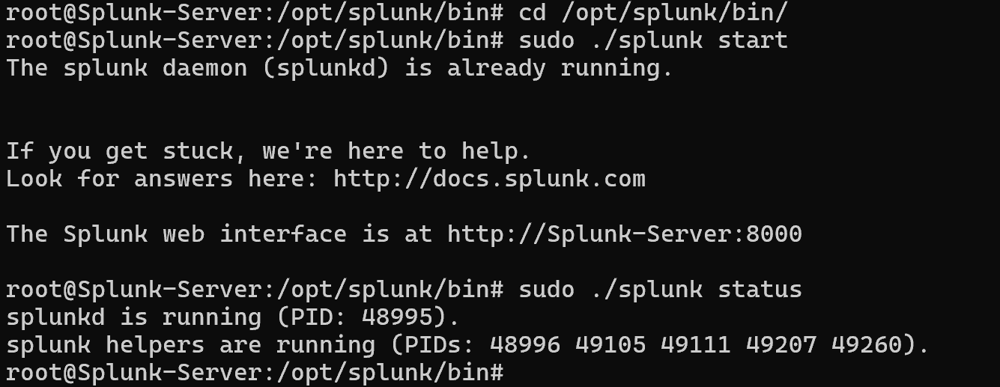

**What to look for:**
- The `splunk start` command running successfully
- The Splunk web interface URL printed to terminal (`http://0.0.0.0:8000`)
- No error messages during startup

---

### 02 - Splunk Login Page
**File:** `02-splunk-login.png`
**README reference:** [Phase 1.1 — Splunk Server Installation](../README.md#11-splunk-server-installation)

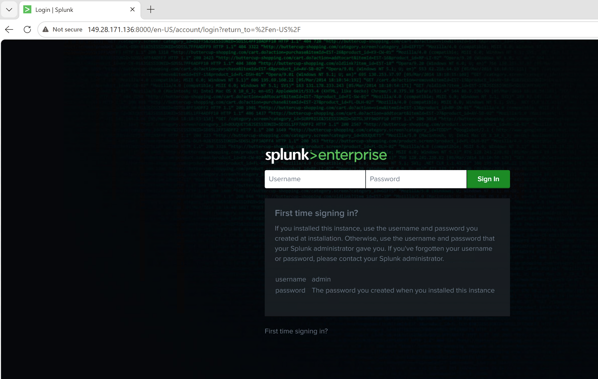

**What to look for:**
- The Splunk Enterprise login page in a browser
- The URL showing your server IP on port 8000
- Username and password fields

---

### 03 - Splunk Index Creation
**File:** `03-splunk-index.png`
**README reference:** [Phase 1.2 — Index & Receiving Configuration](../README.md#12-index--receiving-configuration)

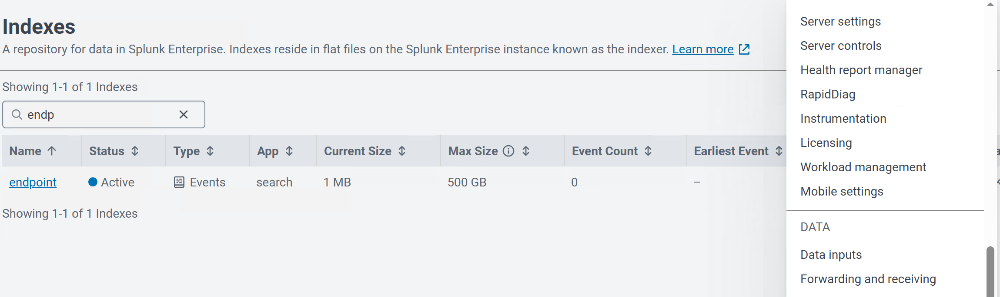

**What to look for:**
- Settings → Indexes screen with the new `endpoint` index listed
- Index name: `endpoint`
- Index type: Events

---

### 04 - Splunk Receiving Port
**File:** `04-splunk-receiving.png`
**README reference:** [Phase 1.2 — Index & Receiving Configuration](../README.md#12-index--receiving-configuration)

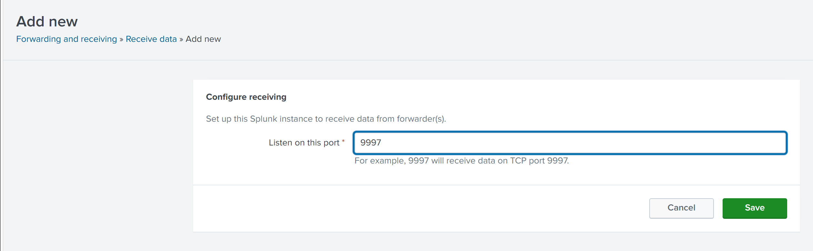

**What to look for:**
- Settings → Forwarding and Receiving screen
- Port 9997 listed as an active receiving port

---

## Phase 2 — Agent Deployment

### 05 - Universal Forwarder Installation
**File:** `05-forwarder-install.png`
**README reference:** [Phase 2.1 — Splunk Universal Forwarder](../README.md#21-splunk-universal-forwarder)

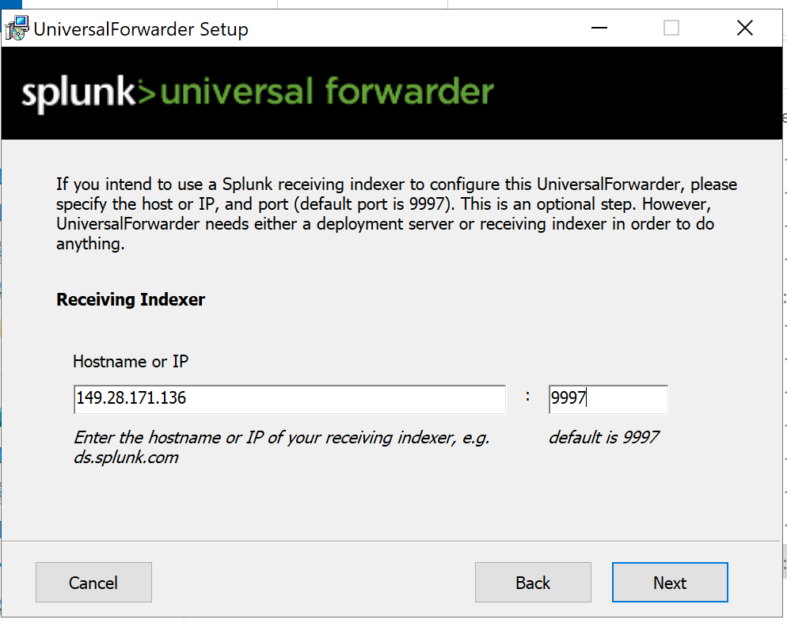

**What to look for:**
- The installer wizard showing the receiving indexer IP and port 9997 configured
- Installation completing without errors
- The Splunk Forwarder service appearing in `services.msc`

---

### 06 - Sysmon Installation
**File:** `06-sysmoninstall.png`
**README reference:** [Phase 2.2 — Sysmon Installation](../README.md#22-sysmon-installation)

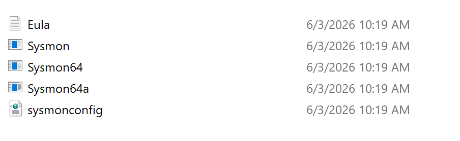

**What to look for:**
- The PowerShell command: `.\Sysmon.exe -accepteula -i .\sysmonconfig.xml`
- Success message confirming Sysmon was installed as a service
- Both `Sysmon.exe` and `sysmonconfig.xml` visible in the same directory

---

### 07 - Sysmon Events in Event Viewer
**File:** `07-sysmon-events.png`
**README reference:** [Phase 2.2 — Sysmon Installation](../README.md#22-sysmon-installation)

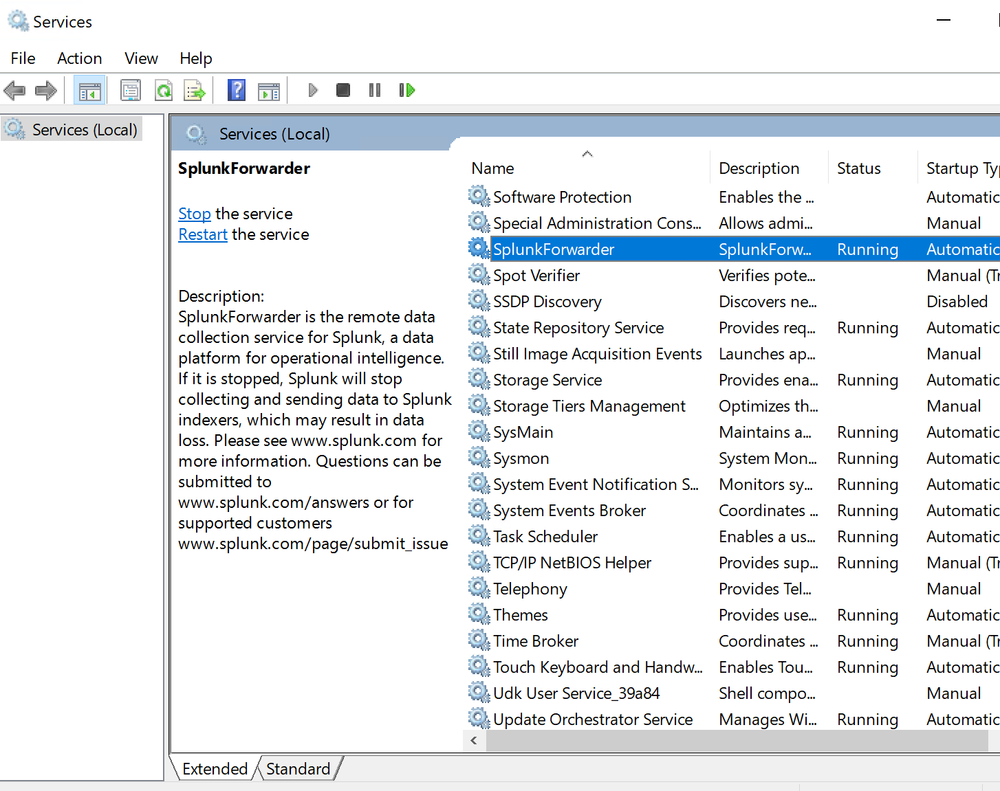

**What to look for:**
- Event Viewer open at: `Applications and Services Logs → Microsoft → Windows → Sysmon → Operational`
- Events actively populating (Event IDs 1, 3, 7, etc.)
- Detail pane showing a process creation event (ID 1) with fields like `CommandLine`, `Image`, `ParentImage`

---

### 08 - inputs.conf File
**File:** `08-inputs-conf.png`
**README reference:** [Phase 2.3 — inputs.conf Configuration](../README.md#23-inputsconf-configuration)

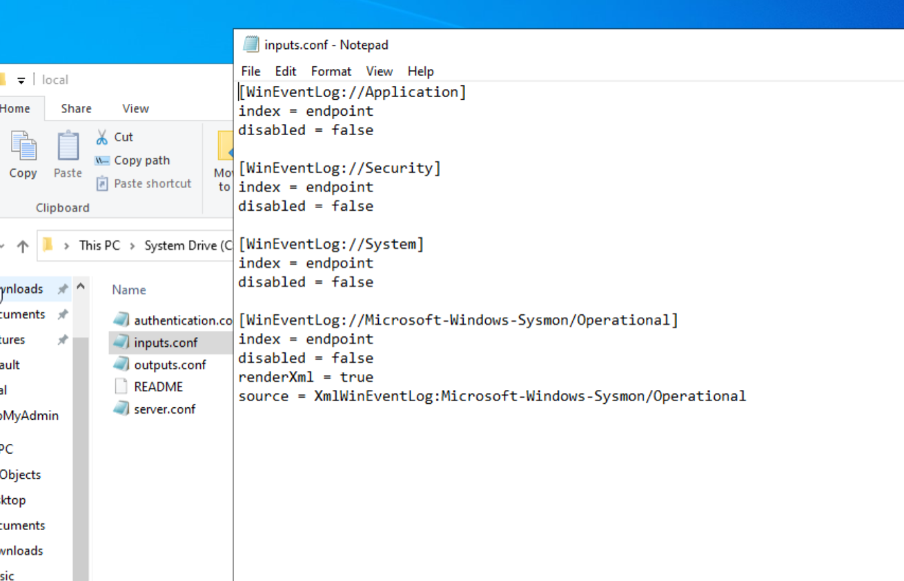

**What to look for:**
- File located at: `C:\Program Files\SplunkUniversalForwarder\etc\system\local\inputs.conf`
- All four stanzas visible: Application, Security, System, and Sysmon Operational
- `renderXml = true` present on the Sysmon stanza
- `index = endpoint` on every stanza

---

### 09 - Both Hosts Visible in Splunk
**File:** `09-splunk-both-hosts.png`
**README reference:** [Phase 2.3 — inputs.conf Configuration](../README.md#23-inputsconf-configuration)

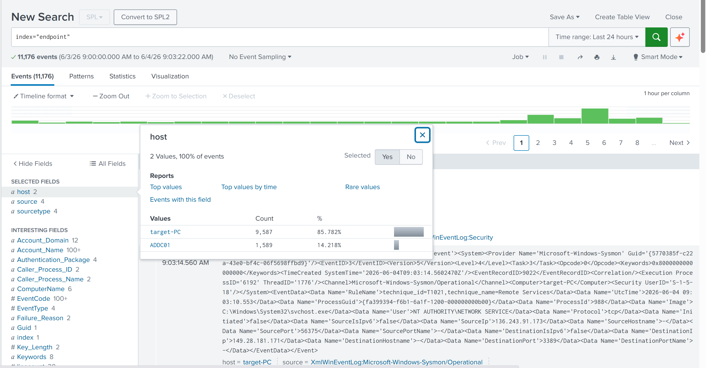

**What to look for:**
- Splunk search: `index=endpoint | stats count by host`
- Both hostnames visible: your Target VM and ADDC01
- Both showing recent event counts (not zero)

---

## Phase 3 — Active Directory

### 10 - Active Directory Role Installation
**File:** `10-ad-role-install.png`
**README reference:** [Phase 3.1 — Installing AD Domain Services](../README.md#31-installing-ad-domain-services)

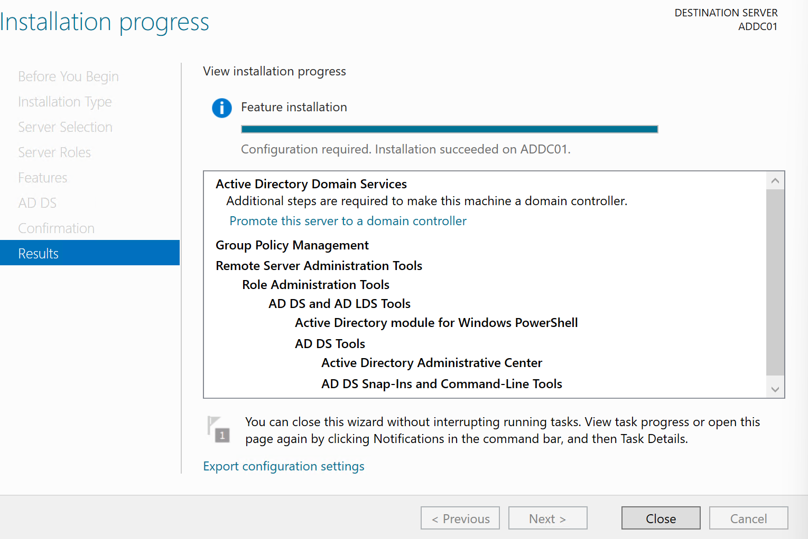

**What to look for:**
- Server Manager → Add Roles and Features wizard
- `Active Directory Domain Services` ticked in the Server Roles list
- "Role-based or feature-based installation" selected

---

### 11 - Promoting to Domain Controller
**File:** `11-ad-promote.png`
**README reference:** [Phase 3.2 — Promoting to Domain Controller](../README.md#32-promoting-to-domain-controller)

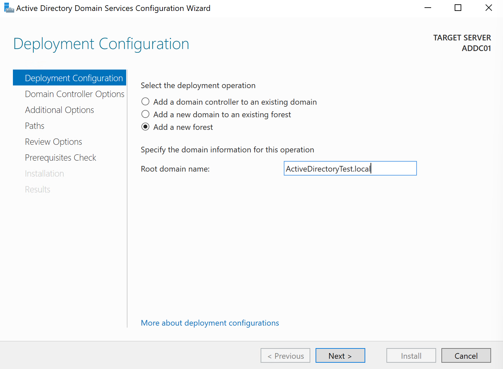

**What to look for:**
- Deployment Configuration screen
- "Add a new forest" selected
- Root domain name filled in (e.g., `SOClab.local`)

---

### 12 - Domain Login Confirmation
**File:** `12-ad-login-confirmation.png`
**README reference:** [Phase 3.2 — Promoting to Domain Controller](../README.md#32-promoting-to-domain-controller)

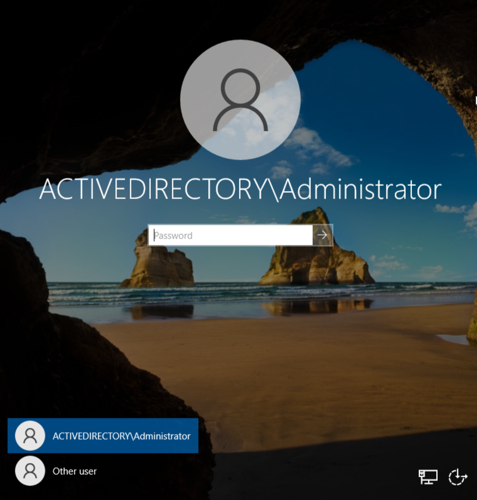

**What to look for:**
- Login screen after the server reboots showing `YOURDOMAIN\Administrator`
- The domain prefix confirms the DC promotion succeeded

---

### 13 - Active Directory Users and Computers
**File:** `13-aduc-overview.png`
**README reference:** [Phase 3.3 — Creating Users & Groups](../README.md#33-creating-users--groups)

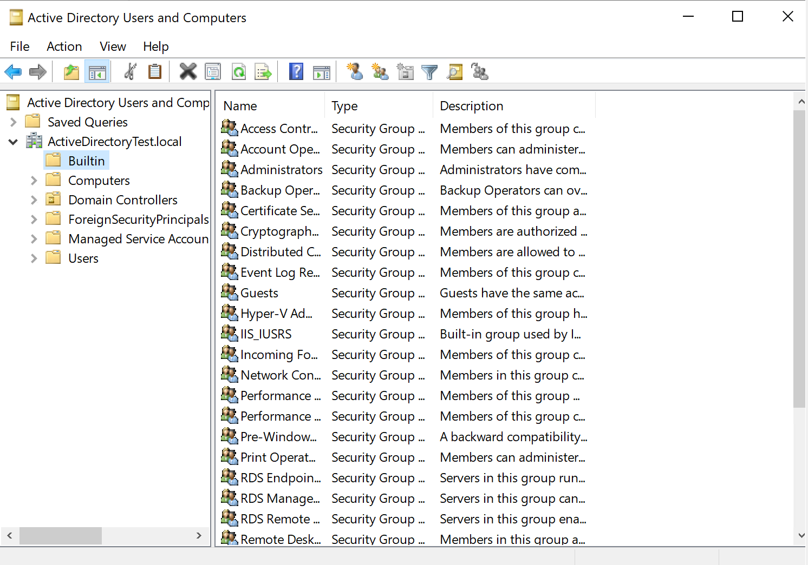

**What to look for:**
- ADUC console open with your domain in the left tree
- Default containers visible: Builtin, Computers, Users
- The description column showing what each built-in group does

---

### 14 - Creating a New User
**File:** `14-new-user.png`
**README reference:** [Phase 3.3 — Creating Users & Groups](../README.md#33-creating-users--groups)

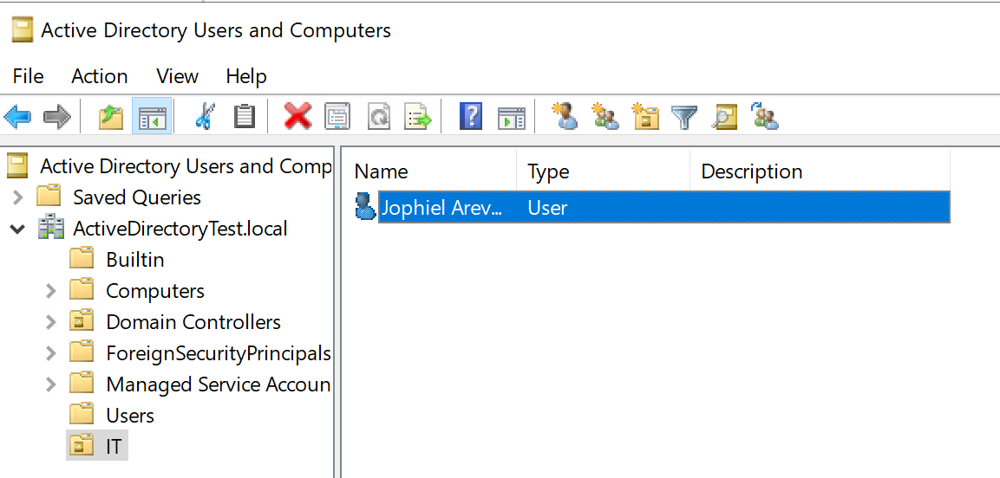

**What to look for:**
- New Object — User dialog with First name, Last name, and User logon name filled in
- At least one user created and visible in the Users container

---

### 15 - Creating a New Group
**File:** `15-new-group.png`
**README reference:** [Phase 3.3 — Creating Users & Groups](../README.md#33-creating-users--groups)

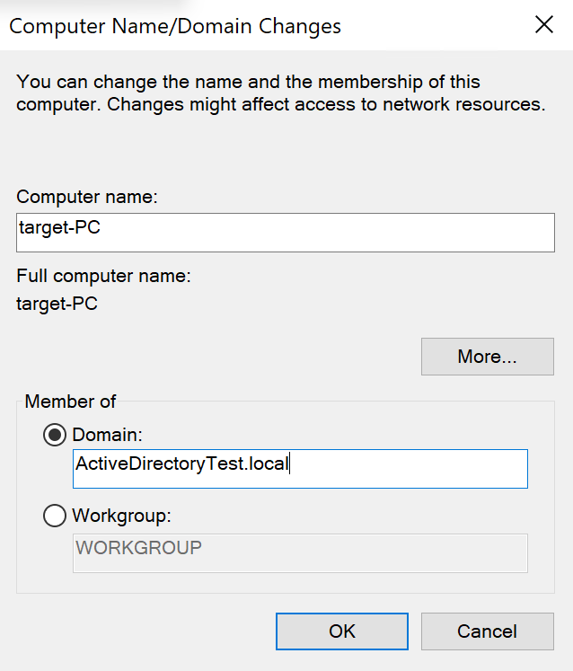

**What to look for:**
- New Object — Group dialog
- Group scope: Global
- Group type: Security
- Group visible in the ADUC tree after creation

---

### 16 - DNS Configuration on Target
**File:** `16-dns-config.png`
**README reference:** [Phase 3.4 — Joining the Target Machine to the Domain](../README.md#34-joining-the-target-machine-to-the-domain)

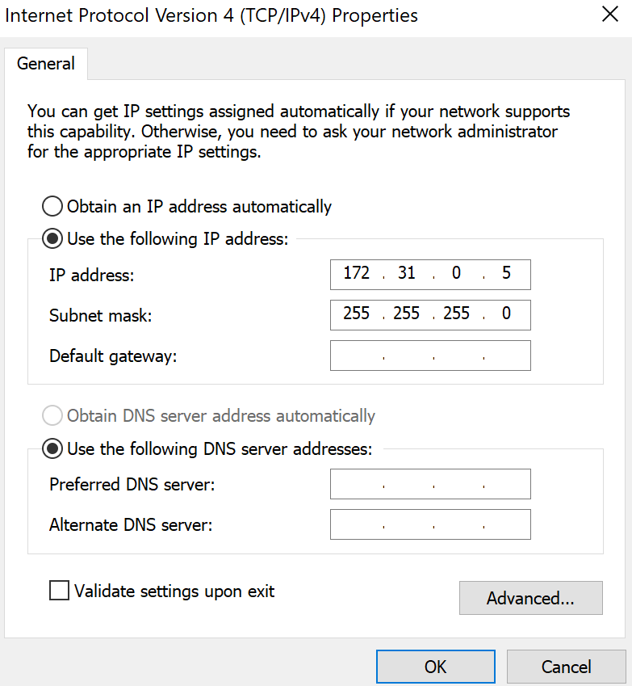

**What to look for:**
- Network adapter IPv4 Properties dialog
- Preferred DNS server set to the Windows Server / DC IP address
- NOT set to 8.8.8.8 or the router — must point to the DC

---

### 17 - Joining the Domain
**File:** `17-domain-join.png`
**README reference:** [Phase 3.4 — Joining the Target Machine to the Domain](../README.md#34-joining-the-target-machine-to-the-domain)

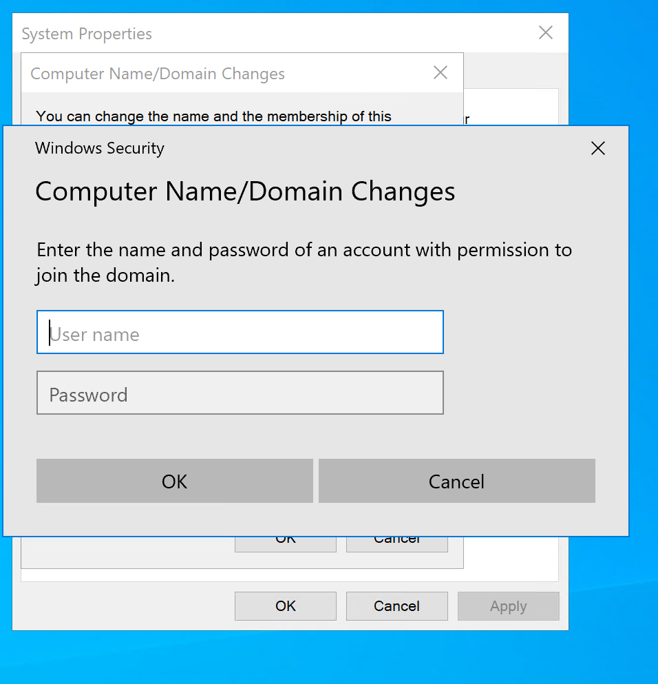

**What to look for:**
- System Properties → Computer Name tab
- "Domain" radio button selected (not Workgroup)
- Domain name field filled in (e.g., `SOClab.local`)

---

### 18 - Domain Join Confirmation
**File:** `18-domain-join-confirm.png`
**README reference:** [Phase 3.4 — Joining the Target Machine to the Domain](../README.md#34-joining-the-target-machine-to-the-domain)

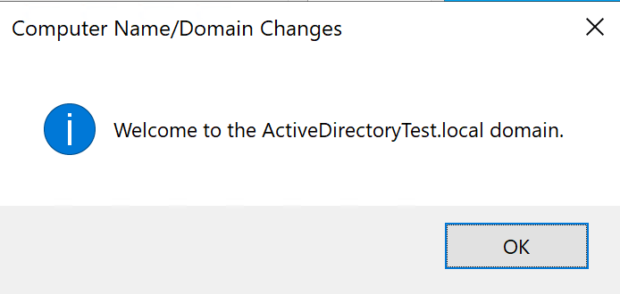

**What to look for:**
- Popup: "Welcome to the SOClab.local domain"
- No error messages
- The prompt to restart the machine

---

### 19 - Logging in as a Domain User
**File:** `19-domain-user-login.png`
**README reference:** [Phase 3.4 — Joining the Target Machine to the Domain](../README.md#34-joining-the-target-machine-to-the-domain)

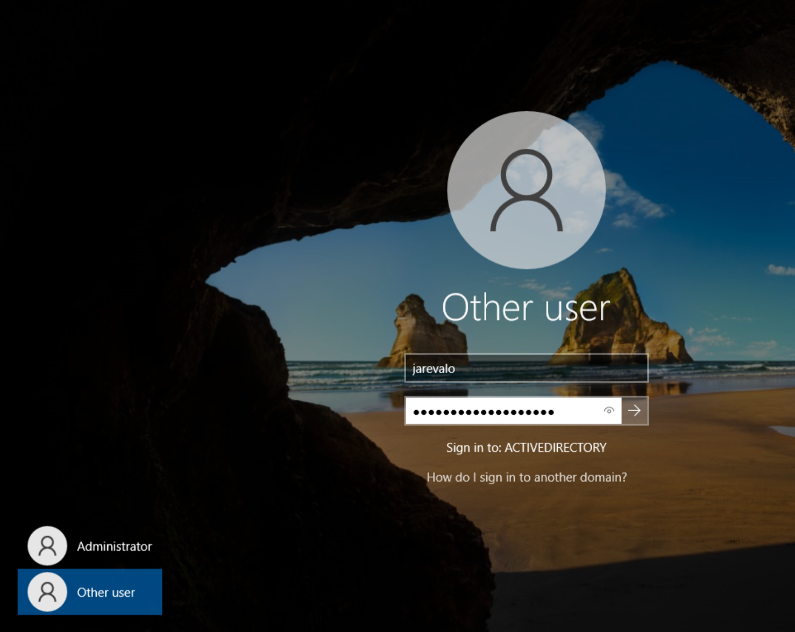

**What to look for:**
- Login screen on the Target VM after restart
- "Other user" selected
- Username showing `DOMAIN\username` format
- Successful desktop load confirming domain auth works

---

## Phase 4 — Attack Simulation

### 20 - Hydra Brute Force Attack
**File:** `20-hydra-attack.png`
**README reference:** [Phase 4.1 — RDP Brute Force with Hydra](../README.md#41-rdp-brute-force-with-hydra)

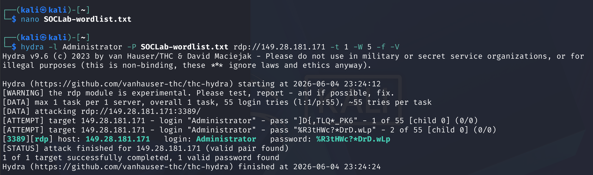

**What to look for:**
- The full `hydra` command with `-L`, `-P`, and `rdp://` flags visible
- Individual attempt lines being printed (verbose mode)
- The green `[3389][rdp]` success line showing the discovered password
- Attack stopping after first success (`-f` flag)

---

### 21 - Splunk Logs During Attack
**File:** `21-splunk-attack-logs.png`
**README reference:** [Phase 4.1 — RDP Brute Force with Hydra](../README.md#41-rdp-brute-force-with-hydra)

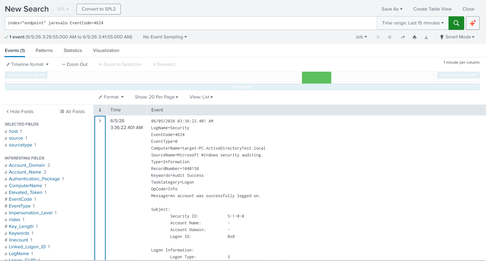

**What to look for:**
- Splunk search for `EventCode=4625`
- Large spike of events in the timeline — the brute force burst
- `Source_Network_Address` column showing the Kali machine's IP repeating hundreds of times

---

### 22 - Atomic Red Team Installation
**File:** `22-atomic-install.png`
**README reference:** [Phase 4.2 — Atomic Red Team](../README.md#42-atomic-red-team)

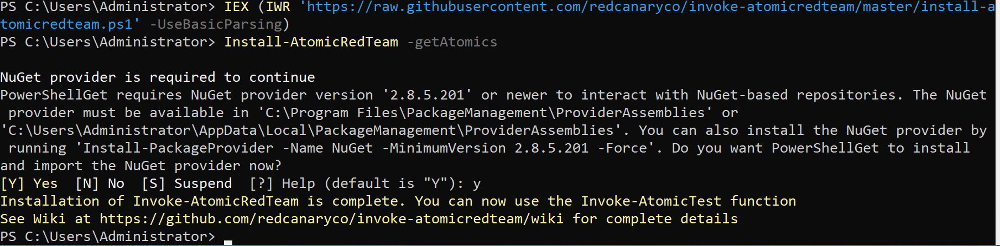

**What to look for:**
- PowerShell running as Administrator
- `Install-Module -Name invoke-atomicredteam` completing successfully
- No errors from Defender (confirms the exclusion was added)

---

### 23 - Atomic Red Team Techniques Folder
**File:** `23-atomic-techniques.png`
**README reference:** [Phase 4.2 — Atomic Red Team](../README.md#42-atomic-red-team)

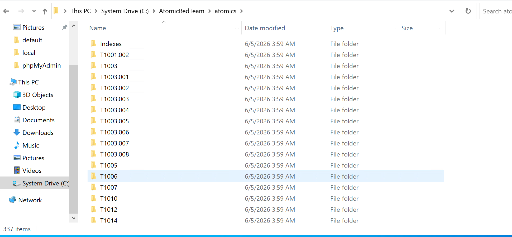

**What to look for:**
- `C:\AtomicRedTeam\atomics\` folder open in Explorer
- Subfolders named with MITRE ATT&CK IDs (T1059, T1136, T1003, etc.)
- Many techniques downloaded — showing the breadth of available tests

---

### 24 - Running an Atomic Technique
**File:** `24-atomic-run.png`
**README reference:** [Phase 4.2 — Atomic Red Team](../README.md#42-atomic-red-team)

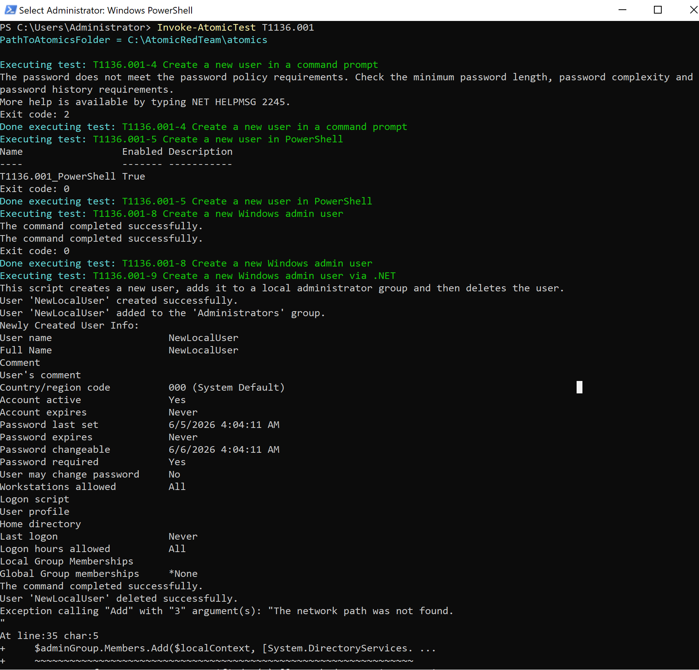

**What to look for:**
- `Invoke-AtomicTest T1136.001` command in PowerShell
- Output showing the test steps being executed
- A new local user being created (visible in the output)

---

### 25 - Atomic Technique Log in Splunk
**File:** `25-splunk-atomic-log.png`
**README reference:** [Phase 4.2 — Atomic Red Team](../README.md#42-atomic-red-team)

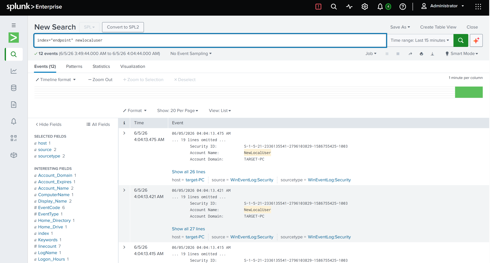

**What to look for:**
- Event ID `4720` — a user account was created
- The new account name matching what Atomic created
- Timestamp matching when you ran the Atomic test
- Source: your Target VM hostname

---

## Phase 5 — Detection & Alerting

### 26 - Brute Force Logs in Splunk
**File:** `26-splunk-brute-force-logs.png`
**README reference:** [Phase 5.1 — Investigating Brute Force Logs](../README.md#51-investigating-brute-force-logs)

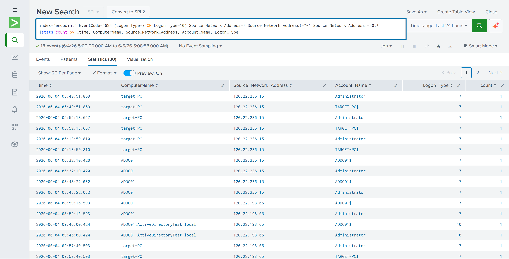

**What to look for:**
- Large volume of `EventCode=4625` events
- All from the same `Source_Network_Address` (Kali's IP)
- Multiple usernames targeted (`Account_Name` column)
- Tight time clustering showing automated tool, not a human

---

### 27 - Kali IP Identified in Splunk
**File:** `27-splunk-kali-ip.png`
**README reference:** [Phase 5.1 — Investigating Brute Force Logs](../README.md#51-investigating-brute-force-logs)

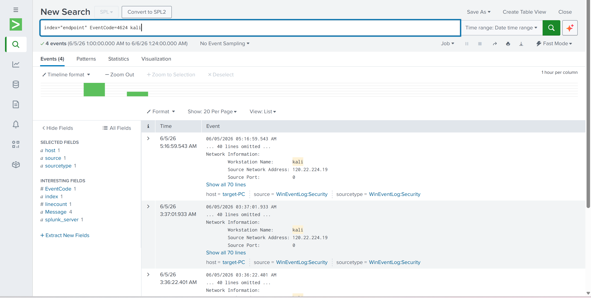

**What to look for:**
- The event detail panel expanded for a 4624 (successful logon)
- `Source_Network_Address` matching the Kali Linux machine's IP
- `Account_Name` showing which user was successfully authenticated
- `Logon_Type` = 10 confirming it was an RDP session

---

### 28 - Splunk Alert Configuration
**File:** `28-alert-config.png`
**README reference:** [Phase 5.2 — RDP Logon Alert Rule](../README.md#52-rdp-logon-alert-rule)

**What to look for:**
- Alert title: "RDP Remote Logon Detected" (or similar)
- Alert type: Real-time
- Trigger condition: Number of results > 0
- The full SPL query visible in the search bar above

---

### 29 - Alert Triggered in Splunk
**File:** `29-alert-triggered.png`
**README reference:** [Phase 5.2 — RDP Logon Alert Rule](../README.md#52-rdp-logon-alert-rule)

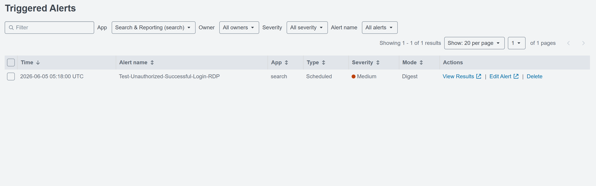

**What to look for:**
- Activity → Triggered Alerts page in Splunk
- Your alert name appearing with a recent timestamp
- The trigger count incrementing as RDP sessions occur
- Confirmation the end-to-end pipeline (attack → log → alert) works

---

## Summary Table

| # | Filename | Phase | Key Content |
|---|----------|-------|-------------|
| 01 | `01-splunk-install01.png` | Splunk Setup | Splunk start terminal output |
| 02 | `02-splunk-login.png` | Splunk Setup | Splunk web UI login page |
| 03 | `03-splunk-index.png` | Splunk Setup | endpoint index created |
| 04 | `04-splunk-receiving.png` | Splunk Setup | Port 9997 receiving configured |
| 05 | `05-forwarder-install.png` | Agents | Universal Forwarder installer |
| 06 | `06-sysmoninstall.png` | Agents | Sysmon install command + output |
| 07 | `07-sysmon-events.png` | Agents | Sysmon events in Event Viewer |
| 08 | `08-inputs-conf.png` | Agents | inputs.conf file content |
| 09 | `09-splunk-both-hosts.png` | Agents | Both hosts sending data to Splunk |
| 10 | `10-ad-role-install.png` | Active Directory | AD DS role being installed |
| 11 | `11-ad-promote.png` | Active Directory | DC promotion wizard |
| 12 | `12-ad-login-confirmation.png` | Active Directory | Domain prefix at login |
| 13 | `13-aduc-overview.png` | Active Directory | ADUC console overview |
| 14 | `14-new-user.png` | Active Directory | New user creation wizard |
| 15 | `15-new-group.png` | Active Directory | New group creation |
| 16 | `16-dns-config.png` | Active Directory | DNS pointing to DC |
| 17 | `17-domain-join.png` | Active Directory | Domain join dialog |
| 18 | `18-domain-join-confirm.png` | Active Directory | Welcome to domain popup |
| 19 | `19-domain-user-login.png` | Active Directory | Domain user login on Target VM |
| 20 | `20-hydra-attack.png` | Attack | Hydra RDP brute force |
| 21 | `21-splunk-attack-logs.png` | Attack | Burst of 4625 events in Splunk |
| 22 | `22-atomic-install.png` | Attack | Atomic Red Team PowerShell install |
| 23 | `23-atomic-techniques.png` | Attack | MITRE technique folders |
| 24 | `24-atomic-run.png` | Attack | Running T1136.001 |
| 25 | `25-splunk-atomic-log.png` | Attack | Event 4720 in Splunk |
| 26 | `26-splunk-brute-force-logs.png` | Detection | Mass 4625 events from Kali |
| 27 | `27-splunk-kali-ip.png` | Detection | Kali IP in event detail |
| 28 | `28-alert-config.png` | Detection | Splunk alert save dialog |
| 29 | `29-alert-triggered.png` | Detection | Alert firing in Splunk |
