# 📸 Screenshots Index — Digital Forensics Investigation

This file documents every screenshot in this repository. Each entry includes where it appears in the main README and what to look for in the image.

Place your `.png` files in this folder using the exact filenames listed below.

---

## Evidence A — Disk Image

### 01 - Evidence A Disk Image Info
**File:** `01-evidenceA-disk-info.png`
**README reference:** [Setup & Integrity Verification](../README.md#setup--integrity-verification)

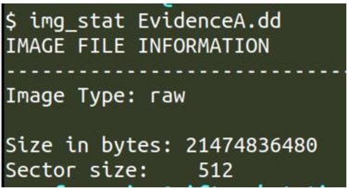

**What to look for:**
- `img_stat` output showing: Image Type: raw, Size: 21474836480 bytes, Sector size: 512
- The `mmls` output below it showing all partitions including the Basic data partition starting at sector 673792
- The calculated offset (673792 × 512 = 344981504) used for mounting

---

### 02 - Registered Owner (winver)
**File:** `02-winver-registered-owner.png`
**README reference:** [Q1 — Who owns the computer?](../README.md#q1--who-owns-the-computer)

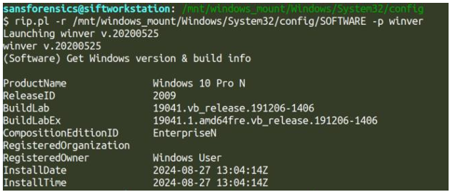

**What to look for:**
- `rip.pl -r .../SOFTWARE -p winver` command visible
- ProductName: Windows 10 Pro N
- RegisteredOwner: Windows User
- InstallDate: 2024-08-27

---

### 03 - Hostname (compname)
**File:** `03-compname-hostname.png`
**README reference:** [Q1 — Who owns the computer?](../README.md#q1--who-owns-the-computer)

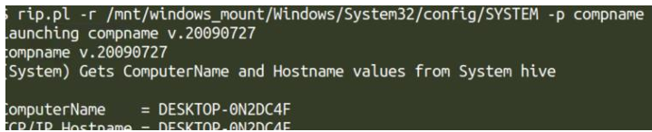

**What to look for:**
- `rip.pl -r .../SYSTEM -p compname` command visible
- ComputerName = DESKTOP-0N2DC4F
- TCP/IP Hostname = DESKTOP-0N2DC4F

---

### 04 - SAM Usernames
**File:** `04-sam-usernames.png`
**README reference:** [Q1 — Who owns the computer?](../README.md#q1--who-owns-the-computer)

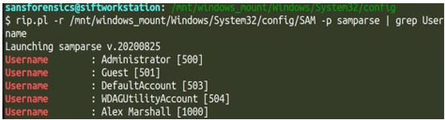

**What to look for:**
- `rip.pl -r .../SAM -p samparse | grep Username` command visible
- Five accounts listed: Administrator [500], Guest [501], DefaultAccount [503], WDAGUtilityAccount [504], Alex Marshall [1000]
- Alex Marshall is the only non-system account (RID 1000)

---

### 05 - Alex User Activity
**File:** `05-alex-user-activity.png`
**README reference:** [Q1 — Who owns the computer?](../README.md#q1--who-owns-the-computer)

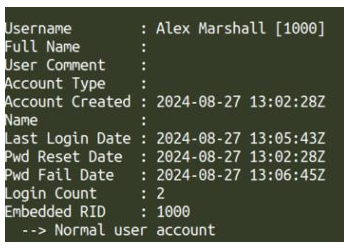

**What to look for:**
- Username: Alex Marshall [1000]
- Account Created: 2024-08-27 13:02:28Z
- Last Login Date: 2024-08-27 13:05:43Z
- Login Count: 2
- Normal user account (not admin)
- Alex is the ONLY user with login activity

---

### 06 - Program Files
**File:** `06-program-files.png`
**README reference:** [Q2 — Installed and recently run programs](../README.md#q2--installed-and-recently-run-programs)

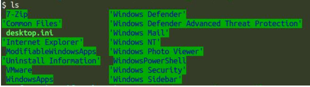

**What to look for:**
- 64-bit applications: 7-Zip, Internet Explorer, ModifiableWindowsApps, VMware, Windows Defender, Windows Mail, Windows Photo Viewer, WindowsPowerShell, Windows Security, Windows Sidebar

---

### 07 - Program Files (x86)
**File:** `07-program-files-x86.png`
**README reference:** [Q2 — Installed and recently run programs](../README.md#q2--installed-and-recently-run-programs)

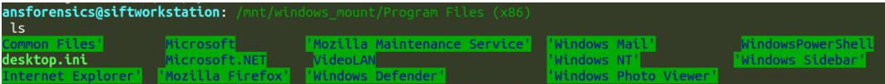

**What to look for:**
- 32-bit applications: Common Files, Internet Explorer, Microsoft, Microsoft.NET, Mozilla Firefox, VideoLAN (VLC), Windows Defender, Windows Mail, Windows Photo Viewer, WindowsPowerShell, Windows Sidebar

---

### 08 - Downloads Folder
**File:** `08-downloads-folder.png`
**README reference:** [Q2 — Installed and recently run programs](../README.md#q2--installed-and-recently-run-programs)

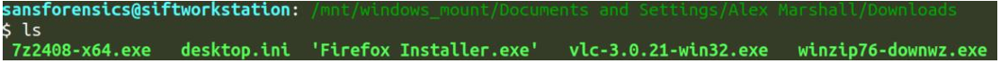

**What to look for:**
- Installer files: 7z2408-x64.exe, Firefox Installer.exe, vlc-3.0.21-win32.exe, winzip76-downwz.exe
- All recently downloaded — confirms Alex was actively setting up this machine

---

### 09 - University Warning Letter
**File:** `09-university-warning.png`
**README reference:** [Q3 — Recycle Bin recovery](../README.md#q3--recycle-bin-recovery)

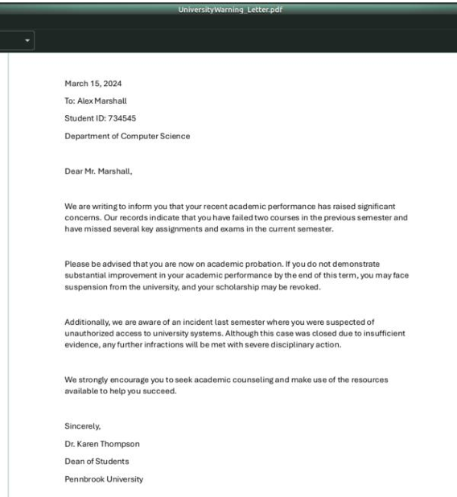

**What to look for:**
- Letter dated March 15, 2024 addressed to Alex Marshall (Student ID: 734545)
- States: failed courses, missed assignments, academic probation
- Mentions allegations of unauthorized access to university systems
- Signed by Dr. Karen Thompson, Dean of Students, Pennbrook University

---

### 10 - Last Will and Testament
**File:** `10-last-will-testament.png`
**README reference:** [Q3 — Recycle Bin recovery](../README.md#q3--recycle-bin-recovery)

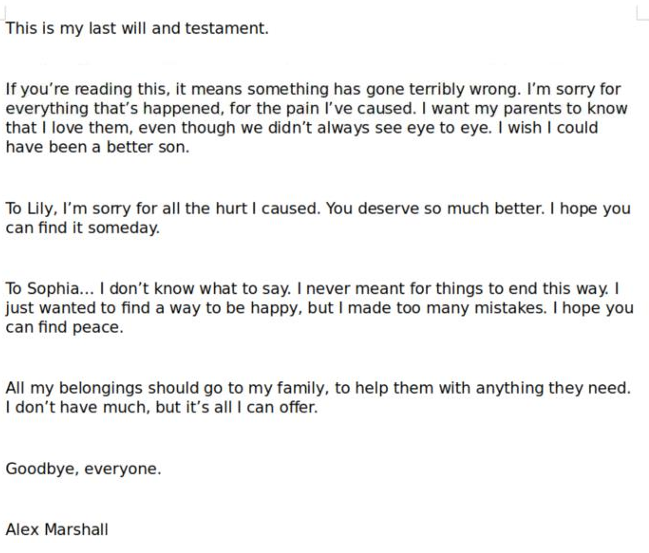

**What to look for:**
- Opening line: "This is my last will and testament."
- Apologies to parents, Lily, and Sophia by name
- Directs belongings to family
- Signed: Alex Marshall
- This was disguised as notes.jpg — Alex deliberately hid it

---

### 11 - Alex Personal Documents
**File:** `11-alex-personal-documents.png`
**README reference:** [Q4 — State of mind indicators](../README.md#q4--state-of-mind-indicators)

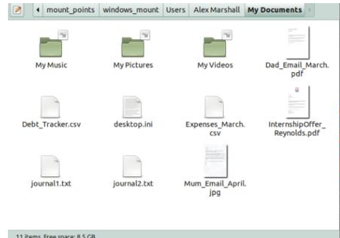

**What to look for:**
- Folder contains: Dad_Email_March.pdf, Debt_Tracker.csv, Expenses_March.csv, InternshipOffer_Reynolds.pdf, journal1.txt, journal2.txt, Mum_Email_April.jpg
- Multiple personal and financial documents indicating a chaotic life situation

---

### 12 - Debt Tracker
**File:** `12-debt-tracker.png`
**README reference:** [Q4 — State of mind indicators](../README.md#q4--state-of-mind-indicators)

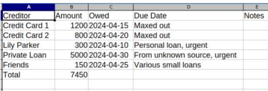

**What to look for:**
- Creditors listed: Credit Card 1 ($1,200 maxed), Credit Card 2 ($800 maxed), Lily Parker ($300 personal loan urgent), Private Loan ($5,000 unknown source urgent), Friends ($150)
- Total: $7,450
- Due dates all in April 2024
- "From unknown source, urgent" on the $5,000 private loan — key red flag

---

### 13 - Journal 1
**File:** `13-journal-1.png`
**README reference:** [Q4 — State of mind indicators](../README.md#q4--state-of-mind-indicators)

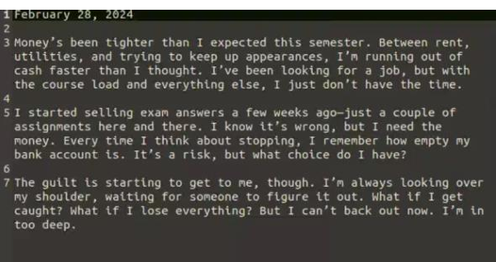

**What to look for:**
- Date: February 28, 2024
- Alex admits to starting to sell exam answers
- Describes guilt: "I know it's wrong but I need the money"
- Fear of being caught: "The guilt is starting to get to me"
- Shows deliberate decision making — not impulsive

---

### 14 - Journal 2
**File:** `14-journal-2.png`
**README reference:** [Q4 — State of mind indicators](../README.md#q4--state-of-mind-indicators)

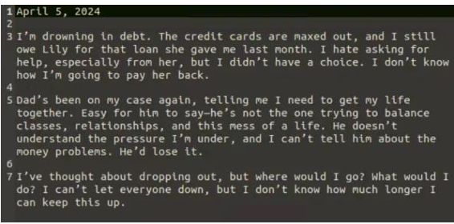

**What to look for:**
- Date: April 5, 2024
- "I'm drowning in debt. The credit cards are maxed out"
- Father pressure: "Dad's been on my case again"
- Considers dropping out: "I've thought about dropping out, but where would I go?"
- Final line: "I don't know how much longer I can keep this up"

---

## Evidence B — Network Capture

### 15 - CheatChat TCP Stream
**File:** `15-cheatchat-stream.png`
**README reference:** [Q5 — Communicating parties & timestamps](../README.md#q5--communicating-parties--timestamps)

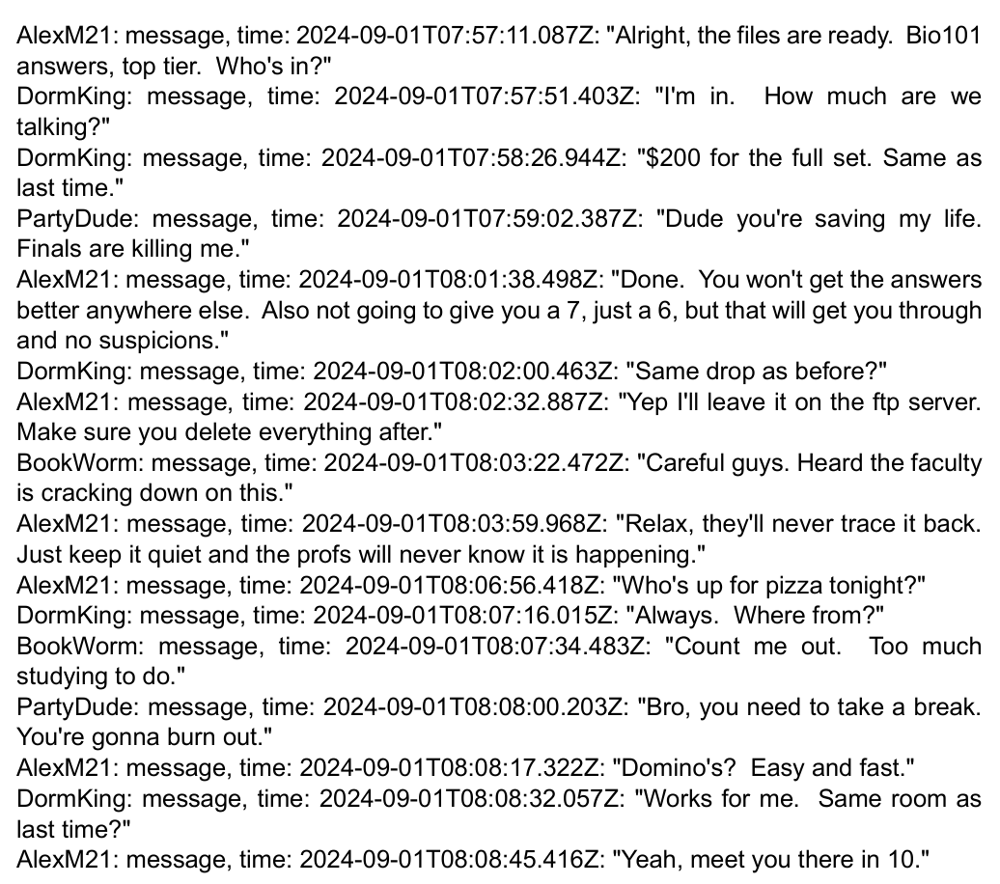

**What to look for:**
- Packet 272 TCP stream from Alex's endpoint
- All four handles visible: AlexM21, DormKing, PartyDude, BookWorm
- Timestamps starting at 2024-09-01T07:57:11Z
- Alex explicitly stating exam answers will be on the FTP server
- BookWorm warning about faculty crackdown

---

### 16 - DormKing PartyDude Stream
**File:** `16-dormking-partydude-stream.png`
**README reference:** [Q5 — Communicating parties & timestamps](../README.md#q5--communicating-parties--timestamps)

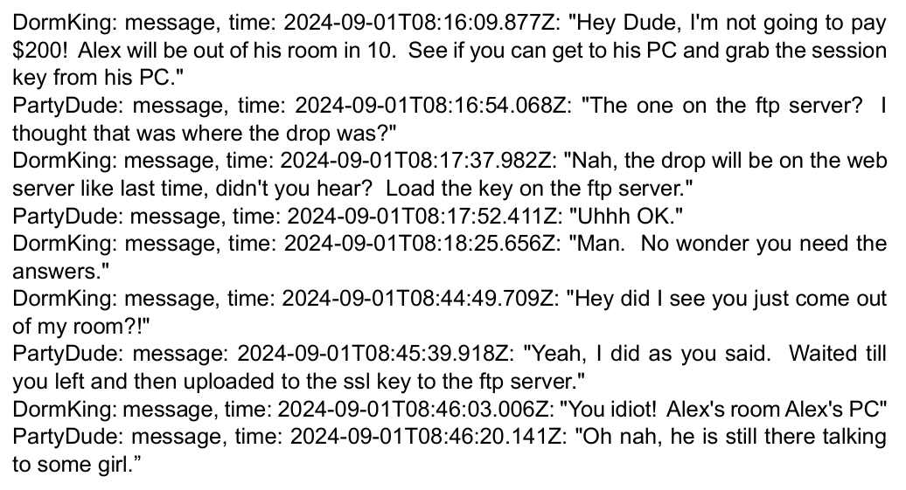

**What to look for:**
- Private conversation between DormKing and PartyDude
- DormKing explicitly instructs PartyDude to enter Alex's room and steal the FTP session key
- The plan fails — PartyDude enters DormKing's room by mistake
- Timestamps: 08:16:09 – 08:46:20Z
- This establishes criminal intent separate from Alex's actions

---

### 17 - HTTP User Agents
**File:** `17-http-user-agents.png`
**README reference:** [Q6 — Browsers, OS, and IP addresses](../README.md#q6--browsers-os-and-ip-addresses)

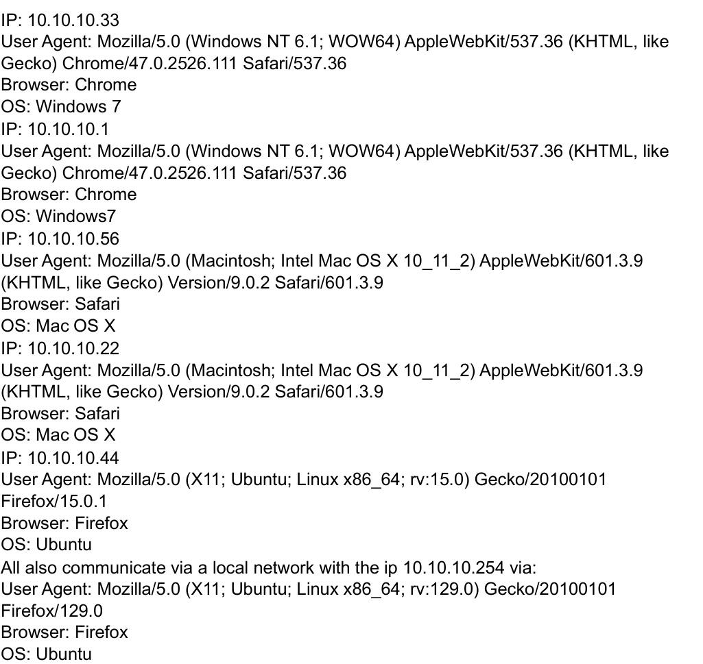

**What to look for:**
- Wireshark filter: `http`
- User-Agent field visible in HTTP headers for each source IP
- Five distinct IPs with different browser/OS combinations
- Local server at 10.10.10.254 running Ubuntu/Firefox (newest version — this is the server)

---

### 18 - FTP Stream 694
**File:** `18-ftp-stream-694.png`
**README reference:** [Q7 — Files transmitted on the network](../README.md#q7--files-transmitted-on-the-network)

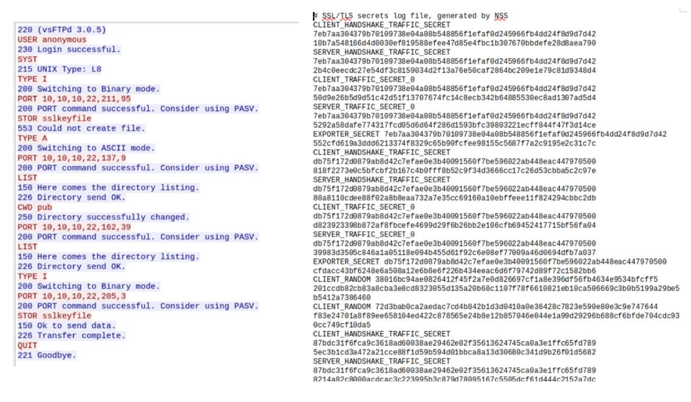

**What to look for:**
- FTP commands visible: USER anonymous, SYST, TYPE A/I, CWD pub, LIST, STOR sslkeyfile
- First upload attempt: 553 Could not create file (permission denied)
- Second attempt: 226 Transfer complete (success)
- SSL/TLS secrets log visible in the right panel — the actual stolen key content
- This is the evidence of DormKing's theft plan succeeding

---

### 19 - Pub Directory
**File:** `19-pub-directory.png`
**README reference:** [Q7 — Files transmitted on the network](../README.md#q7--files-transmitted-on-the-network)

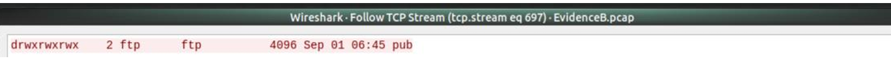

**What to look for:**
- `CWD pub` then `LIST` response
- Files visible: test.txt, upload.txt (pre-existing)
- Directory permissions: drwxrwxrwx (world-writable — explains why upload eventually succeeded)

---

## Evidence C — Memory Dump

### 20 - Evidence C Image Type
**File:** `20-evidenceC-imagetype.png`
**README reference:** [Evidence C — Memory Dump](../README.md#evidence-c--memory-dump-personal-laptop)

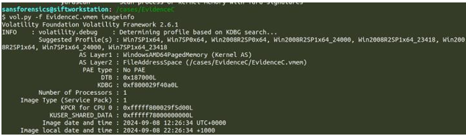

**What to look for:**
- `vol.py -f EvidenceC.vmem imageinfo` command
- Suggested Profile(s): Win7SP1x64 listed first
- Image date and time: 2024-09-08 22:26:34 UTC
- This is Sophia's laptop — not Alex's

---

### 21 - Registry Hives
**File:** `21-registry-hives.png`
**README reference:** [Evidence C — Memory Dump](../README.md#evidence-c--memory-dump-personal-laptop)

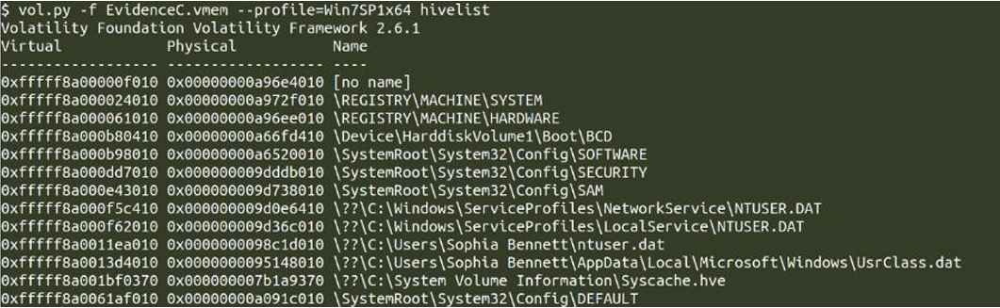

**What to look for:**
- `vol.py -f EvidenceC.vmem --profile=Win7SP1x64 hivelist` command
- Critical line: `C:\Users\Sophia Bennett\ntuser.dat` — this reveals the logged-in user
- Standard Windows hives: SYSTEM, SOFTWARE, SAM, SECURITY, DEFAULT all present
- NTUSER.DAT path confirms the laptop owner is Sophia Bennett

---

### 22 - PSList Processes
**File:** `22-pslist-processes.png`
**README reference:** [Q9 — Running applications](../README.md#q9--running-applications)

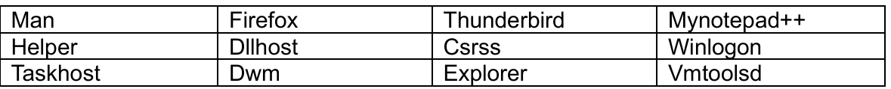

**What to look for:**
- `vol.py -f EvidenceC.vmem --profile=Win7SP1x64 pslist` command
- Key processes: firefox.exe (PID 3512), thunderbird.exe (PID 1892), Mynotepad++.exe (PID 4360)
- System processes: csrss.exe, winlogon.exe, explorer.exe, dwm.exe
- vmtoolsd.exe confirms this is running inside VMware

---

### 23 - Netscan Connections
**File:** `23-netscan-connections.png`
**README reference:** [Q10 — Recently visited web pages](../README.md#q10--recently-visited-web-pages)

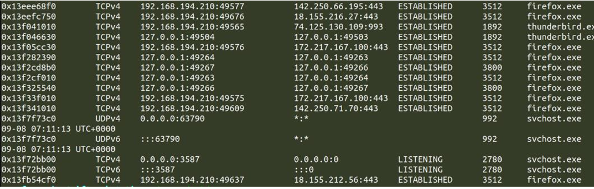

**What to look for:**
- `vol.py -f EvidenceC.vmem --profile=Win7SP1x64 netscan` command
- firefox.exe connections to 142.250.66.195:443 and 172.217.167.100:443 (Google services — ESTABLISHED)
- thunderbird.exe connections to 74.125.130.109:993 (Gmail IMAP — ESTABLISHED)
- All connections showing ESTABLISHED state — active at time of memory capture

---

### 24 - Sophia Email Strings
**File:** `24-sophia-email-strings.png`
**README reference:** [Q11 — Owner identity and connection to case](../README.md#q11--owner-identity-and-connection-to-case)

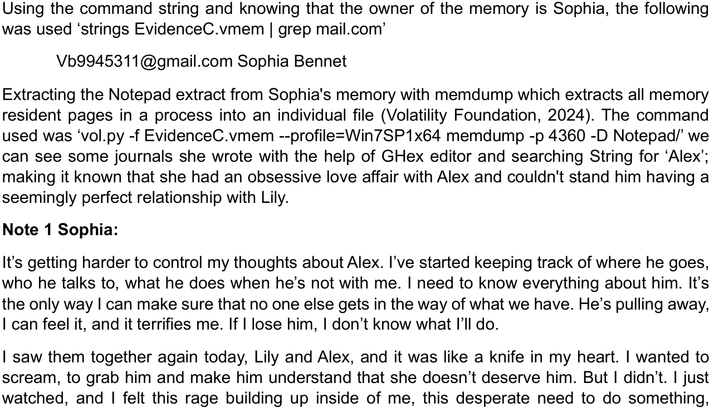

**What to look for:**
- `strings EvidenceC.vmem | grep "gmail.com"` command
- Result: Vb9945311@gmail.com  Sophia Bennet
- This email address matches the "ArtLover99" account from the network capture
- Confirms the laptop owner is the same Sophia from Alex's private chat

---

### 25 - Sophia Journal Notepad
**File:** `25-sophia-journal-notepad.png`
**README reference:** [Q11 — Owner identity and connection to case](../README.md#q11--owner-identity-and-connection-to-case)

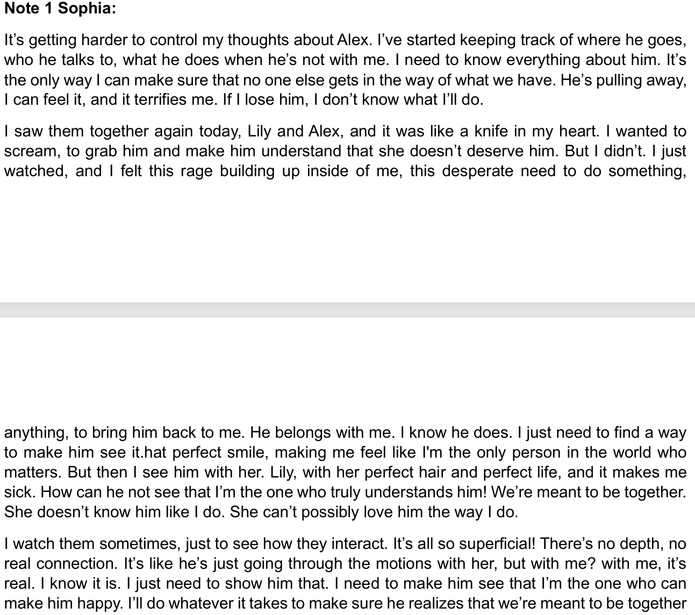

**What to look for:**
- GHex editor open with the Notepad++ memdump file
- Search string "Alex" highlighted in the hex view
- Readable text visible in the right pane showing journal entries
- Key phrases: "keeping track of where he goes", "I'll do whatever it takes"
- Obsessive surveillance behaviour documented in her own words

---

### 26 - LSAdump Password
**File:** `26-lsadump-password.png`
**README reference:** [Q12 — Computer password](../README.md#q12--computer-password)

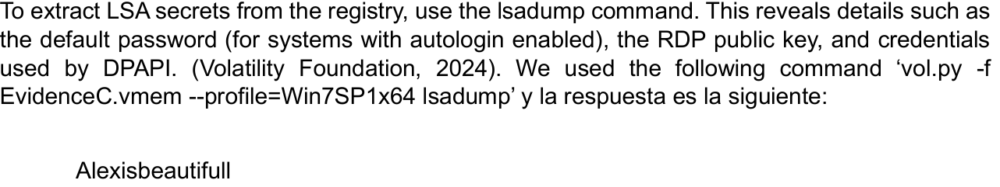

**What to look for:**
- `vol.py -f EvidenceC.vmem --profile=Win7SP1x64 lsadump` command
- Default password (autologin): `Alexisbeautifull`
- This password is not a coincidence — it is direct evidence of obsession

---

## Evidence D — Mobile Phone

### 27 - Non-Stock APKs
**File:** `27-non-stock-apks.png`
**README reference:** [Q13 — Non-stock applications](../README.md#q13--non-stock-applications)

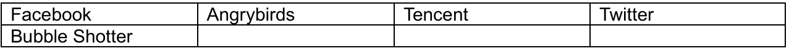

**What to look for:**
- `find /mnt/e01 -name "*.apk"` command
- APK paths visible for: Facebook, Angry Birds, Tencent, Twitter, Bubble Shooter
- Paths showing the app package names (com.facebook.katana etc.)

---

### 28 - Call History
**File:** `28-call-history.png`
**README reference:** [Q14 — Contacts, messages, and calls](../README.md#q14--contacts-messages-and-calls)

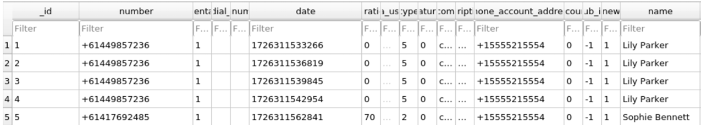

**What to look for:**
- SQLite browser open with calllog.db
- 4 calls to Lily Parker (+61449857236) in rapid succession — all no answer (duration 0)
- 1 call to Sophia Bennett (+61417692485) — duration 70 seconds (connected)
- All calls within 30 seconds of each other: 10:58:53 to 10:59:22 UTC
- This sequence shows desperation — trying Lily repeatedly then immediately calling Sophia

---

### 29 - Contact List
**File:** `29-contact-list.png`
**README reference:** [Q14 — Contacts, messages, and calls](../README.md#q14--contacts-messages-and-calls)

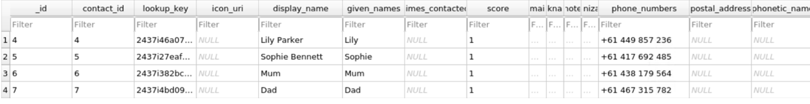

**What to look for:**
- SQLite browser open with contacts2.db
- 4 contacts visible: Lily Parker, Sophie Bennett, Mum, Dad
- Contact IDs show gaps (4, 5, 6, 7) — IDs 1, 2, 3 were deleted
- Alex deliberately removed at least 3 contacts before his death

---

### 30 - Deleted Contacts Hex
**File:** `30-deleted-contacts-hex.png`
**README reference:** [Q14 — Contacts, messages, and calls](../README.md#q14--contacts-messages-and-calls)

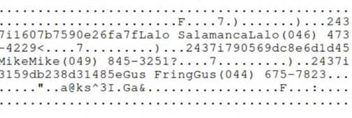

**What to look for:**
- Bless hex editor open with icing_contacts.db-wal (Write-Ahead Log file)
- Readable strings visible: names and phone numbers of deleted contacts
- Partial names recovered from the WAL backup buffer
- This proves Alex deleted the contacts — WAL files capture the state before deletion

---

### 31 - SMS Messages
**File:** `31-sms-messages.png`
**README reference:** [Q14 — Contacts, messages, and calls](../README.md#q14--contacts-messages-and-calls)

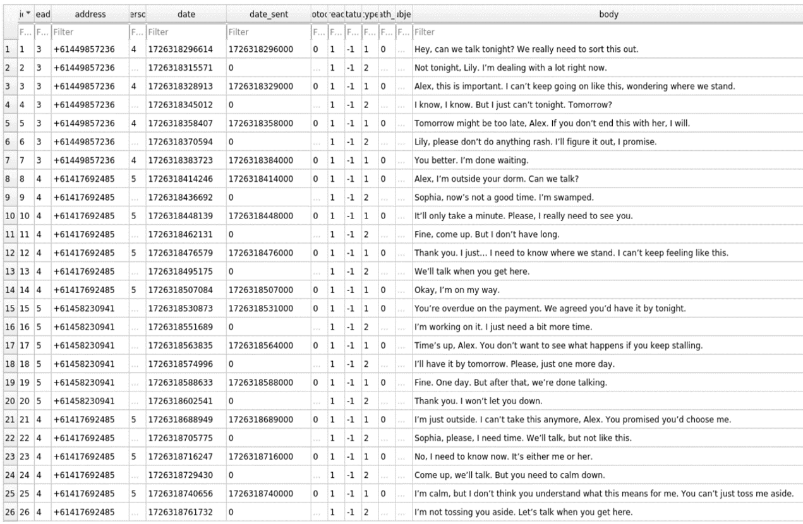

**What to look for:**
- SQLite browser open with mmssms.db
- 26 message rows visible
- Three phone numbers: Lily (+61449857236), Sophia (+61417692485), Unknown (+61458230941)
- Message bodies visible in the body column
- Unknown number messages contain payment threats: "Time's up. You don't want to see what happens"
- Timestamps showing all activity compressed into ~8 minutes (12:51 – 12:59 UTC)

---

### 32 - Browser Search History
**File:** `32-browser-search-history.png`
**README reference:** [Q15 — Internet search history](../README.md#q15--internet-search-history)

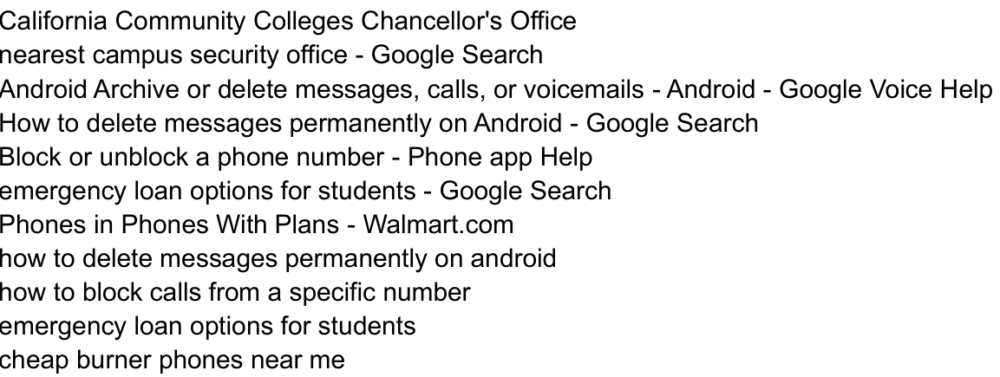

**What to look for:**
- SQLite browser open with the History database
- Search queries visible: "how to delete messages permanently on android", "cheap burner phones near me", "nearest campus security office", "emergency loan options for students"
- The combination of these searches tells a clear story: Alex was scared, trying to hide evidence, and knew he was in danger
- Timestamps of searches showing this happened in the days before September 14

---

### 33 - Alex and Sophia Photos
**File:** `33-alex-sophia-photos.png`
**README reference:** [Q16 — Additional evidence linking owner to case](../README.md#q16--additional-evidence-linking-owner-to-case)

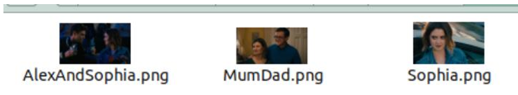

**What to look for:**
- Three images in the download folder: AlexAndSophia.png, MumDad.png, Sophia.png
- Alex had photos of Sophia and her parents on his phone — confirms a real relationship, not casual
- These photos are on HIS phone — meaning Sophia shared them with him or he took them

---

### 34 - Encrypted Recording
**File:** `34-encrypted-recording.png`
**README reference:** [Q16 — Additional evidence linking owner to case](../README.md#q16--additional-evidence-linking-owner-to-case)

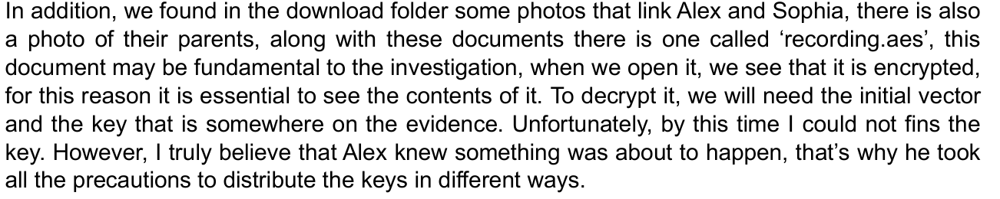

**What to look for:**
- `file recording.aes` output showing: data (encrypted binary — no recognisable header)
- Hex editor showing random-looking bytes with no readable strings
- No magic number visible — properly AES encrypted
- The decryption key was never found in any of the four evidence items
- This may be the most critical undiscovered piece of evidence in the case

---

## Summary Table

| # | Filename | Evidence | Key Content |
|---|----------|----------|-------------|
| 01 | `01-evidenceA-disk-info.png` | A — Disk | img_stat + mmls output |
| 02 | `02-winver-registered-owner.png` | A — Disk | Windows version + registered owner |
| 03 | `03-compname-hostname.png` | A — Disk | Computer hostname DESKTOP-0N2DC4F |
| 04 | `04-sam-usernames.png` | A — Disk | All 5 user accounts from SAM |
| 05 | `05-alex-user-activity.png` | A — Disk | Alex Marshall login timestamps |
| 06 | `06-program-files.png` | A — Disk | 64-bit installed applications |
| 07 | `07-program-files-x86.png` | A — Disk | 32-bit installed applications |
| 08 | `08-downloads-folder.png` | A — Disk | Installer files in Downloads |
| 09 | `09-university-warning.png` | A — Disk | Recovered university warning letter |
| 10 | `10-last-will-testament.png` | A — Disk | Recovered last will disguised as .jpg |
| 11 | `11-alex-personal-documents.png` | A — Disk | Personal documents folder overview |
| 12 | `12-debt-tracker.png` | A — Disk | $7,450 debt spreadsheet |
| 13 | `13-journal-1.png` | A — Disk | Journal entry Feb 28 — exam selling |
| 14 | `14-journal-2.png` | A — Disk | Journal entry Apr 5 — drowning in debt |
| 15 | `15-cheatchat-stream.png` | B — Network | CheatChat group exam sales conversation |
| 16 | `16-dormking-partydude-stream.png` | B — Network | DormKing theft plot against Alex |
| 17 | `17-http-user-agents.png` | B — Network | IP addresses, browsers, OS per endpoint |
| 18 | `18-ftp-stream-694.png` | B — Network | FTP sslkeyfile upload (theft evidence) |
| 19 | `19-pub-directory.png` | B — Network | FTP pub directory listing |
| 20 | `20-evidenceC-imagetype.png` | C — Memory | Volatility imageinfo — Win7SP1x64 |
| 21 | `21-registry-hives.png` | C — Memory | Hivelist showing Sophia Bennett |
| 22 | `22-pslist-processes.png` | C — Memory | Active processes — Firefox, Thunderbird, Notepad++ |
| 23 | `23-netscan-connections.png` | C — Memory | Active TCP connections at time of dump |
| 24 | `24-sophia-email-strings.png` | C — Memory | Sophia's Gmail address from strings |
| 25 | `25-sophia-journal-notepad.png` | C — Memory | Obsessive journal entries in GHex |
| 26 | `26-lsadump-password.png` | C — Memory | Password: Alexisbeautifull |
| 27 | `27-non-stock-apks.png` | D — Mobile | APK files found on Android image |
| 28 | `28-call-history.png` | D — Mobile | Call log — 4x Lily no answer, Sophia connected |
| 29 | `29-contact-list.png` | D — Mobile | 4 contacts with gaps showing deletions |
| 30 | `30-deleted-contacts-hex.png` | D — Mobile | WAL file showing deleted contact data |
| 31 | `31-sms-messages.png` | D — Mobile | All SMS including debt threats |
| 32 | `32-browser-search-history.png` | D — Mobile | Searches revealing fear and cover-up |
| 33 | `33-alex-sophia-photos.png` | D — Mobile | Photos of Sophia on Alex's phone |
| 34 | `34-encrypted-recording.png` | D — Mobile | Uncracked recording.aes file |
