# 📸 Screenshots Index

This file documents every screenshot in this repository. Each entry includes:
- **What it shows** — the exact screen/state captured
- **Where it appears** in the main README
- **What to look for** — key elements to notice in the screenshot

Place your `.png` files in this folder using the filenames listed below.

> **Naming convention:** `NN-short-description.png` where `NN` is a zero-padded number matching the order in the walkthrough.

---

## Phase 1 — Infrastructure Setup

### 01 - Elasticsearch Installation
**File:** `01-elasticsearch-install.png`

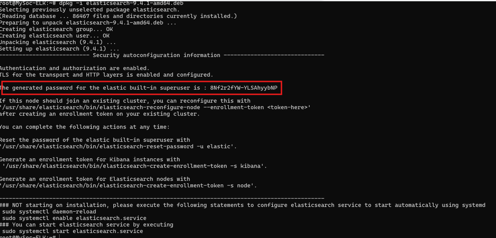

**README reference:** [Phase 1.1 — Elasticsearch Installation](../README.md#11-elasticsearch-installation)

**What to look for:**
- The auto-generated password line: `The generated password for the elastic built-in superuser is:`
- The three utility commands (reset password, generate Kibana token, generate node token)
- The dashed separator lines framing the block

---

### 02 - Elasticsearch Configuration
**File:** `02-elasticsearch-config.png`
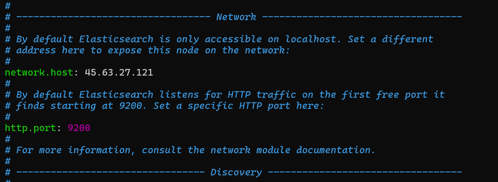
**README reference:** [Phase 1.1 — Elasticsearch Installation](../README.md#11-elasticsearch-installation)

**What to look for:**
- `network.host` set to `0.0.0.0` or the server's IP
- `http.port: 9200`
- Any commented-out defaults vs. active settings

---

### 03 - Kibana Enrollment Token
**File:** `03-kibana-token.png`
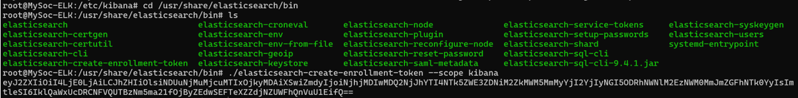
**README reference:** [Phase 1.2 — Kibana Deployment](../README.md#12-kibana-deployment)

**What to look for:**
- The full enrollment token string printed to stdout
- No error messages in stderr

---

### 04 - Kibana Login Page
**File:** `04-kibana-login.png`
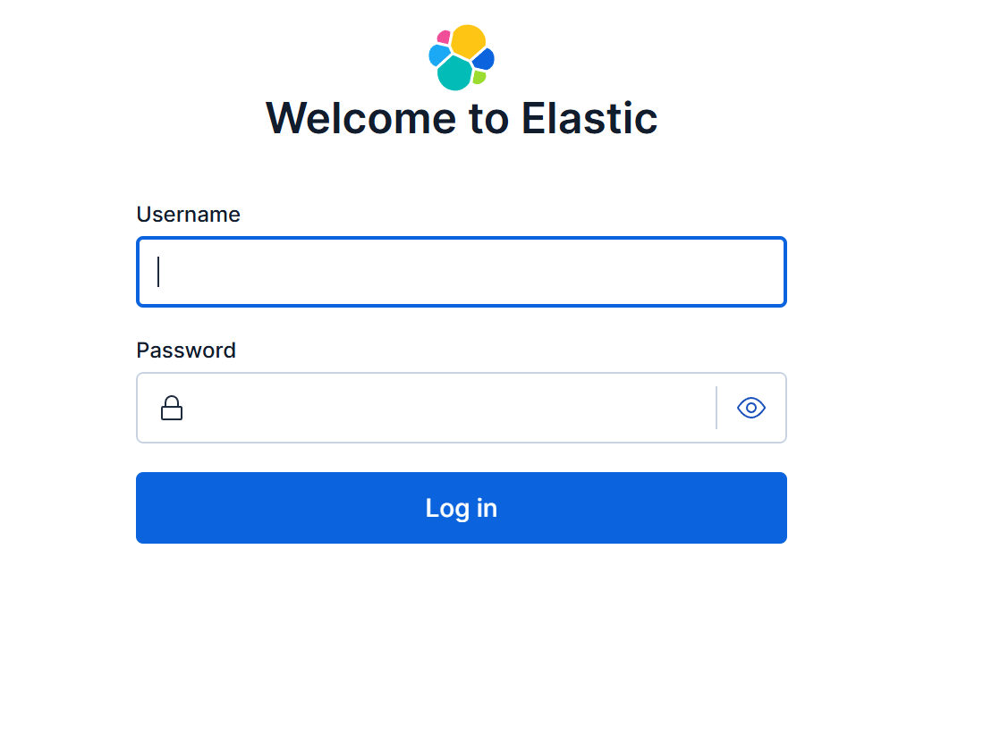
**README reference:** [Phase 1.2 — Kibana Deployment](../README.md#12-kibana-deployment)

**What to look for:**
- The Elastic logo and "Welcome to Elastic" heading
- Username and password input fields
- No SSL/TLS errors in the browser

---

### 05 - Firewall Rules
**File:** `05-firewall-rules.png`
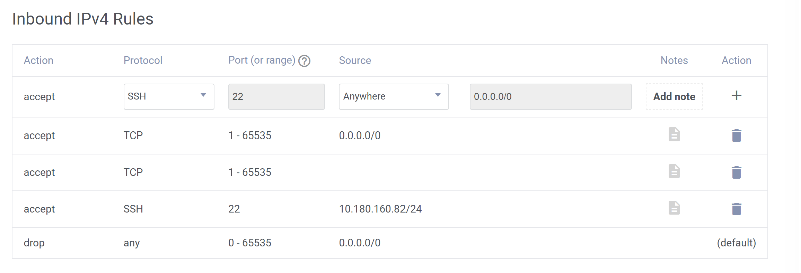
**README reference:** [Phase 1.3 — Firewall Configuration](../README.md#13-firewall-configuration)

**What to look for:**
- Port 22 restricted to your IP only (not 0.0.0.0/0)
- Port 5601 (Kibana) rule
- Port 9200 (Elasticsearch) rule
- Port 8220 (Fleet Server) rule
- Source IPs are specific (not open to everyone)

---

## Phase 2 — Agent Deployment

### 06 - Fleet Server Setup
**File:** `06-fleet-server-setup.png`
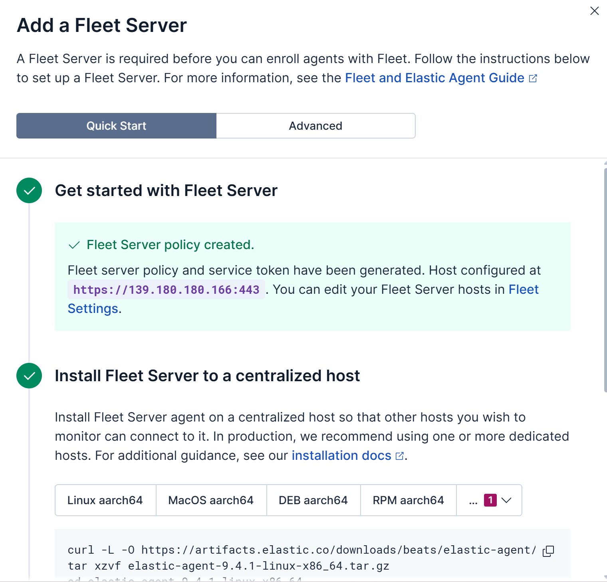
**README reference:** [Phase 2.1 — Fleet Server](../README.md#21-fleet-server)

**What to look for:**
- Fleet Server host URL configured
- "Quick Start" option selected
- The generated enrollment command that you'll run on the Fleet Server machine

---

### 07 - Windows Agent Installation
**File:** `07-windows-agent-install.png`
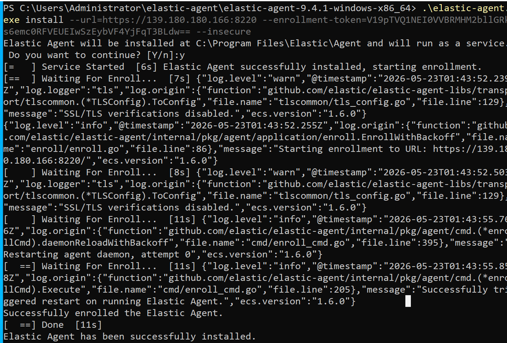
**README reference:** [Phase 2.2 — Windows Agent](../README.md#22-windows-agent-soc-win-jop)

**What to look for:**
- The install command with `--url`, `--enrollment-token`, and `--insecure` flags visible
- Success message from the installer
- No error messages

---

### 08 - Linux Agent Installation
**File:** `08-linux-agent-install.png`
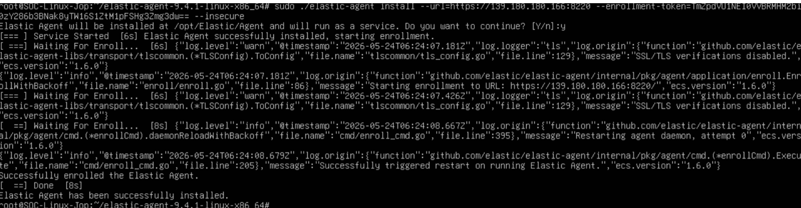
**README reference:** [Phase 2.3 — Linux Agent](../README.md#23-linux-agent-soc-linux-jop)

**What to look for:**
- Both agents showing green "Healthy" status in Fleet
- Agent names matching: `SOC-WIN-JOP` and `SOC-Linux-Jop`
- Policy assignments shown correctly

---

## Phase 3 — Sysmon & Data Ingestion

### 09 - Sysmon Installation
**File:** `09-sysmon-install.png`
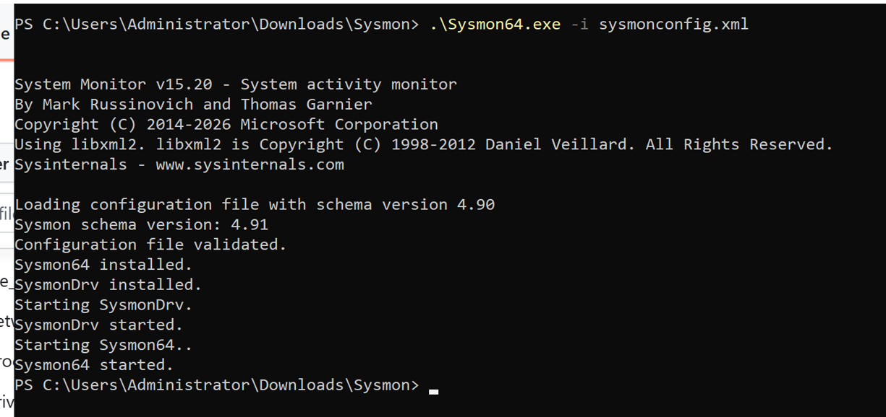
**README reference:** [Phase 3.1 — Sysmon Installation](../README.md#31-sysmon-installation)

**Command shown:**
```
.\Sysmon64.exe -accepteula -i .\sysmonconfig.xml
```

**What to look for:**
- "Sysmon64 installed" or similar success message
- The config file being applied (sysmonconfig.xml referenced)
- No error messages

---

### 10 - Sysmon Event Viewer
**File:** `10-sysmon-event-viewer.png`
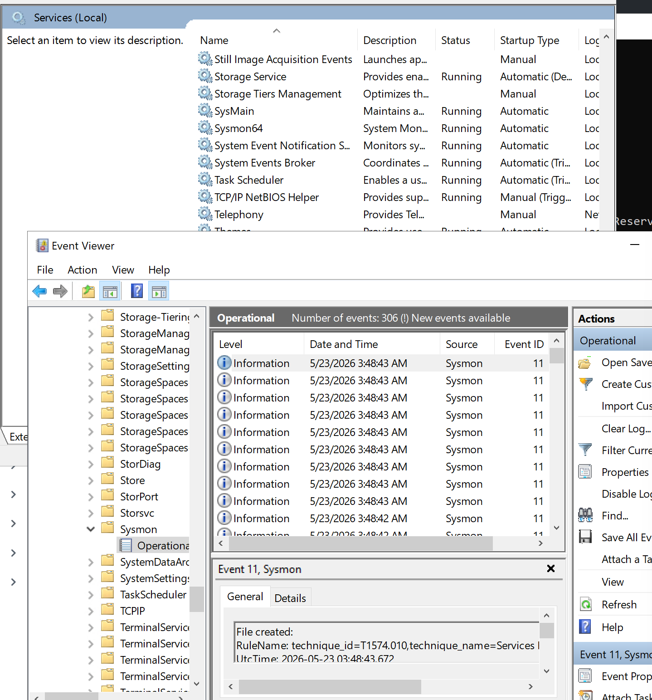
**README reference:** [Phase 3.1 — Sysmon Installation](../README.md#31-sysmon-installation)

**What to look for:**
- Events populating in the log (Event IDs 1, 3, 7, etc.)
- Sysmon service showing as running in `services.msc`
- The event detail pane showing a sample process creation event (ID 1) with fields like `CommandLine`, `Image`, `ParentImage`

---

### 11 - Windows Event Log Integration
**File:** `11-event-log-integration.png`

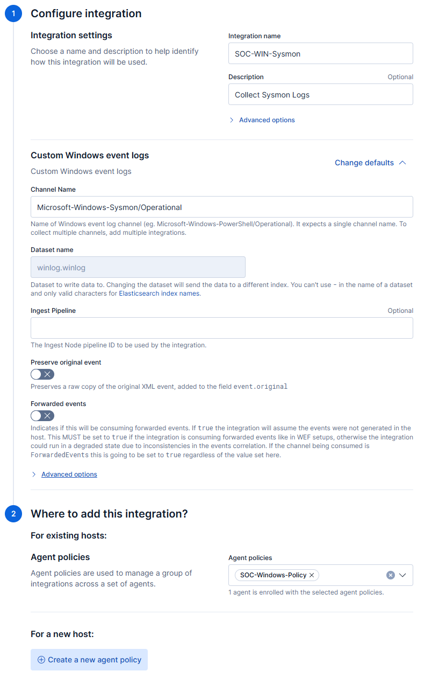
**README reference:** [Phase 3.2 — Windows Event Log Integration](../README.md#32-windows-event-log-integration)

**What to look for:**
- The custom channel name: `Microsoft-Windows-Sysmon/Operational`
- The integration settings for the Windows agent policy

---

### 12 - Defender Event Integration
**File:** `12-defender-integration.png`
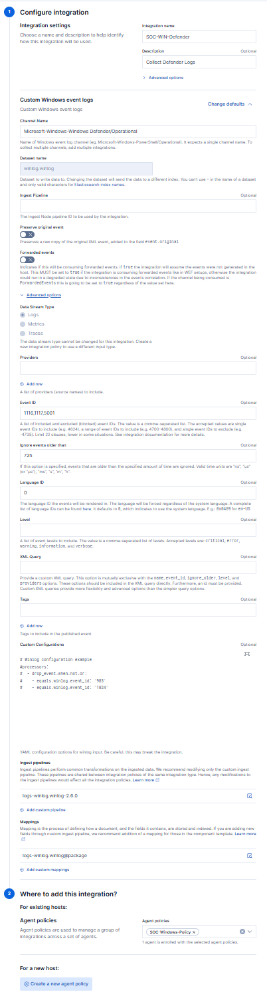
**README reference:** [Phase 3.2 — Windows Event Log Integration](../README.md#32-windows-event-log-integration)

**What to look for:**
- Defender channel: `Microsoft-Windows-Windows Defender/Operational`
- Event IDs filtered: 1116 (malware detected), 1117 (malware action taken), 5001 (real-time protection disabled)

---

## Phase 4 — Detection Engineering

### 13 - SSH Brute Force Alert
**File:** `13-ssh-alert-config.png`
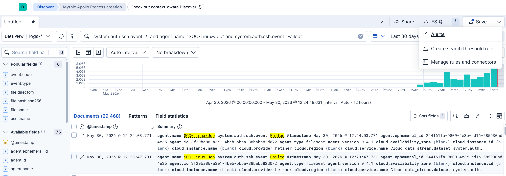
**README reference:** [Phase 4.1 — SSH Brute Force Alert](../README.md#41-ssh-brute-force-alert)

**What to look for:**
- The KQL query: `system.auth.ssh.event: "Failed" and agent.name: "SOC-Linux-Jop"`
- Threshold set to 5
- Group by fields: `source.ip`, `user.name`
- Time window: 5 minutes

---

### 14 - SSH Brute Force Map Dashboard
**File:** `14-ssh-map-dashboard.png`
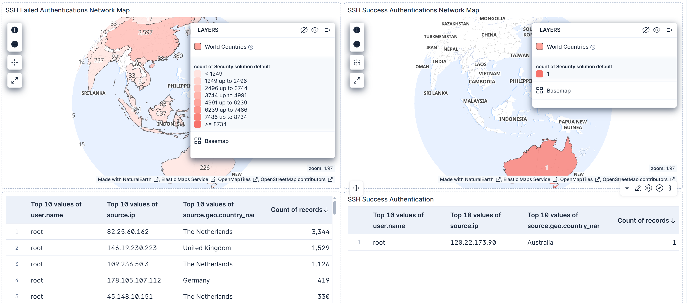

**README reference:** [Phase 4.1 — SSH Brute Force Alert](../README.md#41-ssh-brute-force-alert)

**What to look for:**
- World map with country-level color gradients
- Tooltip showing country name and attack count when hovering
- Majority of attacks visible from specific regions (e.g., Eastern Europe, Asia)

---

### 15 - RDP Brute Force Alert
**File:** `15-rdp-alert.png`
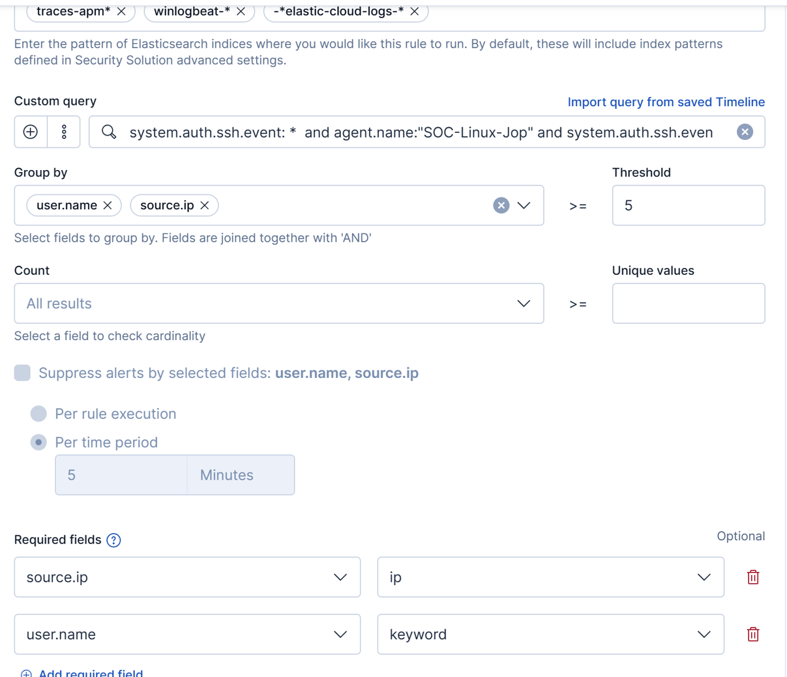
**README reference:** [Phase 4.2 — RDP Brute Force Alert](../README.md#42-rdp-brute-force-alert)

**What to look for:**
- Query: `event.code: "4625" and agent.name: "SOC-WIN-JOP"`
- Alert name and severity configured
- Schedule/threshold settings

---

### 16 - RDP Activity Dashboard
**File:** `16-rdp-dashboard.png`
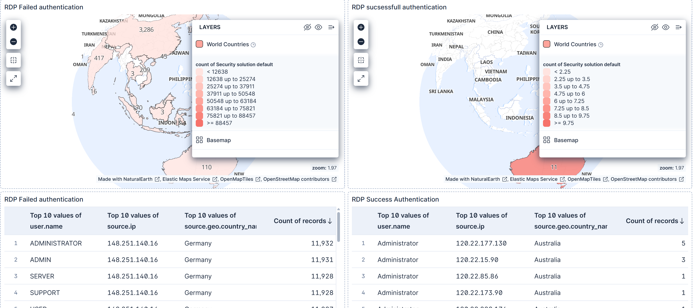
**README reference:** [Phase 4.2 — RDP Brute Force Alert](../README.md#42-rdp-brute-force-alert)


**What to look for:**
- Multiple visualization panels on one dashboard
- Time filter applied showing recent activity
- Both failed (4625) and successful (4624 LogonType:10) events visible

---

### 17 - RDP Map
**File:** `17-rdp-map.png`
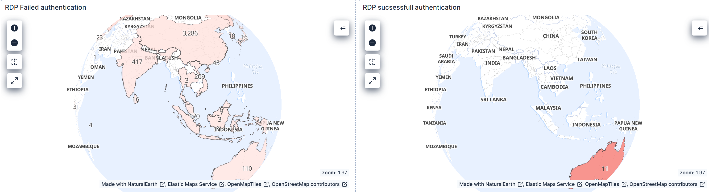
**README reference:** [Phase 4.3 — Dashboards](../README.md#43-dashboards)


---

### 18 - RDP Tables
**File:** `18-rdp-tables.png`
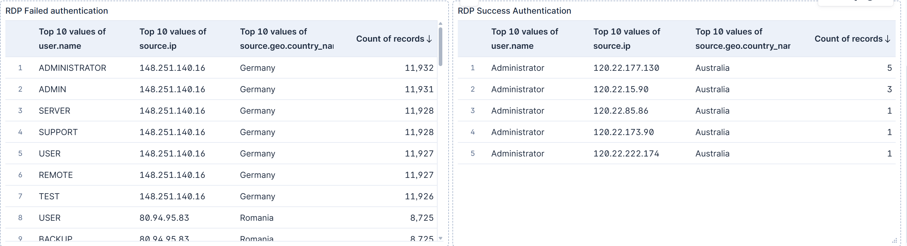
**README reference:** [Phase 4.3 — Dashboards](../README.md#43-dashboards)

**What to capture:** The table visualizations within the RDP dashboard showing IP addresses, usernames, timestamps, and logon types side by side.

---

## Phase 5 — Attack Simulation

### 19 - Mythic C2 Installation
**File:** `19-mythic-install.png`
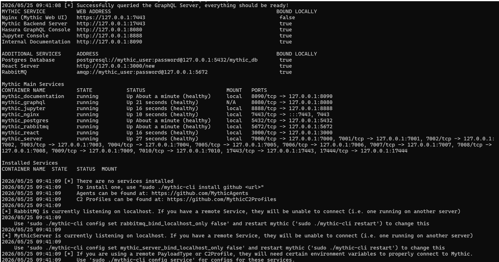
**README reference:** [Phase 5.1 — Mythic C2 Setup](../README.md#51-mythic-c2-setup)

**What to look for:**
- All Mythic service containers starting (mythic_server, mythic_postgres, mythic_rabbitmq, etc.)
- No container crash/exit messages
- The final line indicating Mythic is accessible on port 7443

---

### 20 - Mythic Web UI
**File:** `20-mythic-ui.png`
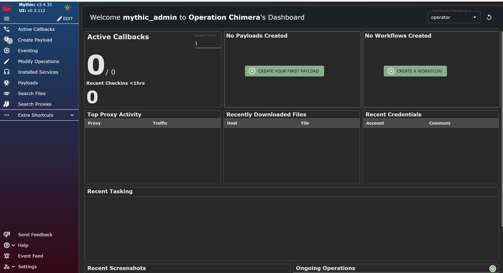
**README reference:** [Phase 5.1 — Mythic C2 Setup](../README.md#51-mythic-c2-setup)

**What to look for:**
- Mythic dashboard homepage
- Navigation showing: Payloads, Callbacks, Operations sections
- Apollo and HTTP C2 profile listed as installed agents/profiles

---

### 21 - Apollo Payload Creation
**File:** `21-apollo-payload.png`
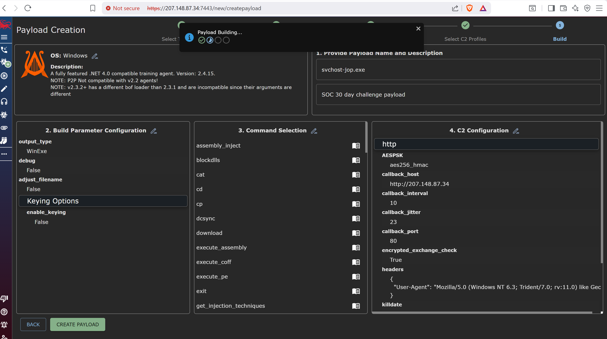
**README reference:** [Phase 5.2 — Apollo Agent & Payload](../README.md#52-apollo-agent--payload)


**What to look for:**
- Agent: Apollo selected
- OS: Windows x64
- C2 Profile: HTTP selected
- Callback host set to the Mythic server's IP
- "Include all commands" option selected

---

### 22 - Hydra RDP Brute Force
**File:** `22-hydra-attack.png`
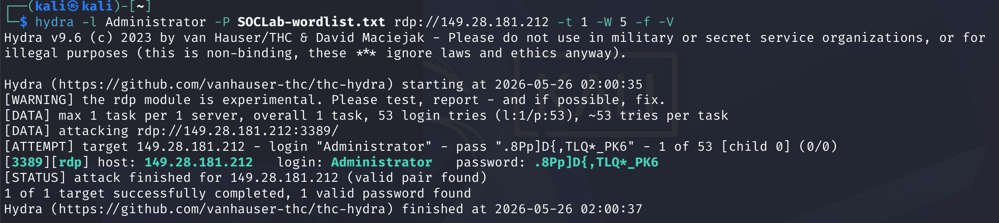
**README reference:** [Phase 5.3 — Attack Execution](../README.md#53-attack-execution)

**What to look for:**
- The `hydra` command with all flags visible
- Hydra's per-attempt output (`[ATTEMPT]` lines)
- The green `[SUCCESS]` or `[3389][rdp]` line showing the discovered password
- The attack stopping after first success (`-f` flag working)

---

### 23 - RDP Session from Kali
**File:** `23-rdp-from-kali.png`
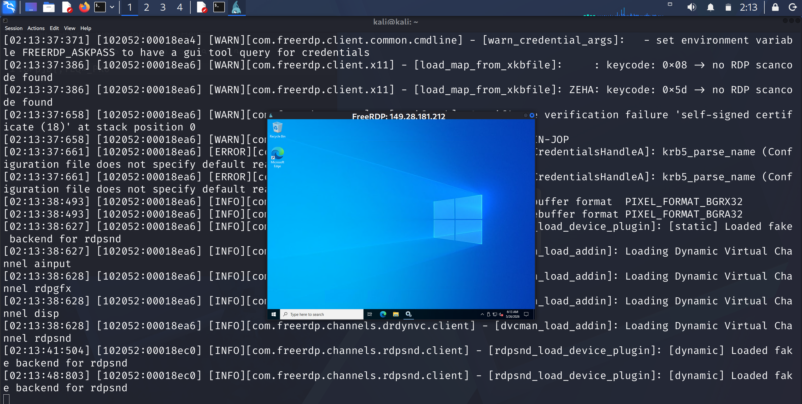
**README reference:** [Phase 5.3 — Attack Execution](../README.md#53-attack-execution)


**What to look for:**
- Windows desktop visible inside the Kali terminal/window
- The `xfreerdp` command in the terminal that launched it
- Confirmation of successful RDP session establishment

---

### 24 - Mythic C2 Callback
**File:** `24-mythic-callback.png`
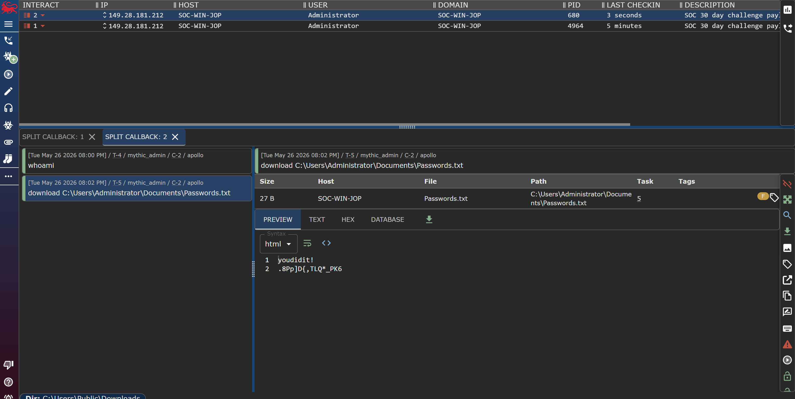
**README reference:** [Phase 5.3 — Attack Execution](../README.md#53-attack-execution)

**What to look for:**
- New callback entry with the victim machine's hostname or IP
- Callback showing "Active" / green status
- Agent: Apollo
- The interaction shell/tasking panel available

---

## Phase 6 — Ticketing Integration

### 25 - osTicket Setup
**File:** `25-osticket-setup.png`
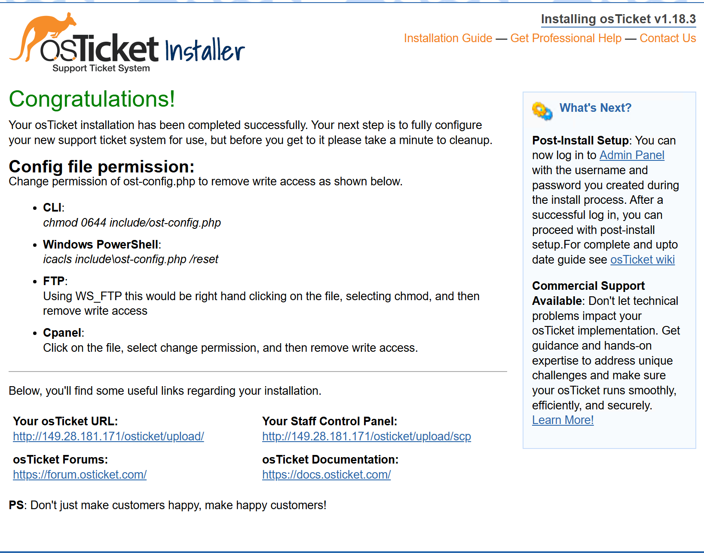
**README reference:** [Phase 6.1 — osTicket Setup](../README.md#61-osticket-setup-windows--xampp)

**What to look for:**
- Database connection details filled in
- Admin account email and password fields
- Installer showing "all requirements met" (green checkmarks)

---

### 26 - osTicket Portal
**File:** `26-osticket-portal.png`
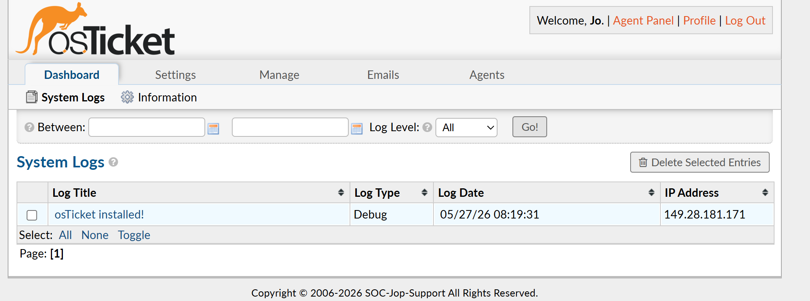
**README reference:** [Phase 6.1 — osTicket Setup](../README.md#61-osticket-setup-windows--xampp)

**What to look for:**
- osTicket dashboard showing ticket queue
- Navigation: Tickets, Knowledgebase, Admin Panel
- Confirmation that the system is operational

---

### 27 - Elastic Webhook Connector
**File:** `27-webhook-connector.png`
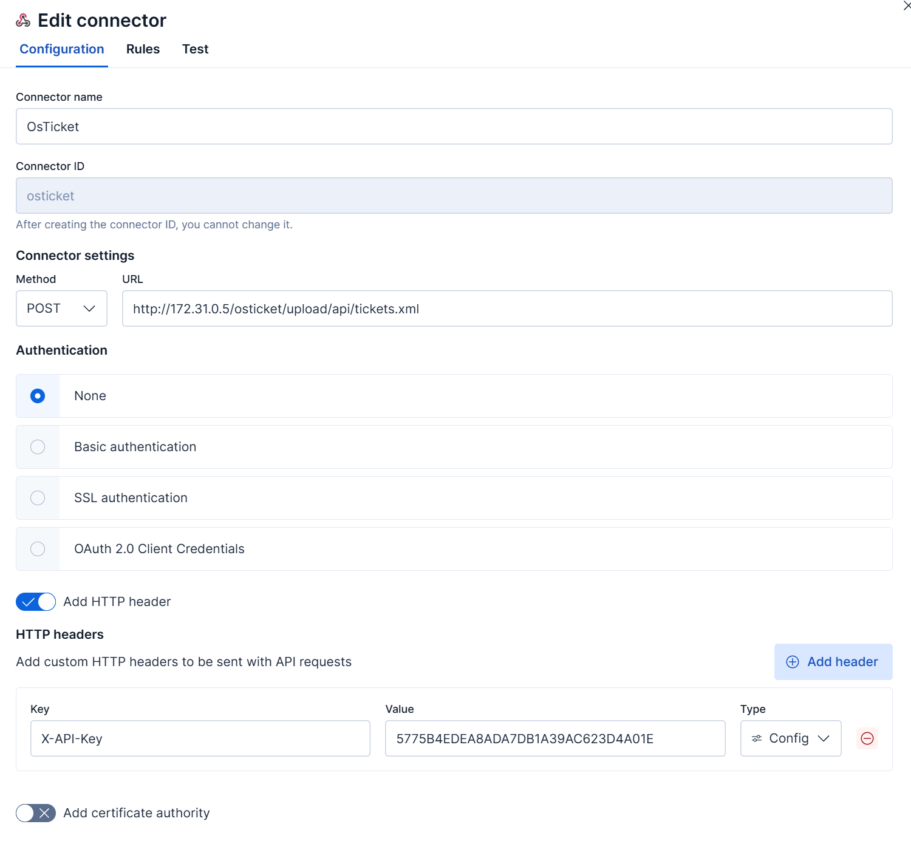
**README reference:** [Phase 6.2 — Elastic → osTicket Webhook Integration](../README.md#62-elastic--osticket-webhook-integration)

**What to look for:**
- URL field pointing to osTicket API endpoint
- HTTP Method: POST
- Header: `X-API-Key` with the osTicket API key
- Content-Type: `application/json`

---

### 28 - Auto-Generated Ticket
**File:** `28-osticket-ticket.png`
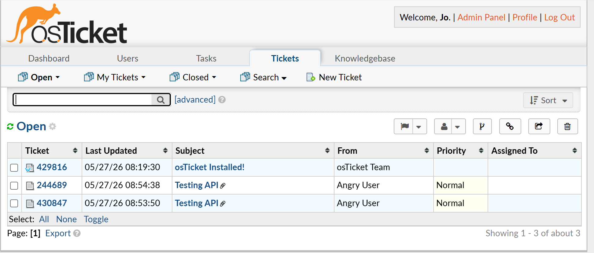
**README reference:** [Phase 6.2 — Elastic → osTicket Webhook Integration](../README.md#62-elastic--osticket-webhook-integration)

**What to look for:**
- Ticket subject matching the alert name (e.g., "SSH Brute Force Detected")
- Ticket body containing alert details (IP, timestamp, count)
- Ticket source: API
- Auto-assignment and priority set

---

## Phase 7 — Threat Hunting

### 29 - Mythic C2 Hunting
**File:** `29-c2-hunting.png`
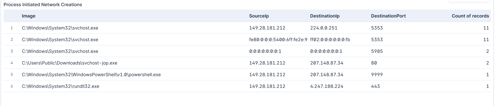
**README reference:** [Phase 7.2 — Mythic C2 Detection & Hunting](../README.md#72-mythic-c2-detection--hunting)

**What to look for:**
- Destination IP matching the Mythic server
- Port 80 connections indicating HTTP C2 beaconing
- Regular time intervals (beaconing pattern visible in the timeline)

---

### 30 - Attack Timeline
**File:** `30-c2-timeline.png`
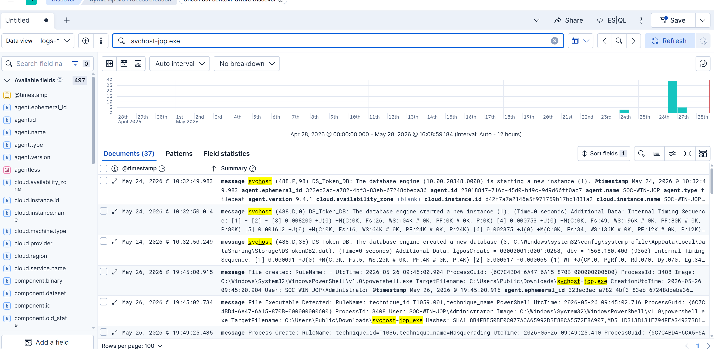
**README reference:** [Phase 7.2 — Mythic C2 Detection & Hunting](../README.md#72-mythic-c2-detection--hunting)

**What to capture:** A Kibana view showing the sequence of attacker activity reconstructed from Sysmon events — the full attack timeline from initial access to C2 establishment.

**Expected event sequence visible:**
1. Event ID 4625 — Failed RDP attempts (brute force)
2. Event ID 4624 LogonType:10 — Successful RDP logon
3. Suspicious commands: whoami, ipconfig, net user (Event ID 4688/Sysmon 1)
4. Event ID 5001 — Windows Defender disabled
5. Event ID 1 — Payload (svchost-jop.exe) execution
6. Event ID 3 — C2 callback connection to Mythic IP

---

## Phase 8 — Elastic EDR

### 31 - EDR Malware Prevention
**File:** `31-edr-prevention.png`
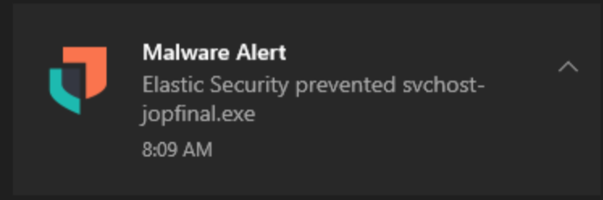
**README reference:** [Phase 8 — Elastic EDR](../README.md#phase-8--elastic-edr)

**What to look for:**
- Windows security notification: "Threat found" or "Action blocked"
- The process failing to start
- Elastic Defend's real-time protection kicking in

---

### 32 - EDR Alert Detail
**File:** `32-edr-alert.png`
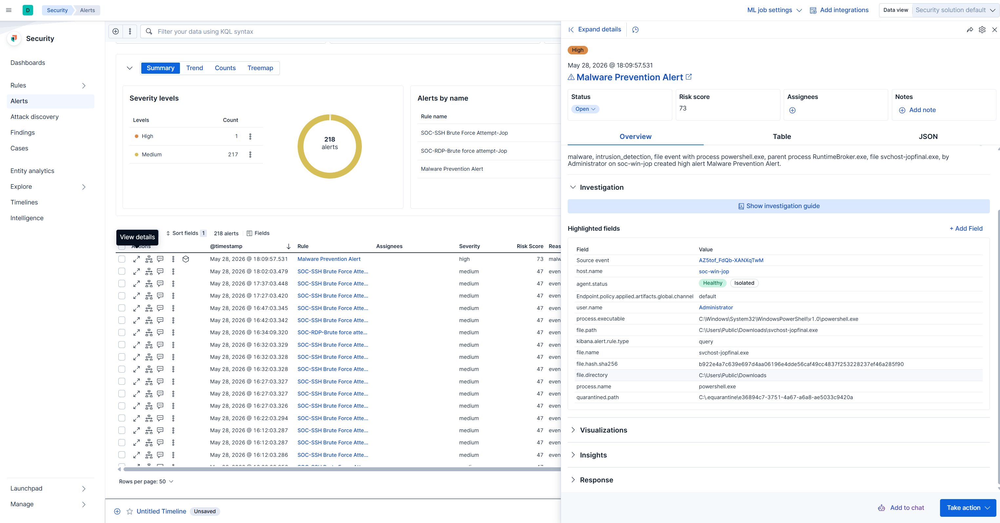
**README reference:** [Phase 8 — Elastic EDR](../README.md#phase-8--elastic-edr)

**What to look for:**
- Alert severity: Critical or High
- Alert type: "Malware Prevention Alert"
- Process name: svchost-jop.exe (or whatever the payload was named)
- File hash matching the Apollo payload hash
- Action: "prevented" (not just detected)
- Host isolation option available

---

## Summary Table

| # | Filename | Phase | Key Content |
|---|----------|-------|-------------|
| 01 | `01-elasticsearch-install.png` | Infrastructure | Security autoconfiguration block with auto password |
| 02 | `02-elasticsearch-config.png` | Infrastructure | elasticsearch.yml network settings |
| 03 | `03-kibana-token.png` | Infrastructure | Kibana enrollment token in terminal |
| 04 | `04-kibana-login.png` | Infrastructure | Kibana browser login page |
| 05 | `05-firewall-rules.png` | Infrastructure | Cloud firewall inbound rules |
| 06 | `06-fleet-server-setup.png` | Agents | Fleet Server setup in Kibana |
| 07 | `07-windows-agent-install.png` | Agents | PowerShell agent installation |
| 08 | `08-linux-agent-install.png` | Agents | Linux agent install + both agents healthy |
| 09 | `09-sysmon-install.png` | Sysmon | Sysmon installation terminal output |
| 10 | `10-sysmon-event-viewer.png` | Sysmon | Sysmon events in Event Viewer |
| 11 | `11-event-log-integration.png` | Ingestion | Sysmon channel in Fleet integration |
| 12 | `12-defender-integration.png` | Ingestion | Defender channel in Fleet integration |
| 13 | `13-ssh-alert-config.png` | Detection | SSH brute force alert configuration |
| 14 | `14-ssh-map-dashboard.png` | Detection | SSH attacks world map |
| 15 | `15-rdp-alert.png` | Detection | RDP brute force alert configuration |
| 16 | `16-rdp-dashboard.png` | Detection | RDP full activity dashboard |
| 17 | `17-rdp-map.png` | Detection | RDP attackers world map |
| 18 | `18-rdp-tables.png` | Detection | RDP failed/success tables |
| 19 | `19-mythic-install.png` | Red Team | Mythic Docker containers starting |
| 20 | `20-mythic-ui.png` | Red Team | Mythic web UI dashboard |
| 21 | `21-apollo-payload.png` | Red Team | Apollo payload creation form |
| 22 | `22-hydra-attack.png` | Red Team | Hydra brute force + success output |
| 23 | `23-rdp-from-kali.png` | Red Team | RDP session open on Kali |
| 24 | `24-mythic-callback.png` | Red Team | Active C2 callback in Mythic |
| 25 | `25-osticket-setup.png` | Ticketing | osTicket web installer |
| 26 | `26-osticket-portal.png` | Ticketing | osTicket SCP portal |
| 27 | `27-webhook-connector.png` | Ticketing | Kibana webhook connector config |
| 28 | `28-osticket-ticket.png` | Ticketing | Auto-generated alert ticket |
| 29 | `29-c2-hunting.png` | Hunting | Sysmon Event ID 3 C2 beaconing |
| 30 | `30-c2-timeline.png` | Hunting | Full attack timeline reconstruction |
| 31 | `31-edr-prevention.png` | EDR | Payload blocked by Elastic Defend |
| 32 | `32-edr-alert.png` | EDR | Malware prevention alert detail |
