# 📸 Screenshots Index — KQL CTF Investigation

Place your `.png` files in this folder using the filenames listed below.

---

## Phase 1 — Initial Access

### 01 - Double Extension Dropper
**File:** `01-double-extension-dropper.png`
**README reference:** [Q1 — Suspicious executable](../README.md#q1--what-is-the-full-filename-of-the-suspicious-executable-in-the-users-downloads-folder)

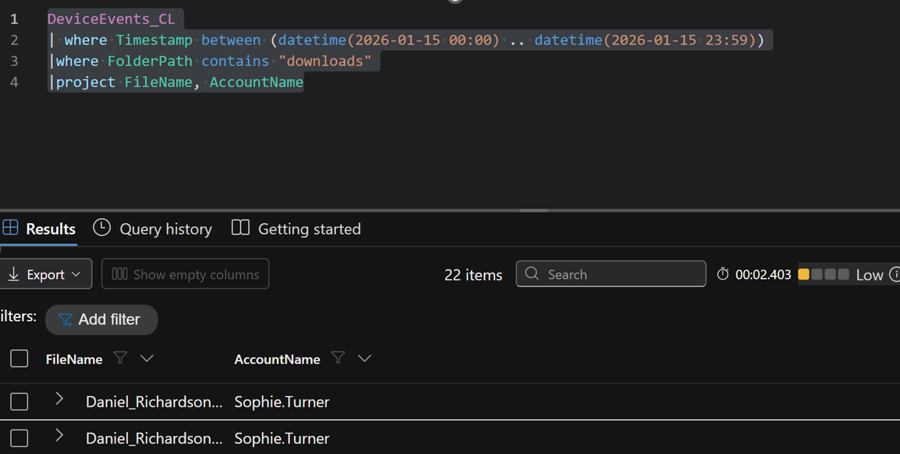

---

### 02 - Patient Zero Hostname
**File:** `02-patient-zero-hostname.png`
**README reference:** [Q2 — Patient zero](../README.md#q2--which-hostname-is-patient-zero)

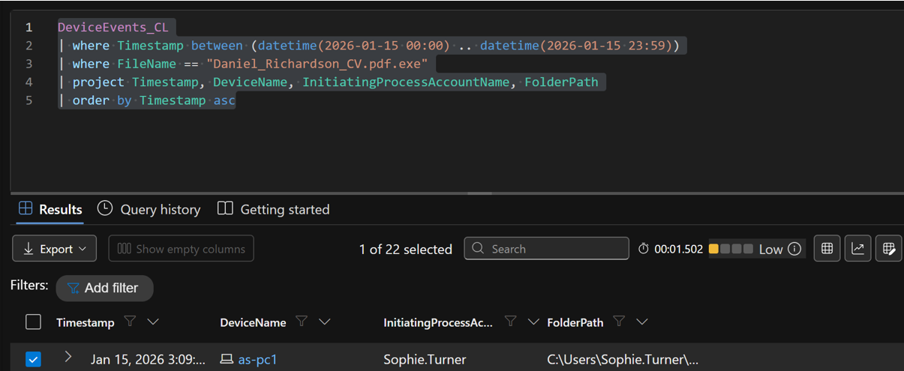

---

### 03 - Compromised User Account
**File:** `03-compromised-user.png`
**README reference:** [Q3 — Executing user](../README.md#q3--what-user-account-ran-the-malicious-file)

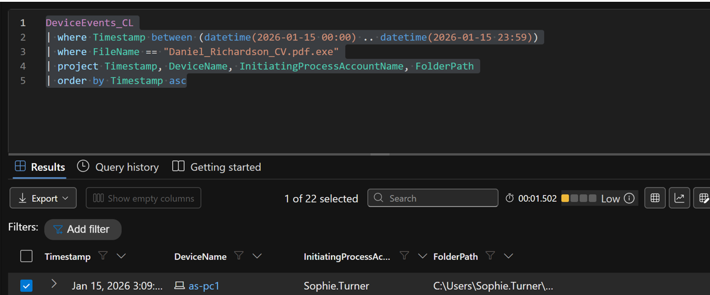

---

### 04 - Dropper SHA256 Hash
**File:** `04-dropper-sha256.png`
**README reference:** [Q4 — SHA256 hash](../README.md#q4--what-is-the-sha256-of-the-dropper)

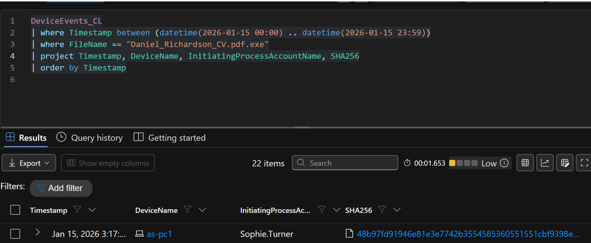

---

## Phase 2 — Discovery

### 05 - CMD Child Process
**File:** `05-cmd-child-process.png`
**README reference:** [Q5 — Initial enumeration binary](../README.md#q5--what-windows-binary-was-used-for-the-initial-enumeration-commands)

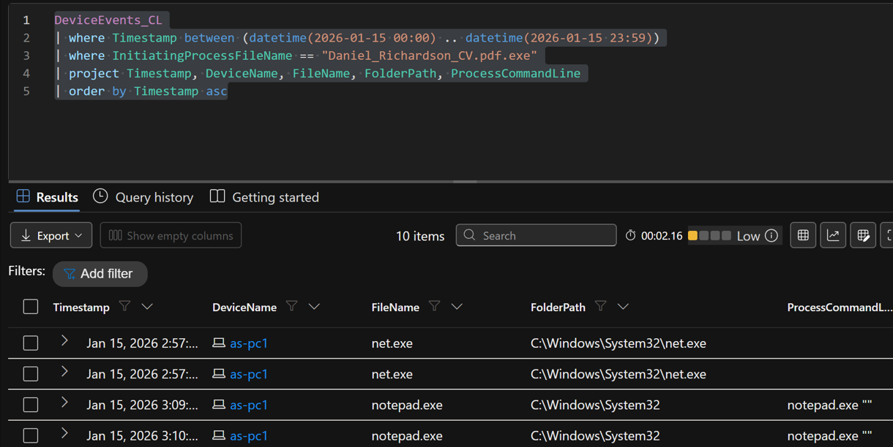

---

### 06 - Localgroup Enumeration
**File:** `06-localgroup-enumeration.png`
**README reference:** [Q6 — Administrators group enumeration](../README.md#q6--what-was-the-full-command-line-used-to-enumerate-the-local-administrators-group)

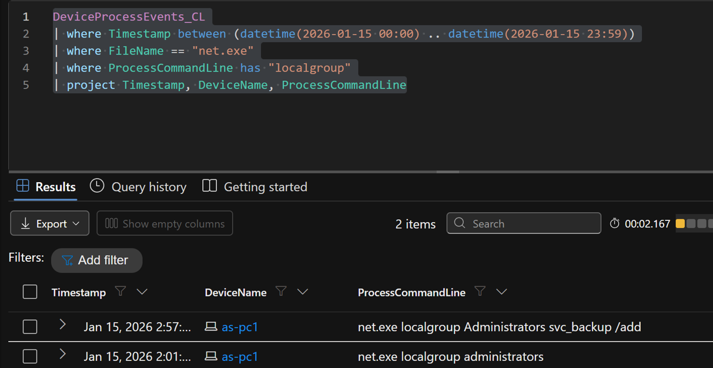

---

## Phase 3 — Persistence & RMM

### 07 - Certutil Download
**File:** `07-certutil-download.png`
**README reference:** [Q7 — LOLBin download](../README.md#q7--what-microsoft-signed-binary-did-the-attacker-abuse-to-download-their-tool)

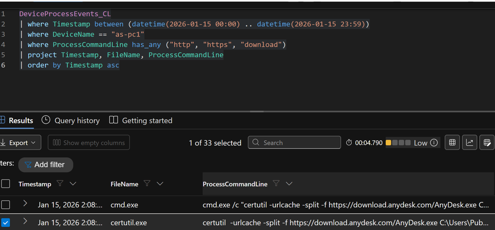

---

### 08 - RMM Tool Path
**File:** `08-rmm-tool-path.png`
**README reference:** [Q8 — RMM tool location](../README.md#q8--what-is-the-full-path-of-the-remote-access-tool-dropped-to-disk)

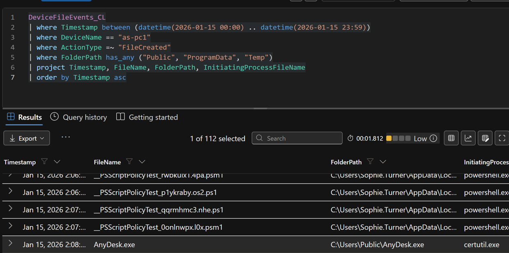

---

### 09 - RMM Password
**File:** `09-rmm-password.png`
**README reference:** [Q9 — RMM unattended password](../README.md#q9--what-password-was-set-on-the-rmm-tool)

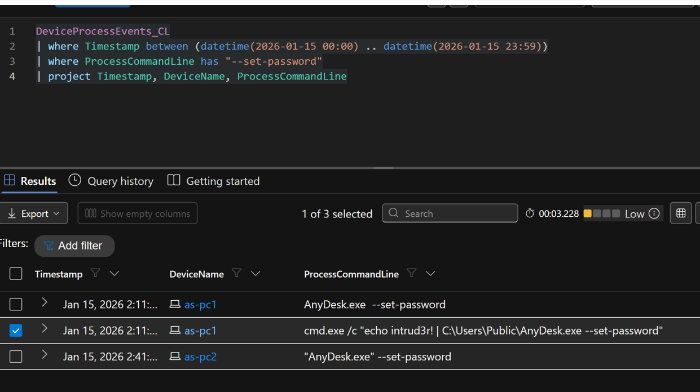

---

### 10 - Backdoor Account Creation
**File:** `10-backdoor-account.png`
**README reference:** [Q10 — Backdoor username](../README.md#q10--what-is-the-username-of-the-backdoor-account-created-on-patient-zero)

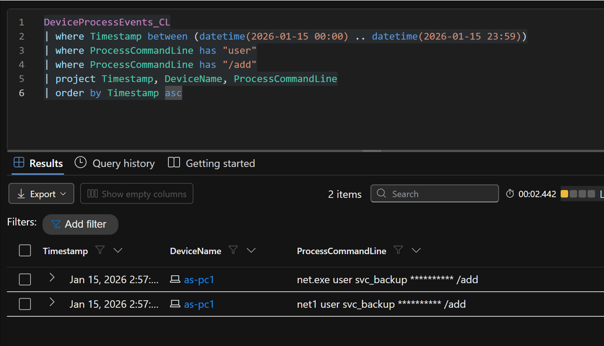

---

### 11 - Backdoor Group Add
**File:** `11-backdoor-group-add.png`
**README reference:** [Q11 — Backdoor group membership](../README.md#q11--what-local-group-was-the-backdoor-account-added-to)

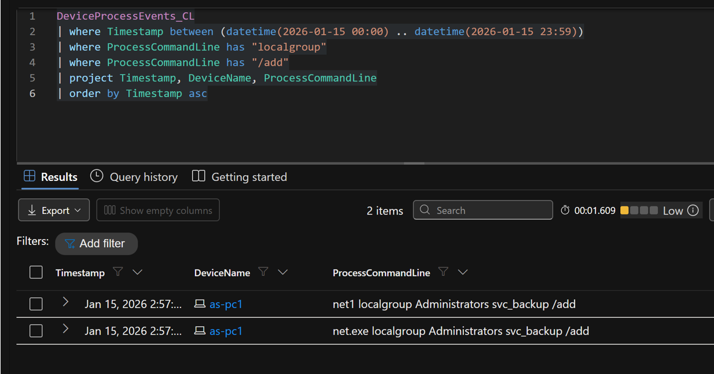

---

## Phase 4 — Lateral Movement

### 12 - Lateral Movement Target
**File:** `12-lateral-movement-target.png`
**README reference:** [Q12 — Brute force destination](../README.md#q12--what-is-the-destination-hostname-of-the-brute-force-attempts)

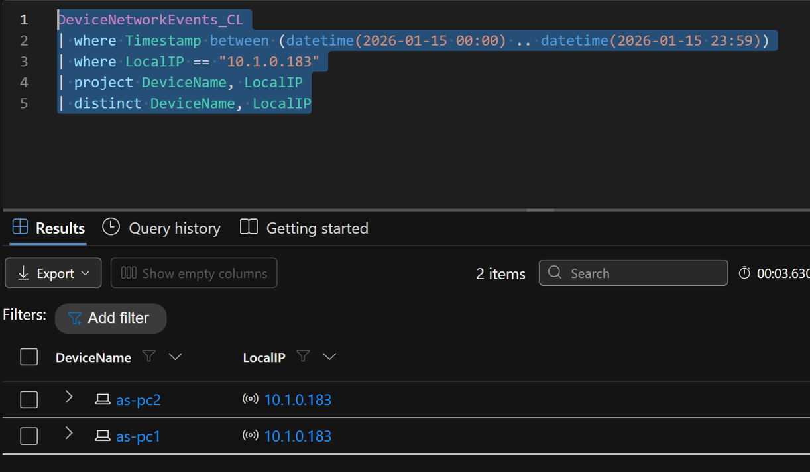

---

### 13 - Successful Lateral Logon
**File:** `13-successful-lateral-logon.png`
**README reference:** [Q13 — Successful account](../README.md#q13--what-account-name-was-successfully-used-to-login)

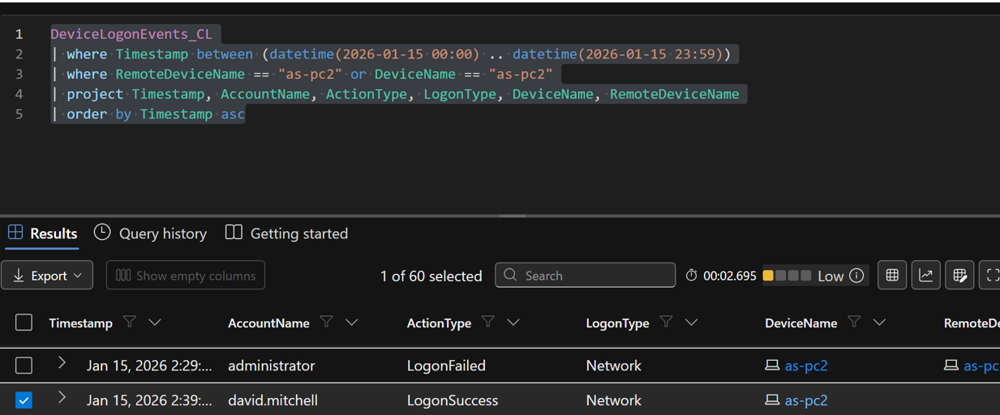

---

### 14 - RDP Logon Type
**File:** `14-rdp-logon-type.png`
**README reference:** [Q14 — LogonType for RDP](../README.md#q14--what-logontype-indicates-the-attacker-established-an-interactive-desktop-session)

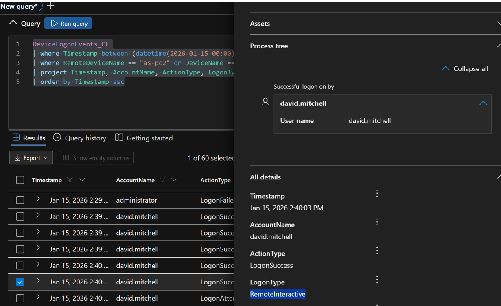

---

### 15 - Staging Domain
**File:** `15-staging-domain.png`
**README reference:** [Q15 — Attacker staging domain](../README.md#q15--what-domain-hosted-the-dropper-that-was-downloaded-on-as-pc2)

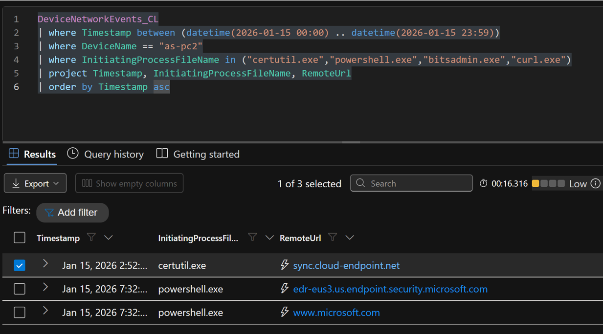

---

### 16 - File Server RDP Logon
**File:** `16-file-server-rdp-logon.png`
**README reference:** [Q16 — Privileged account to file server](../README.md#q16--what-account-name-eventually-succeeded-via-rdp-to-the-file-server)

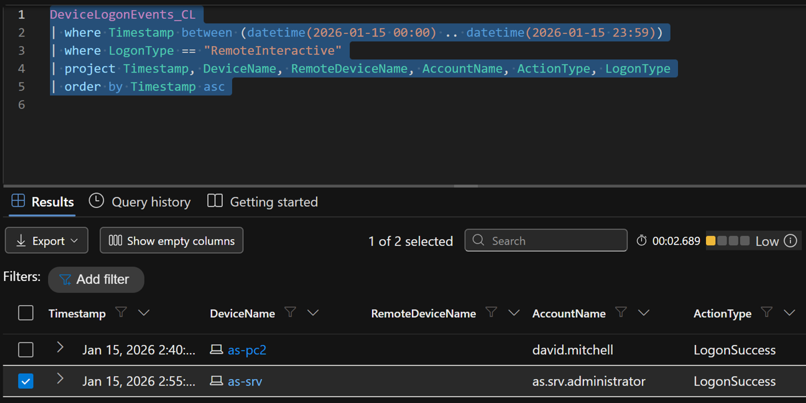

---

## Phase 5 — File Server Compromise

### 17 - Masquerading Filename
**File:** `17-masquerading-filename.png`
**README reference:** [Q17 — Dropper renamed on server](../README.md#q17--what-filename-was-the-dropper-saved-as-on-the-file-server)

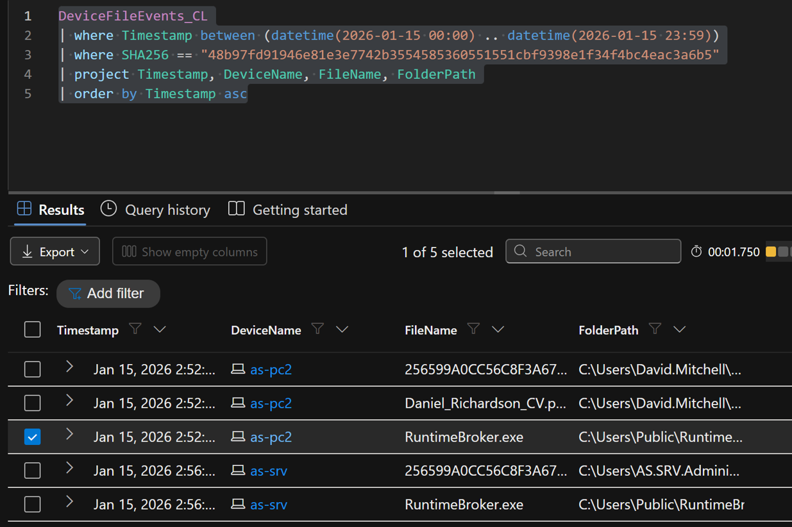

---

### 18 - Masquerading Full Path
**File:** `18-masquerading-full-path.png`
**README reference:** [Q18 — Masquerading binary location](../README.md#q18--what-is-the-full-file-path-of-the-masquerading-binary)

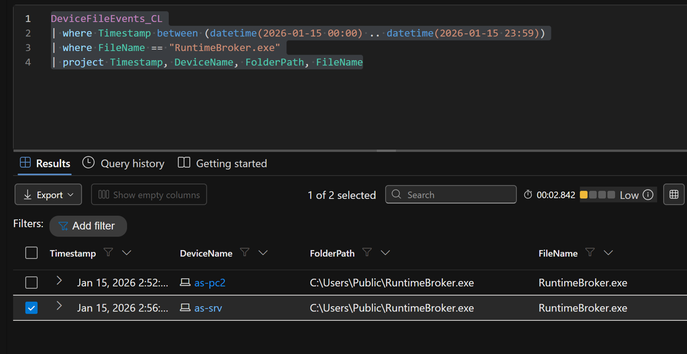

---

### 19 - Scheduled Task Name
**File:** `19-scheduled-task-name.png`
**README reference:** [Q19 — Persistence task name](../README.md#q19--what-is-the-name-of-the-scheduled-task-that-was-created)

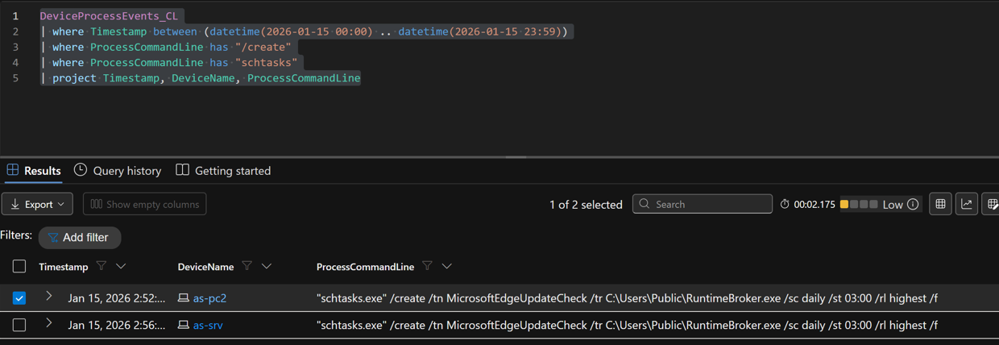

---

### 20 - Scheduled Task Time
**File:** `20-scheduled-task-time.png`
**README reference:** [Q20 — Daily execution time](../README.md#q20--at-what-time-was-the-persistence-scheduled-task-set-to-run-daily)

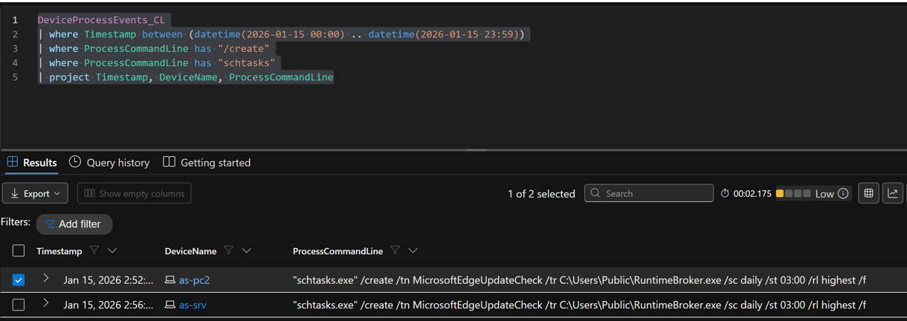

---

## Phase 6 — Collection & Staging

### 21 - Staging Archive
**File:** `21-staging-archive.png`
**README reference:** [Q21 — Archive filename](../README.md#q21--what-is-the-filename-of-the-staging-archive)

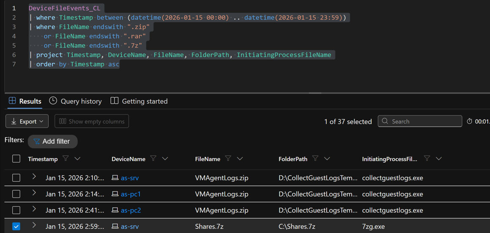

---

### 22 - Archive Tool
**File:** `22-archive-tool.png`
**README reference:** [Q22 — Archiving process](../README.md#q22--what-process-created-the-staging-archive)

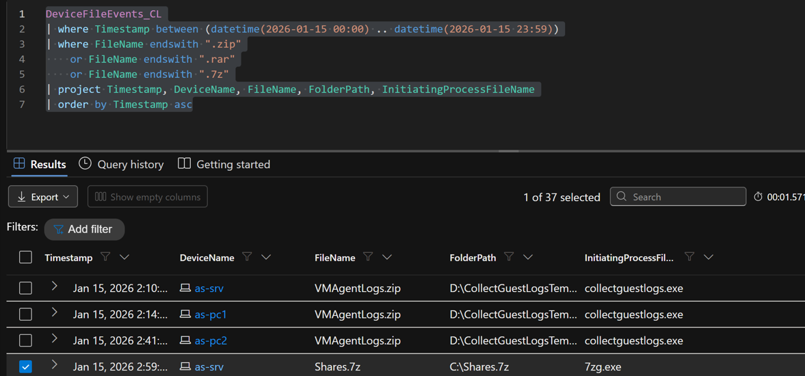

---

### 23 - Client Folders
**File:** `23-client-folders.png`
**README reference:** [Q23 — Distinct clients staged](../README.md#q23--how-many-distinct-clients-were-staged-for-exfiltration)

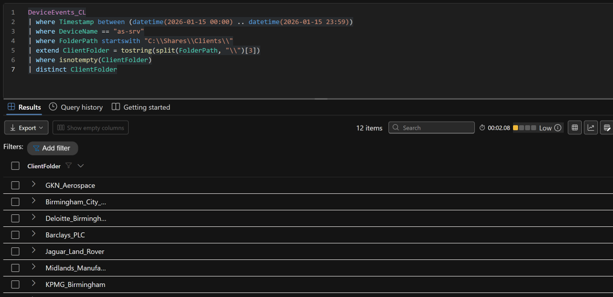

---

### 24 - Staged File Types
**File:** `24-staged-file-types.png`
**README reference:** [Q24 — Repeatedly accessed filenames](../README.md#q24--name-one-of-the-two-filenames-repeatedly-accessed-across-client-folders)

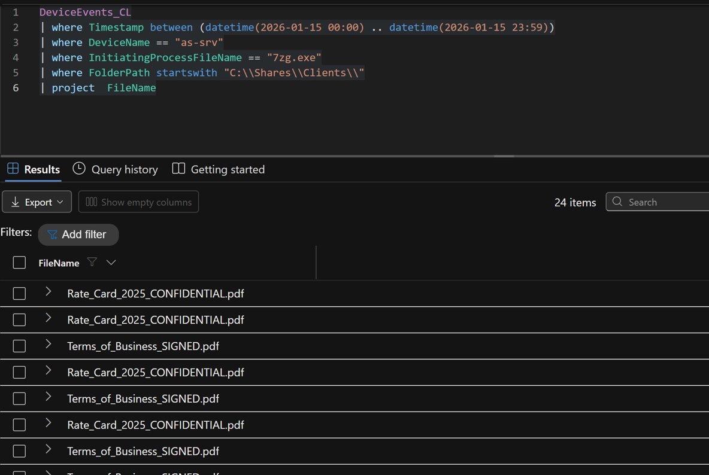

---

### 25 - Archive Final Path
**File:** `25-archive-final-path.png`
**README reference:** [Q25 — Archive relocation](../README.md#q25--what-is-the-full-path-the-archive-was-moved-to)

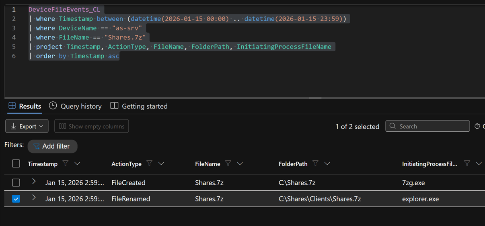

---

## Phase 7 — Defence Evasion

### 26 - Log Clearing
**File:** `26-log-clearing.png`
**README reference:** [Q26 — Event log clearing tool](../README.md#q26--what-windows-utility-was-used-to-clear-the-event-logs)

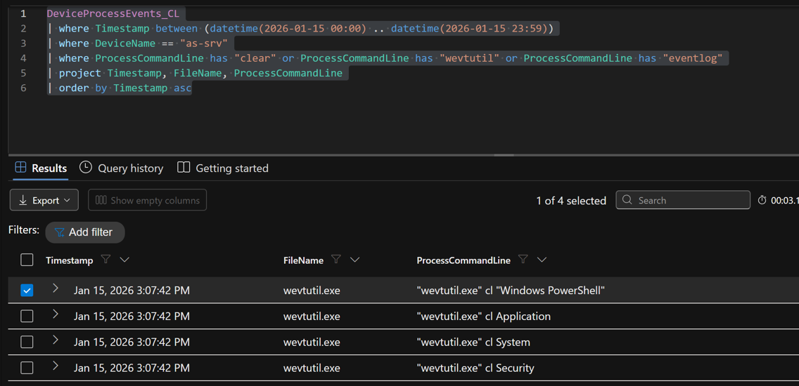

---

### 27 - MITRE Mapping
**File:** `27-mitre-mapping.png`
**README reference:** [Q27 — MITRE ATT&CK tactic](../README.md#q27--what-is-the-mitre-attck-tactic-id-for-bundling-files-into-an-archive-prior-to-exfiltration)

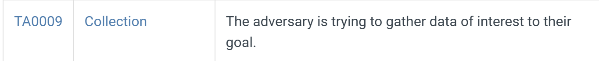

---

## Summary Table

| # | Filename | Phase | Answer |
|---|----------|-------|--------|
| 01 | `01-double-extension-dropper.png` | Initial Access | `Daniel_Richardson_CV.pdf.exe` |
| 02 | `02-patient-zero-hostname.png` | Initial Access | `as-pc1` |
| 03 | `03-compromised-user.png` | Initial Access | `Sophie.Turner` |
| 04 | `04-dropper-sha256.png` | Initial Access | SHA256 hash |
| 05 | `05-cmd-child-process.png` | Discovery | `cmd.exe` |
| 06 | `06-localgroup-enumeration.png` | Discovery | `net localgroup administrators` |
| 07 | `07-certutil-download.png` | Persistence | `certutil.exe` |
| 08 | `08-rmm-tool-path.png` | Persistence | `C:\ProgramData\AnyDesk\AnyDesk.exe` |
| 09 | `09-rmm-password.png` | Persistence | `Sup3rS3cur3RMM!` |
| 10 | `10-backdoor-account.png` | Persistence | `helpdesk` |
| 11 | `11-backdoor-group-add.png` | Persistence | `Administrators` |
| 12 | `12-lateral-movement-target.png` | Lateral Movement | `as-pc2` |
| 13 | `13-successful-lateral-logon.png` | Lateral Movement | `j.harris` |
| 14 | `14-rdp-logon-type.png` | Lateral Movement | `RemoteInteractive` |
| 15 | `15-staging-domain.png` | Lateral Movement | `filestorage-cdn.net` |
| 16 | `16-file-server-rdp-logon.png` | Lateral Movement | `svc_backup` |
| 17 | `17-masquerading-filename.png` | Server Compromise | `RuntimeBroker.exe` |
| 18 | `18-masquerading-full-path.png` | Server Compromise | `C:\ProgramData\Microsoft\RuntimeBroker.exe` |
| 19 | `19-scheduled-task-name.png` | Persistence | `WindowsUpdateService` |
| 20 | `20-scheduled-task-time.png` | Persistence | `03:00` |
| 21 | `21-staging-archive.png` | Collection | `Shares.7z` |
| 22 | `22-archive-tool.png` | Collection | `7zg.exe` |
| 23 | `23-client-folders.png` | Collection | 8 clients |
| 24 | `24-staged-file-types.png` | Collection | `Contract.pdf` / `Pricing.xlsx` |
| 25 | `25-archive-final-path.png` | Collection | `C:\Shares\Clients\Shares.7z` |
| 26 | `26-log-clearing.png` | Defence Evasion | `wevtutil.exe` |
| 27 | `27-mitre-mapping.png` | MITRE | `TA0009 — Collection` |
