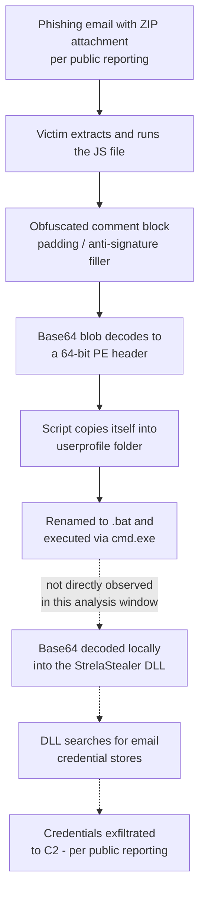

# Malicious JavaScript Analysis — StrelaStealer Loader

Static and dynamic analysis of a heavily obfuscated JavaScript file that carries a full Windows PE (DLL) embedded as a Base64 blob. Both the script and the extracted DLL are independently attributed to **StrelaStealer** by multiple VirusTotal engines.

**Environment:** REMnux (`sha256sum`, CyberChef, `file`, `box-js`)
**Analyst:** Jophiel Arevalo Enriquez

> **Note:** This document contains no hyperlinks and no external URLs/domains/IPs. StrelaStealer is documented to exfiltrate to a C2 server once the DLL stage runs, but no such network indicator was directly captured within this analysis window — see the Dynamic Analysis and Malware Family Context sections for why. Executable filenames referenced below are defanged (`[.]`) for safe storage.

---

## Verdict

| | |
|---|---|
| **Classification** | Malicious — JavaScript Loader / Dropper |
| **Delivered Payload** | StrelaStealer (email credential stealer, DLL) |
| **Execution Vector** | Obfuscated JS → self-copy renamed to `.bat` → `cmd.exe` execution |
| **VT Detection** | 33/62 (script) · 46/68 (embedded DLL) |

---

## 1. Sample Overview

| Property | Value |
|---|---|
| Filename (as received) | `Javascript-lab.js` |
| File size | ~1.38 MB (1,448,447 bytes) |
| SHA256 | `23107ced99838695bf4391c1271bafce47fad96e95b28f52df0a060038f80a7b` |

```
ls
sha256sum Javascript-lab.js
```


A 1.38 MB `.js` file is already unusual — legitimate JavaScript rarely reaches that size, which is an early hint that something large (like an embedded binary) is packed inside.

## 2. Threat Intelligence — Script Hash


**33/62** engines flagged it malicious.

| | |
|---|---|
| Tags | javascript, spreader, obfuscated, long-sleeps |
| Community filename observed | `28836_2593959416481[.]js` |
| Community threat score | 10/10 |
| Community family tag | strela |

The `long-sleeps` tag is worth flagging early — it suggests the script deliberately delays part of its execution, a common anti-sandbox technique aimed at outlasting automated analysis timeouts. This becomes relevant again in the dynamic analysis section below.

## 3. Static Analysis — Obfuscation and Embedded Payload


The script opens with a `/* militarysnore` block comment header followed by roughly twenty lines in a `set <word>=<char>` pattern. Since this text sits inside an unclosed JS comment, it doesn't appear to execute as active logic — it reads as padding/decoy content, likely intended to inflate the file size and dilute simple string- or entropy-based detection signatures while still looking superficially "code-like" to a quick skim.

Immediately after that block, the file contains a single massive Base64-like string beginning with `TVqQAAMAAAAEAAAA...`. That specific sequence is recognizable *before even decoding it* — it's the standard Base64 encoding of a Windows PE file's `MZ` DOS header, meaning there's almost certainly a full executable packed into this "JavaScript" file as a string.

## 4. Decoding the Payload — CyberChef

Loaded the Base64 blob into CyberChef's `From Base64` recipe to confirm:


The decoded output opens with `MZ` and the classic DOS stub message *"This program cannot be run in DOS mode"*, followed by a full PE section table: `.text`, `.rdata`, `.data`, `.pdata`, `.xdata`, `.bss`, `.idata`, `.CRT`, `.tls`, `.reloc`. The presence of `.pdata`/`.xdata` (exception-handling tables) specifically indicates a **64-bit (x64)** PE image. Confirmed: this JS file is carrying an entire compiled binary as an inline string.

## 5. Embedded Object Extraction

Saved the CyberChef-decoded output to disk and hashed it:

```
sha256sum Javascript-malwarefinal
```


SHA256: `ae1388f95f2678b7b6aabaf430b646710cdea10850c2556fbfcc0fb068e6fe4e`

`file` confirmed the type directly: `PE32+ executable (DLL) (console) x86-64, for MS Windows` — matching the section-table read above exactly (see Dynamic Analysis screenshot below for the `file` command output).

## 6. Threat Intelligence — Embedded DLL


**46/68** engines flagged the extracted DLL malicious — higher confidence than the script wrapper itself.

| | |
|---|---|
| Observed filename | `file[.]exe[.]infected` |
| Tags | pedll, spreader, overlay, 64bits |
| Popular threat label | trojan.tedy/stealer |
| Family labels | tedy, stealer, strela |

Notable vendor calls: `Trojan[stealer]:Win/StrelaStealer.ASDF!...` (AliCloud), `HEUR:Trojan-PSW.Win64.Strela.gen` (Kaspersky), `Trojan:Win32/StrelaStealer.PDIMTB` (Microsoft), `Win.Keylogger.Tedy-10023593-0` (ClamAV) — independent, consistent StrelaStealer attribution across engines that don't share detection logic.

## 7. Dynamic Analysis — box-js

```
file Javascript-malwarefinal
box-js Javascript-lab.js --no-shell-error
cat Javascript-lab.js.results/IOC.json
```


`box-js` (a JS sandbox that emulates the WScript/ActiveX environment malicious scripts typically abuse) ran the script with its default 10-second timeout and captured one concrete behavior:

```
cmd /k copy "<sandbox path>\CURRENT_SCRIPT_IN_FAKED_DIR.js" "%userprofile%\pleasantobject[.]bat" && "%userprofile%\pleasantobject[.]bat"
```

The script copies its own source file into the user's profile folder, renames the copy with a `.bat` extension, and immediately executes it via `cmd.exe`.

**Why this matters, and why the trail stops here:** this matches a documented StrelaStealer technique — public reporting on this family describes exactly this pattern, where a script-turned-batch-file contains the Base64-encoded DLL and a subsequent step (commonly a native decoder like `certutil`) reconstitutes and launches the real payload. Given the `long-sleeps` tag flagged by VirusTotal, it's plausible the script intentionally delays that next step past `box-js`'s short analysis window — a classic sandbox-evasion technique. I did not capture the DLL reconstitution/execution step directly in this run; the read above (`.bat`-container → decode → execute) is informed by public research on this exact family, not by something I traced myself past this point.

## 8. Malware Family Context — StrelaStealer

StrelaStealer (aka Strela) is an email-credential stealer first publicly documented in November 2022, and it remains under active development. It targets login credentials from Microsoft Outlook and Mozilla Thunderbird specifically — historically by locating and reading local credential stores such as Thunderbird's `logins.json` and `key4.db`, and (in Outlook's case) abusing a known weakness in how Outlook 2016 encrypts stored IMAP passwords via DPAPI.

Distribution has consistently followed a phishing-with-attachment pattern: ZIP archives containing an obfuscated JavaScript file, targeting organizations across the EU and US with a particular focus on Italy, Spain, Germany, and Ukraine. Delivery mechanics have evolved across campaigns — some variants have the JS fetch the DLL from a remote WebDAV server, while others (matching this sample far more closely) embed the Base64-encoded DLL directly inside the script or a dropped batch file, later decoded locally via a tool like `certutil` rather than downloaded. Public reporting also notes that recent campaigns have stripped debugging (PDB) strings that once made the DLL trivially identifiable, specifically to weaken static signature detection — consistent with the heavy obfuscation observed in this sample. Once running, the DLL is reported to exfiltrate stolen credentials via an HTTP POST to an attacker-controlled server.

---

## Infection Chain



*Steps beyond the self-copy/rename/execute stage (dashed) reflect public StrelaStealer research rather than direct observation in this analysis — see Dynamic Analysis section for why.*

---

## Indicators of Compromise

| Type | Value |
|---|---|
| SHA256 (JS loader) | `23107ced99838695bf4391c1271bafce47fad96e95b28f52df0a060038f80a7b` |
| SHA256 (embedded DLL) | `ae1388f95f2678b7b6aabaf430b646710cdea10850c2556fbfcc0fb068e6fe4e` |
| Observed alternate JS filename | `28836_2593959416481[.]js` |
| Observed DLL filename | `file[.]exe[.]infected` |
| Dropped/renamed file | `%userprofile%\pleasantobject[.]bat` |
| External network indicators | None captured in this analysis window |

## MITRE ATT&CK Mapping

| Technique | ID | Basis |
|---|---|---|
| Phishing: Spearphishing Attachment | T1566.001 | Public reporting on this family |
| User Execution: Malicious File | T1204.002 | Observed |
| Obfuscated Files or Information | T1027 | Observed |
| Deobfuscate/Decode Files or Information | T1140 | Observed |
| Masquerading: Masquerade File Type | T1036.008 | Observed |
| Virtualization/Sandbox Evasion | T1497 | Inferred from `long-sleeps` tag |
| Unsecured Credentials: Credentials In Files | T1552.001 | Public reporting on this family |
| Exfiltration Over C2 Channel | T1041 | Public reporting on this family |

## Key Takeaways

**Lab Questions**

1. **SHA256 hash of the JavaScript?** `23107ced99838695bf4391c1271bafce47fad96e95b28f52df0a060038f80a7b`
2. **SHA256 hash embedded in the JavaScript?** `ae1388f95f2678b7b6aabaf430b646710cdea10850c2556fbfcc0fb068e6fe4e`
3. **File type embedded in the script?** DLL
4. **Malware family?** Strela (StrelaStealer), per VirusTotal
5. **What does the JavaScript do?** Once executed, it copies itself to the `%userprofile%` directory, renames the copy to `pleasantobject[.]bat`, and runs it.

**Recap**

- This JavaScript carries a large embedded Base64 string; decoding it reveals an `MZ` header — a DLL that VirusTotal ties to StrelaStealer.
- The JavaScript executes a batch file stored under `%userprofile%` named `pleasantobject[.]bat`.

**Technical Detail**

The script's massive size comes almost entirely from an embedded 64-bit PE (DLL), Base64-encoded inline and preceded by a block of decoy/padding text. Rather than downloading its payload, this variant self-decodes locally — consistent with a documented shift in StrelaStealer's delivery technique. Dynamic analysis confirmed the self-copy-and-rename-to-`.bat` behavior directly; the DLL decode/execution and credential-theft/exfiltration stages are documented in public StrelaStealer research but weren't captured within this sandbox's analysis window, plausibly because of the sample's built-in execution delay.

## Tools Used

- `sha256sum` — file hashing
- VirusTotal — file and community threat intel
- CyberChef (`From Base64` recipe) — payload decoding
- `file` — binary type identification
- `box-js` — JavaScript sandbox / dynamic behavior analysis
