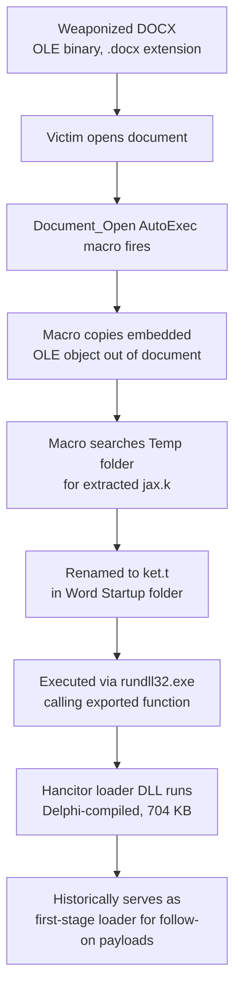

# Malicious DOCX Analysis — Embedded OLE Object Delivering Hancitor Loader

Static analysis of a Word document masquerading as a modern `.docx` file while actually being a legacy OLE compound file. An AutoExec VBA macro extracts a DLL embedded in the document's OLE Object Pool and executes it via `rundll32`. VirusTotal and Malpedia both attribute the payload to **Hancitor** (aka Chanitor), a long-running macro-delivered downloader family.

**Environment:** REMnux (static analysis toolset — `exiftool`, `oleid`, `olevba`, `oledump`)
**Analyst:** Jophiel Arevalo Enriquez

> **Note:** This document contains no hyperlinks and no external URLs/domains/IPs — none were observed in the sample itself (delivery is fully self-contained via an embedded OLE object, unlike a network-download dropper). Reconstructed code blocks below are for documentation only and are not directly executable outside the original malicious document.

---

## Verdict

| | |
|---|---|
| **Classification** | Malicious — Office Macro Dropper (self-contained, OLE-embedded payload) |
| **Delivered Payload** | Hancitor / Chanitor loader DLL (Delphi-compiled) |
| **Execution Vector** | VBA AutoExec macro → OLE object extraction → `rundll32` DLL execution |
| **VT Detection** | 43/63 (document) · 53/72 (embedded DLL) |

---

## 1. Sample Overview

| Property | Value |
|---|---|
| Filename (as received) | `Document-lab.docx` |
| File size | 1336 kB (1.27 MB) |
| SHA256 (document) | `0b22278ddb598d63f07eb983bcf307e0852cd3005c5bc15d4a4f26455562c8ec` |
| Author / Last Modified By | MyPc |
| Created / Modified | 2021-05-24 12:32:00 |
| Visible content | 3 words, 21 characters, 1 page |

Initial triage with `exiftool` and `sha256sum`:


**First red flag, before opening the macro at all:** `exiftool` reports `Identification: Word 8.0` and `Comp Obj User Type: Microsoft Word 97-2003 Document` — this file is a legacy **OLE compound binary** wearing a `.docx` extension. Modern `.docx` is a zip/XML container that structurally cannot carry VBA macros; that requires the older binary format or `.docm`. The mismatched extension is a deliberate evasion move — mail/web filters that trust the file extension may treat it as a "safe" modern Office file, while Word itself reads the true binary format underneath and executes whatever macro is embedded regardless of what the filename claims.

Also notable: 1.3 MB is a lot of file for "3 words, 21 characters" of visible content — a strong early signal that something much larger is embedded inside.

## 2. Threat Intelligence — Document Hash


**43/63** engines flagged it malicious. VT's own AI code-insight summary flagged the macro's `Shell` call executing an external program with a specific argument before I'd even opened the macro myself.

| | |
|---|---|
| Popular threat label | `trojan.valyria/hancitor` |
| Categories | trojan, dropper, downloader |
| Family labels | valyria, hancitor, w97m |
| Tags | doc, run-file, create-ole, calls-wmi, auto-open, macros |

Notable vendor calls: `VBA/TrojanDropper.Agent.BZD` (ESET), `Trojan.Chanitor.59` (DrWeb), `Trojan/Win.Qbot.R422510` (AhnLab) — the Qbot reference is a lineage signal, since Hancitor has historically served as a first-stage loader for follow-on banking trojans.

## 3. Static Triage — oleid


| Indicator | Value | Risk |
|---|---|---|
| File format | MS Word 97-2003 Document/Template | info |
| Container format | OLE | info |
| VBA Macros | Yes, suspicious | **HIGH** |
| XLM Macros | No | — |
| ObjectPool | **True** | low (flagged) — "very likely to contain embedded OLE objects or files. Use oleobj to check it." |
| Encrypted | False | — |

The `ObjectPool: True` flag lines up exactly with the file-size mismatch noted above — a strong pointer toward an embedded payload.

## 4. Macro Analysis — olevba


Reconstructed logic from `Macros/VBA/ThisDocument`:

```vba
' Reconstructed for documentation — not directly executable outside the original document
Private Sub Document_Open()
    Dim startupPath As String
    startupPath = Options.DefaultFilePath(wdStartupPath)

    If Dir(startupPath & "\ket.t") = "" Then
        Call CopyEmbeddedObject   ' navigates selection, issues Selection.Copy
        Call FindDroppedFile      ' recursively searches Word's Temp folder for "jax.k"

        If foundPath <> "" Then
            Name foundPath As startupPath & "\ket.t"   ' rename jax.k -> ket.t
            Shell("rundll32.exe " & startupPath & "\ket.t,EUAYKIYBPAX")
        End If
    End If
End Sub
```

| Function | Behavior |
|---|---|
| `Document_Open` (AutoExec) | Runs automatically when the document opens |
| `yyy()` | Moves the selection cursor through the document body and issues `Selection.Copy` — manually triggering extraction of the embedded object rather than reading the OLE stream programmatically |
| `xxx()` / `Search()` | Recursively walks Word's Temp directory looking for a file literally named `jax.k` |
| Execution | Once found, renames `jax.k` → `ket.t` in Word's Startup folder and launches it with `rundll32.exe <path>\ket.t,EUAYKIYBPAX` |

`olevba`'s own keyword table confirms every piece: `AutoExec: Document_Open`, `Suspicious: Shell`, `Suspicious: Call`, `Suspicious: CreateObject`, and a detected Base64 string that decodes to `rundll32` — an obfuscated duplicate reference to the same execution technique.

**Read at this stage:** `jax.k`/`ket.t` are almost certainly a DLL, deliberately given non-standard extensions (`.k`, `.t`) specifically to slip past attachment filters that block `.exe`/`.dll`, then invoked via `rundll32.exe`, calling a specific exported function (`EUAYKIYBPAX`) as the entry point — a classic living-off-the-land execution technique. This was still an inference at this point; confirmed below.

## 5. Structural Analysis — oledump

```
oledump.py Document-lab.docx
```


19 OLE streams total. Two stand out:

| # | Stream | Size | Note |
|---|---|---|---|
| 8 | `Macros/VBA/ThisDocument` | 4,635 | The macro analyzed above |
| 16 | `ObjectPool/_1683339676/\x01Ole10Native` | **721,178** | Marked `O` (OLE object) by oledump — by far the largest stream in the file |

Stream 16's size (~704 KB) matches the file size VirusTotal later reported for the extracted DLL almost exactly — strong confirmation this is the embedded payload referenced in the macro.

## 6. Embedded Object Extraction

Dumped stream 16 as a hex view first to see what it contained before extracting:

```
oledump.py Document-lab.docx -s 16
```


The hex/ASCII column reveals two build-environment path strings baked into the object: a Temp-folder path ending in `jax.k` (matching exactly what the macro's `Search()` function looks for) and a Desktop build path referencing a project folder — both under a `MyPc` user profile, matching the document's own `Author`/`Last Modified By` metadata. This ties the document's authoring environment directly to the embedded payload's build environment.

Extracted the object directly and identified it:

```
oledump.py Document-lab.docx -s 16 -e > embedded.file
file embedded.file
sha256sum embedded.file
```


Confirmed: `embedded.file: PE32 executable (DLL) (GUI) Intel 80386, for MS Windows` — exactly matching the macro's `rundll32` execution theory.

## 7. Threat Intelligence — Embedded DLL


**53/72** engines flagged the extracted DLL malicious — higher confidence than the container document itself.

| | |
|---|---|
| Popular threat label | `trojan.bsymem/zusy` |
| Categories | trojan, downloader |
| Family labels | bsymem, zusy, hancitor |

Notable vendor calls: `Chanitor.Trojan.Downloader.DDS` (Malwarebytes), `Win32/TrojanDownloader.Hancitor.L` (ESET), `Trojan.Chanitor.59` (DrWeb), `Win/malicious_confidence_100%(W)` (CrowdStrike Falcon), `Trojan-Banker.QakBot` (Ikarus), `Trojan:Win32/Qbot.RMIMTB` (Microsoft) — consistent Hancitor attribution with the same Qbot follow-on lineage signal seen on the document itself.


| Property | Value |
|---|---|
| File type | Win32 DLL — PE32, Intel 80386 |
| Compiler / Linker | Borland Delphi 7 / Turbo Linker (Delphi) |
| File size | 704.00 KB (720,896 bytes) |
| Compilation Timestamp | 1992-06-19 — a known default/stripped Delphi compiler timestamp, not a real build date |
| First Seen In The Wild | 2021-05-25 |
| Observed names | `ket.t`, `jax.k`, `malicious.doc_jax.k`, and notably **`2021-05-24-Hancitor-DLL-01.bin`** |

That last observed name is a strong corroborating detail — it follows the `YYYY-MM-DD-Family-##.ext` convention widely used by public malware-traffic datasets, and the date matches this document's own creation timestamp (2021-05-24) almost exactly. This sample appears to be a well-documented, publicly catalogued Hancitor loader rather than an obscure one-off.

## 8. Malware Family Context — Hancitor


Per Malpedia (Fraunhofer FKIE malware research database, aka: Chanitor), Hancitor emerged in 2013 and spreads through social engineering — phishing emails carrying either a malicious link or a weaponized Office document with a malicious macro, matching exactly the delivery method documented here.

---

## Infection Chain



---

## Indicators of Compromise

| Type | Value |
|---|---|
| SHA256 (DOCX container) | `0b22278ddb598d63f07eb983bcf307e0852cd3005c5bc15d4a4f26455562c8ec` |
| SHA256 (embedded DLL) | `2a8b737a4752060a308c4312b7c0cf6c05cde5b370906286dea9cdd36f5aa613` |
| MD5 (embedded DLL) | `9dc6f214fc82d637de2f68f3c519d339` |
| Observed filenames | `jax.k`, `ket.t`, `2021-05-24-Hancitor-DLL-01.bin` |
| Exported function called | `EUAYKIYBPAX` |
| Drop location | Word Startup folder (`Options.DefaultFilePath(wdStartupPath)`) |
| Execution method | `rundll32.exe` |
| External network indicators | None observed — payload delivery is fully self-contained in this artifact |

## MITRE ATT&CK Mapping

| Technique | ID |
|---|---|
| Phishing: Spearphishing Attachment | T1566.001 |
| User Execution: Malicious File | T1204.002 |
| Command and Scripting Interpreter: Visual Basic | T1059.005 |
| System Binary Proxy Execution: Rundll32 | T1218.011 |
| Masquerading: Masquerade File Type | T1036.008 |
| Obfuscated Files or Information | T1027 |
| Deobfuscate/Decode Files or Information | T1140 |
| File and Directory Discovery | T1083 |

## Key Takeaways

**Lab Questions**

1. **Author of the document?** MyPc
2. **Creation date?** 2021-05-24 12:32
3. **Encrypted?** No
4. **Native Windows application the macro runs?** `rundll32.exe`
5. **SHA256 of the embedded file?** `2a8b737a4752060a308c4312b7c0cf6c05cde5b370906286dea9cdd36f5aa613`

**Recap**

- A malicious document created by MyPc on 2021-05-24 at 12:32 contained malicious VBA macros instructed to load a DLL using `rundll32.exe`.
- The document has an embedded DLL, which — per OSINT — appears related to **Hancitor**, a malware family spread via phishing.

**Technical Detail**

1. **OLE structure:** 19 streams total; the payload lives in the single largest stream, `ObjectPool/_1683339676/\x01Ole10Native` (721,178 bytes).
2. **Behavior summary:** A `.docx`-named file is actually a legacy OLE binary carrying an AutoExec macro that extracts an embedded 704 KB Delphi-compiled DLL — disguised with non-standard `.k`/`.t` extensions — and launches it via `rundll32.exe` with a specific exported function. VirusTotal and Malpedia both attribute the payload to **Hancitor (Chanitor)**, a downloader family active since 2013 that has historically served as a first-stage loader for follow-on payloads including Qbot-linked activity. Unlike the earlier PDF sample, this dropper is fully self-contained — no external domain or IP was observed for the initial payload delivery.

## Tools Used

- `exiftool` — metadata extraction
- `sha256sum` — file hashing
- `oleid` — OLE container risk triage
- `olevba` — VBA macro extraction and keyword analysis
- `oledump.py` — OLE stream enumeration, hex inspection, and object extraction
- `file` — binary type identification
- VirusTotal — file and community threat intel
- Malpedia — malware family reference
